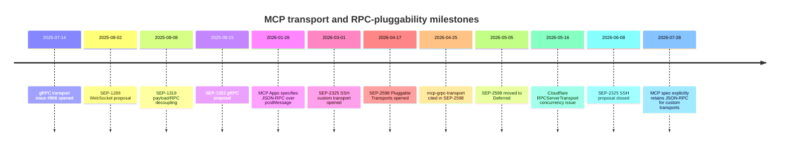
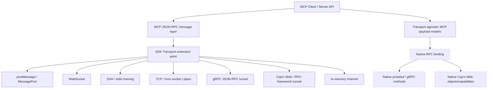
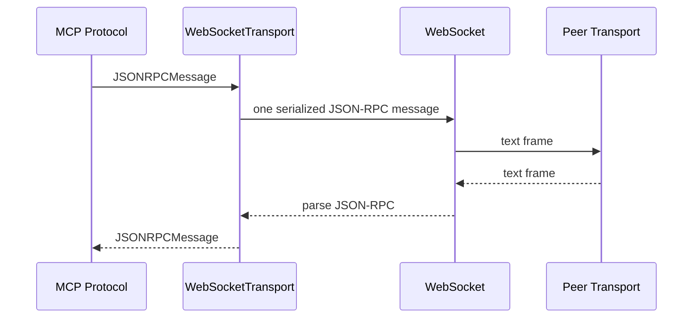
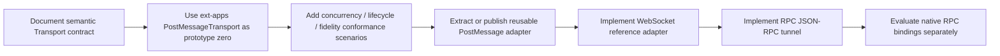

# MCP RPC Transport Pluggability Across the Official SDKs

## Executive summary

**Conclusion: a JSON-RPC-preserving `Transport` extension point is technically feasible across all ten MCP SDKs, and it is a substantially lower-risk first step than the broader version of SEP-2598.** The strongest evidence is that much of the ecosystem already works this way: TypeScript, Java, Kotlin, C#, Go, Rust, and Swift expose explicit transport abstractions; PHP exposes a transport interface but mixes message and HTTP/session concerns; Ruby has transport base classes tied closely to its server runtime; and Python's equivalent abstraction is a pair of typed AnyIO streams carrying `SessionMessage`.

More importantly, **the current MCP 2026-07-28 specification has moved toward exactly the narrower boundary contemplated here**. It says MCP messages are JSON-RPC, allows custom transports, says protocol semantics are identical across transports, and requires custom transports to preserve the JSON-RPC message format, message patterns, and per-request metadata model. The spec identifies framing, delivery, cancellation, and termination as transport/binding responsibilities—not MCP method semantics.

That makes the recommended architectural line:

> **Transport = carry complete MCP JSON-RPC messages over another carrier.**
> **Native RPC binding = translate MCP operations into another RPC system's native methods/types/capabilities.**

The first category cleanly covers WebSocket, SSH, Unix/TCP streams, `postMessage`/`MessagePort`, in-process channels, a gRPC bidirectional JSON-RPC tunnel, or an RPC-framework tunnel. The second category includes mapping `tools/call` directly onto a protobuf RPC method or mapping MCP entities onto native Cap'n Web object capabilities; that is a different and harder problem. SEP-1319 deliberately decoupled request/result payload schemas from JSON-RPC wrappers in order to make such future native bindings possible without changing today's JSON wire representation.

The most persuasive reference implementation already exists: **MCP Apps' `PostMessageTransport` is merged code in the official `modelcontextprotocol/ext-apps` repository.** It implements the TypeScript SDK's `Transport`, accepts and emits `JSONRPCMessage`, validates incoming messages against the JSON-RPC schema, and carries them through `window.postMessage`. The accompanying MCP Apps specification explicitly chose MCP JSON-RPC over `postMessage` instead of inventing a separate UI protocol.

There is also real evidence for the RPC-framework direction. Cloudflare's Agents SDK has an `RPCServerTransport` used by `McpAgent`; a 2026 issue describes MCP JSON-RPC responses being carried through that RPC path and exposes a concurrency bug caused by keeping only one pending response resolver. The issue was assigned to Matt Carey. That bug is particularly useful evidence: **an RPC carrier works, but transport conformance must explicitly test overlapping requests and response correlation.**

SEP-2598 was therefore directionally right but broader than necessary. It proposed both a mandatory Tier-1 SDK interface/conformance harness **and** permitting custom transports to transcode JSON-RPC into other encodings as long as a bidirectional mapping existed. Reviewers objected to the conformance burden, over-prescriptive cross-language API requirements, and semantic assumptions that do not fit native gRPC—for example request IDs, `initialize`, cancellation notifications, and exhaustive feature mappings. The PR remains open but was moved to **Deferred** in May 2026.

The recommended first step is consequently narrower:

**standardize the semantic contract of a JSON-RPC message transport, not a universal language API and not native-RPC translation; use the existing MCP Apps `PostMessageTransport` as prototype zero; extract/generalize it; and validate it with a transport-neutral conformance checklist.**

## Landscape, proposals, and timeline

The history shows three different lines of work gradually converging.

The first line proposed additional concrete wire mechanisms—WebSocket, gRPC, and SSH. The second line, SEP-1319, separated MCP data payloads from the JSON-RPC wrapper so native bindings could eventually exist. The third line, SEP-2598, tried to generalize transport extensibility itself. In parallel, SDKs independently accumulated transport interfaces, in-memory adapters, WebSocket implementations, TCP/UDP adapters, and finally the official MCP Apps `PostMessageTransport`.



The original [gRPC standard-transport issue #966](https://github.com/modelcontextprotocol/modelcontextprotocol/issues/966), opened by Kurtis Van Gent on July 14, 2025, proposed protobuf/gRPC over HTTP/2 as an MCP transport. SEP-1352 later developed that direction in more detail and contemplated implementations supporting JSON-RPC, gRPC, or both.

[SEP-1288](https://github.com/modelcontextprotocol/modelcontextprotocol/issues/1288), opened by Larry Maccherone on August 2, 2025, proposed WebSocket as a full-duplex MCP transport. The proposal evolved away from adding a separate envelope and toward carrying MCP messages directly. It is now closed/dormant rather than part of the standard transport set.

[SEP-1319](https://github.com/modelcontextprotocol/modelcontextprotocol/issues/1319), opened by Kurtis Van Gent on behalf of the Transport Working Group on August 8, 2025, is particularly important architecturally. It separated payload types such as call parameters/results from the JSON-RPC method wrapper while explicitly leaving existing JSON wire representations unchanged. GitHub now labels the SEP accepted/final.

[SEP-2325](https://github.com/modelcontextprotocol/modelcontextprotocol/pull/2325), authored by `@tobert` beginning March 1, 2026, proposed SSH as an informational custom transport. It documented SSH subsystem and embedded-SSH-server models and observed that an existing stdio MCP server can run as an SSH subsystem using the same newline JSON framing. The PR linked a Go SDK branch, an example server, and a stdio-to-SSH shim. It was closed by the author on June 8, 2026 because interest had stalled, not because the implementation approach was shown invalid.

[SEP-2598](https://github.com/modelcontextprotocol/modelcontextprotocol/pull/2598), opened by Kurtis Van Gent on April 17, 2026, attempted to consolidate these threads. It proposed keeping only stdio and Streamable HTTP as standard transports, requiring Tier-1 SDKs to expose an extension interface and reusable conformance harness, and letting concrete transports ship independently or as extensions. It also proposed permitting custom transports to transcode JSON-RPC into protobuf, CBOR, or other representations, provided the MCP semantics could be mapped back.

That last part produced the deepest disagreement. Mark Roth pointed out that a native gRPC transport may not have a JSON-RPC request ID at all, may not support `notifications/cancelled`, and may not implement a stateful `initialize`; he therefore argued against requiring every field and operation to round-trip through a generalized JSON-RPC transport abstraction. The same review also raised the need for an API that associates responses with carrier-level requests without exposing JSON-RPC IDs as the routing mechanism.

There was separate pushback on process: `@pcarleton` argued that requiring every Tier-1 SDK to build and maintain its own transport conformance harness would impose a significant burden and suggested transport extensions instead plug into optional centralized conformance tests. `@halter73` likewise cautioned against forcing identical interface shapes onto languages that already had idiomatic abstractions.

Those objections become much easier to accommodate if the first SEP says only:

> An SDK should expose an idiomatic extension point through which complete MCP JSON-RPC messages can be sent and received; the method names and concurrency primitive are language-specific.

The current 2026-07-28 transport specification strongly supports that narrower interpretation: only stdio and Streamable HTTP are standard, custom transports are allowed, and custom transports must preserve JSON-RPC and MCP message patterns.

## Catalog of discovered transports, proposals, forks, and adapters

The table distinguishes **carrier transports**, which preserve MCP JSON-RPC messages, from **native-RPC proposals**, which translate MCP semantics into another RPC model.

| Artifact | Link | Author / owner | Date | Status | SDK / language | What it demonstrates |
|---|---|---|---|---|---|---|
| SEP-1288 WebSocket Transport | [modelcontextprotocol #1288](https://github.com/modelcontextprotocol/modelcontextprotocol/issues/1288) | Larry Maccherone (`@lmaccherone`) | 2025-08-02 | Proposal issue; closed/dormant | Protocol / cross-language | Full-duplex WebSocket carrier for MCP; evidence of demand for a non-HTTP persistent transport. |
| gRPC standard transport | [modelcontextprotocol #966](https://github.com/modelcontextprotocol/modelcontextprotocol/issues/966) | Kurtis Van Gent | 2025-07-14 | Issue; closed | Protocol / gRPC | Early proposal for protobuf/gRPC as a standard MCP transport. |
| SEP-1319 payload/RPC decoupling | [modelcontextprotocol #1319](https://github.com/modelcontextprotocol/modelcontextprotocol/issues/1319) | Kurtis Van Gent, Transport WG | 2025-08-08 | Accepted/final issue | Protocol | Separates payload schemas from JSON-RPC wrappers, intentionally without changing current wire JSON; foundation for future native bindings. |
| SEP-1352 gRPC | [modelcontextprotocol #1352](https://github.com/modelcontextprotocol/modelcontextprotocol/issues/1352) | Kurtis Van Gent, Mark Roth, Harvey Tuch | 2025-08-15 | Proposal issue; closed; proposal text Draft | Protocol / gRPC | More explicit native gRPC/protobuf MCP binding, with JSON-RPC/gRPC coexistence considered. |
| MCP Apps `PostMessageTransport` | [ext-apps `message-transport.ts`](https://github.com/modelcontextprotocol/ext-apps/blob/main/src/message-transport.ts) | Author unspecified in retrieved file metadata; MCP Apps maintainers | implementation date unspecified; spec snapshot 2026-01-26 | **Merged/main** | TypeScript | Implements the SDK `Transport`; sends and validates `JSONRPCMessage` through browser `postMessage`. This is the strongest existing prototype for pluggability. |
| SEP-2325 SSH Custom Transport | [modelcontextprotocol PR #2325](https://github.com/modelcontextprotocol/modelcontextprotocol/pull/2325) | `@tobert` | 2026-03-01 | PR/fork branch; closed 2026-06-08 | Protocol + Go reference work | SSH subsystem/embedded-server designs, stdio-compatible JSON framing, Go branch, example server and stdio↔SSH shim. |
| SEP-2598 Pluggable Transports | [modelcontextprotocol PR #2598](https://github.com/modelcontextprotocol/modelcontextprotocol/pull/2598) | Kurtis Van Gent (`@kurtisvg`) | 2026-04-17 | **Open PR; Deferred** | Cross-SDK | Proposed public SDK extension point + conformance harness + independent transport packages; also proposed alternate encodings, which drew semantic objections. |
| `mcp-grpc-transport` | [ClawQL package source](https://github.com/danielsmithdevelopment/ClawQL/tree/main/packages/mcp-grpc-transport) | Daniel Smith / `@danielsmithdevelopment` | repo date unspecified; referenced 2026-04-25 | Third-party package / main | TypeScript / gRPC | Native protobuf service plus an **optional bidirectional JSON-RPC fallback stream**. The latter is exactly the JSON-RPC tunnel pattern. |
| Cloudflare Agents `RPCServerTransport` | [cloudflare/agents issue #1540](https://github.com/cloudflare/agents/issues/1540) | implementation author unspecified; issue assigned to Matt Carey | implementation date unspecified; issue 2026-05-16 | Existing implementation; bug issue closed with linked fix work | TypeScript / Cloudflare RPC | `McpAgent` transports MCP through Cloudflare's RPC path. Concurrency bug demonstrates why a transport harness must test simultaneous requests and correlation. |
| Cap'n Web `RpcTransport` | [cloudflare/capnweb](https://github.com/cloudflare/capnweb) | Cloudflare | unspecified | Merged/main | TypeScript | Generic bidirectional `send(string)` / `receive(): string` RPC transport. It can underlie an MCP JSON-RPC tunnel, although no verified public MCP `CapnWebTransport` adapter was found in this research. |
| Kotlin WebSocket transport | [kotlin-sdk](https://github.com/modelcontextprotocol/kotlin-sdk) | MCP/JetBrains Kotlin SDK maintainers | unspecified | Merged/main | Kotlin | Current README explicitly exposes WebSocket among SDK transports, proving the existing `Transport` interface supports non-HTTP carriers. |
| Python WebSocket client | [python-sdk `client/websocket.py`](https://github.com/modelcontextprotocol/python-sdk/blob/main/src/mcp/client/websocket.py) | Python SDK maintainers | unspecified | Merged/main | Python | Returns the same `SessionMessage` read/write stream pair as stdio/HTTP transports; excellent evidence that Python already has a transport-neutral message seam. |
| TypeScript legacy WebSocket client | [v2 migration guide](https://github.com/modelcontextprotocol/typescript-sdk/blob/main/docs/migration/upgrade-to-v2.md) | TypeScript SDK maintainers | v2 migration, current main | Removed from v2 core; custom interface remains | TypeScript | `WebSocketClientTransport` was intentionally removed because WebSocket is not a standard spec transport, while the public `Transport` interface was retained specifically for custom implementations. |
| Swift `NetworkTransport` | [swift-sdk `NetworkTransport.swift`](https://github.com/modelcontextprotocol/swift-sdk/blob/main/Sources/MCP/Base/Transports/NetworkTransport.swift) | Swift SDK maintainers | unspecified | Merged/main | Swift | Custom transport over Apple's Network framework supporting TCP/UDP; demonstrates that the raw-`Data` transport interface is already carrier-pluggable. |
| Go `InMemoryTransport` | [go-sdk `mcp/transport.go`](https://github.com/modelcontextprotocol/go-sdk/blob/main/mcp/transport.go) | Go SDK maintainers | unspecified | Merged/main | Go | `NewInMemoryTransports()` creates interconnected client/server transports on the same message abstraction; ideal conformance-test baseline. |
| Kotlin `ChannelTransport` | [kotlin-sdk `ChannelTransport.kt`](https://github.com/modelcontextprotocol/kotlin-sdk/blob/main/kotlin-sdk-testing/src/commonMain/kotlin/io/modelcontextprotocol/kotlin/sdk/testing/ChannelTransport.kt) | Kotlin SDK maintainers | unspecified | Merged/main; experimental/testing | Kotlin | Uses coroutine `Channel<JSONRPCMessage>` pairs; explicit in-process message transport with no network layer. |
| TypeScript `InMemoryTransport` | [v2 migration documentation](https://github.com/modelcontextprotocol/typescript-sdk/blob/main/docs/migration/upgrade-to-v2.md) | TypeScript SDK maintainers | unspecified | Merged/main/exported | TypeScript | Linked in-memory pair used extensively in examples/tests; proves MCP core is already independent of actual networking. |
| PHP Protocol/Transport decoupling | [php-sdk PR #160](https://github.com/modelcontextprotocol/php-sdk/pull/160) | `@lvluoyue` | unspecified | Merged | PHP | Made `Protocol` stateless with respect to `TransportInterface`, removed `getTransport()`, and passes transport to processing instead; useful preparatory refactor for pluggability. |

### The requested Matt Carey / Cap'n Web branch evidence

I could verify two closely related primary-source facts, but **not** the specific public branch/fork names `rpctransport` or `capnwebtransport`.

First, Cloudflare Agents has an MCP `RPCServerTransport`; issue #1540 describes `McpAgent` using it and was assigned to Matt Carey. Second, Cloudflare's Cap'n Web exposes a generic `RpcTransport` abstraction whose contract is a bidirectional stream of complete string messages.

Direct searches for a public `mattzcarey/typescript-sdk` branch named `rpctransport` or `capnwebtransport`, and for an indexed `CapnWebTransport` MCP class, did not return a verifiable primary-source artifact. Those entries should therefore be treated as **unverified / link unspecified**, rather than inferred from the Cloudflare Agents implementation. They are high-priority items for direct GitHub branch/fork search or a question to Matt Carey.

## SDK transport seams and feasibility

The cross-SDK result is stronger than SEP-2598's wording might suggest: **the work is mostly API normalization/documentation, not a ground-up refactor.**

| SDK | Current seam and verified path | Message boundary | Effort | Breaking-change risk | Recommended language-specific shape |
|---|---|---|---|---|---|
| **TypeScript** | [`packages/core-internal/src/shared/transport.ts`](https://github.com/modelcontextprotocol/typescript-sdk/blob/main/packages/core-internal/src/shared/transport.ts) | `JSONRPCMessage` | **Low** | Low if additive | Keep `Transport`; split transport-neutral context/capabilities from HTTP-specific `TransportSendOptions`. |
| **Python** | [`src/mcp/client/websocket.py`](https://github.com/modelcontextprotocol/python-sdk/blob/main/src/mcp/client/websocket.py), stdio/HTTP clients, `ClientSession` stream constructor | `SessionMessage` over AnyIO memory streams | **Low–Medium** | Very low if streams remain supported | Add an idiomatic `Protocol`/async-context-manager factory returning `(ReadStream, WriteStream[, metadata])`; do not force callback OO style. |
| **Java** | [`McpTransport.java`](https://github.com/modelcontextprotocol/java-sdk/blob/main/mcp-core/src/main/java/io/modelcontextprotocol/spec/McpTransport.java) | `JSONRPCMessage` | **Very low** | Very low | Treat existing `McpTransport` plus client/server refinements as the extension point; document conformance semantics. |
| **Kotlin** | [`shared/Transport.kt`](https://github.com/modelcontextprotocol/kotlin-sdk/blob/main/kotlin-sdk-core/src/commonMain/kotlin/io/modelcontextprotocol/kotlin/sdk/shared/Transport.kt) | `JSONRPCMessage` | **Very low** | Very low | Existing `suspend` API is essentially the target contract; use `AbstractTransport` helpers and coroutine callbacks/channels. |
| **C#** | [`ITransport.cs`](https://github.com/modelcontextprotocol/csharp-sdk/blob/main/src/ModelContextProtocol.Core/Protocol/ITransport.cs) | `JsonRpcMessage` + `ChannelReader` | **Very low** | Very low | Keep `IClientTransport.ConnectAsync → ITransport`; use channels for receive and `SendMessageAsync` for send. |
| **Go** | [`mcp/transport.go`](https://github.com/modelcontextprotocol/go-sdk/blob/main/mcp/transport.go) | `jsonrpc.Message` | **Very low** | Low; only legacy `SessionID()` cleanup could break | Existing `Transport.Connect → Connection{Read,Write,Close}` is arguably the cleanest reference design. |
| **PHP** | [`src/Server/Transport/TransportInterface.php`](https://github.com/modelcontextprotocol/php-sdk/blob/main/src/Server/Transport/TransportInterface.php) | serialized `string` plus context | **Medium** | Medium if existing interface changed directly | Add a new typed/message-level `MessageTransportInterface`; adapt existing execution-oriented `TransportInterface` rather than breaking it. |
| **Ruby** | [`lib/mcp/server/transports/streamable_http_transport.rb`](https://github.com/modelcontextprotocol/ruby-sdk/blob/main/lib/mcp/server/transports/streamable_http_transport.rb), [`lib/mcp/server.rb`](https://github.com/modelcontextprotocol/ruby-sdk/blob/main/lib/mcp/server.rb) | Hash/JSON strings, strongly server-oriented | **Medium–High** | Low if new abstraction is additive | Introduce a small duck-typed `MessageTransport`/base class and adapters around current stdio/HTTP transports; keep Rack-specific dispatch separate. |
| **Rust** | [`crates/rmcp/src/transport.rs`](https://github.com/modelcontextprotocol/rust-sdk/blob/main/crates/rmcp/src/transport.rs) | role-typed `TxJsonRpcMessage` / `RxJsonRpcMessage` | **Very low** | Very low | Existing `Transport<R>` + `IntoTransport` is already ideal; preserve generic `Sink`/`Stream` and `AsyncRead`/`AsyncWrite` adapters. |
| **Swift** | [`Sources/MCP/Base/Transport.swift`](https://github.com/modelcontextprotocol/swift-sdk/blob/main/Sources/MCP/Base/Transport.swift) | raw `Data` | **Low–Medium** | Very low if layered | Retain byte-level `Transport`; add a typed JSON-RPC adapter/protocol above it instead of replacing the existing abstraction. |

### Representative API shapes

TypeScript is already explicitly documented as the minimal MCP transport contract. In abridged form its shape is:

```ts
interface Transport {
  start(): Promise<void>;
  send(message: JSONRPCMessage, options?: TransportSendOptions): Promise<void>;
  close(): Promise<void>;
  onmessage?: (message: JSONRPCMessage, extra?: MessageExtraInfo) => void;
}
```

The important point is not those exact names; it is that **decoded JSON-RPC messages cross the boundary**.

The weakness is that TypeScript's generic `TransportSendOptions` has acquired Streamable-HTTP-oriented concepts such as related request IDs, per-request stream behavior, resumption controls, cancellation signals, and headers. That is precisely where an incremental cleanup can improve pluggability without changing the underlying protocol abstraction.

Go provides an even cleaner split:

```go
type Transport interface {
    Connect(context.Context) (Connection, error)
}

type Connection interface {
    Read(context.Context) (jsonrpc.Message, error)
    Write(context.Context, jsonrpc.Message) error
    Close() error
}
```

The SDK itself describes `Connection` as a logical bidirectional JSON-RPC connection. Its only notable historical leak is `SessionID()`, which already carries a TODO for removal.

Rust is similarly direct:

```rust
trait Transport<R> {
    fn send(&mut self, msg: TxJsonRpcMessage<R>) -> ...;
    fn receive(&mut self) -> ... Option<RxJsonRpcMessage<R>>;
    fn close(&mut self) -> ...;
}
```

`IntoTransport` lets normal Rust `Sink`/`Stream` and async reader/writer types become MCP transports, making WebSocket-, TCP-, pipe-, and in-process-style adapters natural.

Kotlin's public interface is almost isomorphic to TypeScript:

```kotlin
interface Transport {
    suspend fun start()
    suspend fun send(message: JSONRPCMessage, options: TransportSendOptions?)
    suspend fun close()
    fun onMessage(block: suspend (JSONRPCMessage) -> Unit)
}
```

Its testing package then proves the abstraction with `ChannelTransport`, whose send and receive sides are coroutine channels of `JSONRPCMessage`.

C# naturally expresses the same idea through channels:

```csharp
interface ITransport : IAsyncDisposable {
    ChannelReader<JsonRpcMessage> MessageReader { get; }
    Task SendMessageAsync(JsonRpcMessage message, CancellationToken ct = default);
}
```

The transport represents an already-established session, while `IClientTransport` handles establishment. That separation between **transport factory** and **connected message channel** is worth copying conceptually in languages where connection creation is complex.

Python is different syntactically but not architecturally. Its WebSocket and HTTP/stdio adapters ultimately produce typed AnyIO streams approximately equivalent to:

```python
(
    MemoryObjectReceiveStream[SessionMessage | Exception],
    MemoryObjectSendStream[SessionMessage],
)
```

`ClientSession` consumes those streams rather than a nominal `Transport` object. That is already pluggability; what is missing is primarily a named, documented extension contract.

Swift sits one layer lower:

```swift
public protocol Transport: Actor {
    func connect() async throws
    func disconnect() async
    func send(_ data: Data) async throws
    func receive() -> AsyncThrowingStream<Data, Swift.Error>
}
```

This explains why a TCP/UDP `NetworkTransport` is already easy to provide, but also why a reusable custom-transport ecosystem would benefit from a typed JSON-RPC codec/adapter immediately above this protocol.

PHP is the clearest case where **a second, narrower abstraction is preferable to changing the existing one**. Its current `TransportInterface` controls initialization/listening and sends serialized strings with a context that can include `session_id`, message type, and HTTP status codes. That interface serves the server runtime well, but HTTP status codes are exactly the kind of carrier-specific concept that a reusable JSON-RPC message transport should avoid.

The already-merged PHP PR #160 helps: the SDK made `Protocol` stateless with respect to the transport, removed `Protocol::getTransport()`, and passes the transport into message processing. That is a useful preparatory decoupling for introducing a cleaner message-level adapter later.

Ruby has a similar but stronger coupling problem. `StreamableHTTPTransport` subclasses `Transport`, acts as a Rack application, owns session/request stream routing, and delegates parsed JSON-RPC into `MCP::Server#handle`. The protocol/server code is therefore separable from JSON parsing, but the current transport objects combine network ingress, session state, Rack semantics, and server dispatch. An additive `MessageTransport` adapter would be safer than rewriting the current classes.

## Concrete transport patterns and the Transport-versus-Binding boundary

The central architectural recommendation is to separate **MCP JSON-RPC-preserving carrier bindings** from **native RPC semantic bindings**.

The current MCP spec itself uses the word *binding* for how a transport frames and delivers MCP messages. To avoid terminology ambiguity, the diagram below uses **carrier binding** for that spec concept and **native-RPC binding** for translating MCP operations into another RPC system's native API.



### PostMessageTransport

This case is no longer hypothetical.

The official MCP Apps repository has:

[`modelcontextprotocol/ext-apps/src/message-transport.ts`](https://github.com/modelcontextprotocol/ext-apps/blob/main/src/message-transport.ts)

Its `PostMessageTransport` directly implements the TypeScript MCP SDK's `Transport`. It validates incoming `event.data` with `JSONRPCMessageSchema`, calls `onmessage` with the parsed `JSONRPCMessage`, and sends outgoing JSON-RPC objects through `postMessage`.

Conceptually:

```ts
class PostMessageTransport implements Transport {
  async start() {
    window.addEventListener("message", this.listener);
  }

  async send(message: JSONRPCMessage) {
    this.target.postMessage(message, targetOrigin);
  }

  async close() {
    window.removeEventListener("message", this.listener);
  }
}
```

That is almost the ideal prototype because nothing in `Client` or `Server` needs to know that the carrier is a browser frame instead of stdio or HTTP.

The MCP Apps specification independently documents the design decision to use **MCP's JSON-RPC base protocol over `postMessage`** rather than a separate UI message format, specifically to reuse existing MCP types, errors, timeouts, and future protocol features.

There is one refinement worth making if this code becomes the general transport prototype. The current implementation validates `event.source`, but its outgoing call uses `"*"` as the target origin. A generic reusable transport should support an explicit `targetOrigin` and, where deployment permits, verify both the expected source and origin.

There is also a subtle specification issue worth resolving explicitly. The 2026-07-28 base transport page says JSON-RPC messages must be UTF-8 encoded, while the MCP Apps implementation sends a structured JavaScript object through structured clone rather than a textual byte stream. A transport-pluggability clarification could therefore define the **SDK boundary** in terms of a validated `JSONRPCMessage` object while allowing carrier-specific serialization—UTF-8 JSON for byte-stream/WebSocket/gRPC tunnels, structured clone for `postMessage`, and so on—provided the JSON-RPC value is preserved.

### WebSocket

WebSocket fits the narrow transport definition almost perfectly.



A simple convention such as **one complete UTF-8 JSON-RPC message per WebSocket text frame** is enough for framing.

There is substantial SDK precedent. The Kotlin SDK currently advertises WebSocket transport support alongside stdio, SSE, and Streamable HTTP. The Python SDK has an official WebSocket client adapter that produces the same typed `SessionMessage` streams consumed by `ClientSession`. TypeScript v1 formerly included `WebSocketClientTransport`; v2 deliberately removed it because WebSocket is not a standard MCP transport, while retaining the public `Transport` interface for users to implement custom transports themselves.

That TypeScript v2 decision is actually a strong argument **for** pluggability: the SDK maintainers did not want every useful carrier in core, but they explicitly retained the seam needed to supply one externally.

### SSH

SEP-2325 is a textbook example of JSON-RPC-preserving transport composition.

Its simplest deployment is:

```text
MCP SDK
   │
   │ newline-delimited JSON-RPC
   ▼
SSH channel / subsystem
   │
   ▼
remote process stdin/stdout
   │
   ▼
existing MCP stdio server
```

The proposal's key observation was that **any stdio MCP server can immediately function behind an SSH subsystem**, because SSH supplies secure remote byte streams while MCP continues to use its normal stdio-compatible framing. It also explored an embedded SSH server for applications needing shared state or persistent server infrastructure.

The SEP additionally referenced a stdio-to-SSH shim, which is precisely what a pluggable ecosystem should permit: old clients see stdio, while the adapter substitutes SSH underneath. The proposal was ultimately closed due to inactivity, with the author saying the code remained useful and could be revived if interest returned.

Under a JSON-RPC `Transport` contract, SSH requires **zero changes to MCP method semantics**.

### gRPC tunnel versus native gRPC

There are two fundamentally different gRPC architectures.

A **JSON-RPC tunnel** can look like:

```proto
message JsonRpcFrame {
  bytes json = 1;
}

service McpTransport {
  rpc Session(stream JsonRpcFrame)
      returns (stream JsonRpcFrame);
}
```

The SDK side remains:

```text
JSONRPCMessage
      │
      ▼
serialize JSON
      │
      ▼
gRPC frame
      │
      ▼
HTTP/2 / HTTP/3 networking
```

This fits the proposed `Transport` abstraction. gRPC can supply TLS/mTLS, load balancing, service discovery, observability, multiplexing, and enterprise routing while MCP still owns JSON-RPC IDs, method names, parameters, results, errors, and notifications.

Daniel Smith's `mcp-grpc-transport`, referenced directly in SEP-2598, provides useful real-world precedent. It implements a native protobuf MCP service **and an optional bidirectional JSON-RPC fallback stream** intended for proxying. The fallback stream is the transport design discussed here; the native protobuf service is a separate binding design.

A **native gRPC binding**, by contrast, could expose operations such as:

```text
rpc CallTool(CallToolRequestParams) returns (CallToolResult)
rpc ListTools(ListToolsRequestParams) returns (ListToolsResult)
```

That eliminates the JSON-RPC wrapper. It is precisely where SEP-2598's reviewers encountered request-ID, cancellation, initialization, and feature-mapping problems. SEP-1319 is the appropriate architectural foundation for that work because it defines the payloads independently of the JSON-RPC method wrapper.

Therefore:

**gRPC carrying opaque/serialized MCP JSON-RPC = Transport.**
**gRPC replacing JSON-RPC methods with protobuf RPC methods = native MCP/gRPC binding.**

Trying to standardize both under one `Transport` interface is what made SEP-2598 difficult.

### Cap'n Web and Cloudflare RPC

Cap'n Web presents the same distinction more sharply because it is itself a JavaScript-native object-capability RPC system.

Its public `RpcTransport` abstraction is strikingly simple:

```ts
interface RpcTransport {
    send(message: string): Promise<void>;
    receive(): Promise<string>;
    abort?(reason: unknown): void;
}
```

Cloudflare explicitly documents it as the interface for implementing Cap'n Web over arbitrary bidirectional streams.

An MCP tunnel could therefore be layered conceptually as:

```text
MCP JSONRPCMessage
       │
       ▼
CapnWebMcpTransport
       │
       │ "send this complete MCP message"
       ▼
Cap'n Web / Cloudflare RPC
       │
       ▼
remote adapter
       │
       ▼
MCP JSONRPCMessage
```

Or, in object-RPC pseudocode:

```ts
await remote.handleMcpMessage(jsonRpcMessage);
```

The Cloudflare Agents `RPCServerTransport` provides evidence that this general shape exists in production-oriented code. Issue #1540 describes overlapping `handleMcpMessage()` calls and a single `_pendingResponse` / `_responseResolver` pair being overwritten, resulting in a successful upstream MCP call whose JSON-RPC response never reaches the waiting caller. The issue was assigned to Matt Carey.

That is an important design lesson: do **not** assume an RPC carrier's native call correlation automatically solves MCP transport correlation when an adapter multiplexes multiple MCP messages. The conformance suite must exercise concurrent traffic.

On the other hand, an API like:

```ts
remote.tools.call(name, args)
remote.resources.read(uri)
```

with Cap'n Web promises/capabilities flowing natively is no longer merely carrying MCP JSON-RPC. That is a **native Cap'n Web binding** and should be built on transport-agnostic MCP payload definitions such as those established by SEP-1319.

### Streamable HTTP variants show what should stay out of the generic interface

The existing Streamable HTTP implementations demonstrate why a generic `Transport` should remain narrow.

TypeScript's generic send options have accumulated request association, request-stream termination, headers, cancellation and resumption concepts. Python's Streamable HTTP implementation attaches rich request context and stream-control metadata to received messages. Swift provides a dedicated `StatelessHTTPServerTransport` with no MCP session ID, direct JSON responses, and no GET/DELETE streaming semantics. Ruby's transport supports stateful/stateless operation, optional single-JSON response mode, per-request SSE streams, session SSE streams, request-to-stream association, and session lifecycle controls.

All of those are reasonable **Streamable HTTP implementation details**.

They should not become requirements of:

```text
Transport<JSONRPCMessage>
```

A generic extension point should not require:

```text
HTTP headers
HTTP status codes
POST/GET/DELETE
SSE event IDs
Last-Event-ID
Mcp-Session-Id
response streams
Origin/Host HTTP policy
```

Instead, where a carrier genuinely needs context to route an outgoing response back through the correct ingress operation, the SDK should allow an **opaque transport context**.

A language-neutral semantic model would be:

```text
ReceivedMessage {
    message: JSONRPCMessage
    context?: opaque TransportContext
}

Transport:
    start/connect
    send(message, optional context)
    receive -> message + optional context
    close
```

For Streamable HTTP, the opaque context might identify the incoming POST or response stream. For `postMessage`, it might identify a `Window` or `MessagePort`. For QUIC it might be a stream handle. For stdio/WebSocket it will often be absent.

The protocol layer must not inspect it.

### In-process transports are especially valuable

The existing in-process implementations prove that "transport" need not mean "network protocol."

Go's `NewInMemoryTransports()` creates connected transport endpoints around the same `jsonrpc.Message` boundary. Kotlin's `ChannelTransport` sends and receives `JSONRPCMessage` over coroutine channels and explicitly documents a linked pair for client/server communication without external networking. TypeScript exports `InMemoryTransport`, and its examples use linked in-memory pairs to exercise real client/server protocol paths. Python's entire transport architecture already adapts actual network/process I/O into AnyIO memory-object streams before the session layer sees it.

These should form the baseline implementation of a conformance harness because they isolate **transport API semantics** from networking behavior.

## Recommended first implementation, conformance plan, and migration

The best first step is no longer to *invent* `PostMessageTransport`; it is to **promote the existing MCP Apps implementation from a domain-specific example into the reference demonstration of the generic SDK extension point**.

### Proposed contract

A replacement or successor to SEP-2598 should deliberately stop short of requiring identical APIs in every SDK.

A suitable normative statement would be:

> An MCP SDK transport extension point accepts and emits complete MCP JSON-RPC messages and is responsible for carrying those messages through an implementation-defined communication mechanism. The extension point must not require carrier-specific concepts from stdio or Streamable HTTP. SDKs may express this contract using interfaces, traits, protocols, streams, channels, callbacks, or other idiomatic language constructs.

This fits the current specification's rule that custom transports preserve JSON-RPC and MCP message patterns.

A second requirement should separate the native-binding problem:

> A mechanism that replaces MCP's JSON-RPC method layer with another RPC system's native method or capability model is a separate protocol binding and is not required to implement the JSON-RPC transport extension contract.

That makes SEP-1319, rather than the Transport interface, the foundation for future native gRPC or native Cap'n Web work.

### PostMessage prototype

Use [`ext-apps/src/message-transport.ts`](https://github.com/modelcontextprotocol/ext-apps/blob/main/src/message-transport.ts) as prototype zero rather than creating a competing implementation.

Generalize it in three ways:

```ts
class PostMessageTransport implements Transport {
  constructor({
    sendTarget,
    receiveTarget,
    expectedSource,
    targetOrigin,
  }: Options) {}

  start(): Promise<void>;
  send(message: JSONRPCMessage): Promise<void>;
  close(): Promise<void>;
}
```

First, support a defined origin policy rather than assuming `"*"`. Second, make the receive event target injectable so the same design can cover `Window`, workers, and appropriate `MessagePort` adapters. Third, keep the public API strictly in terms of `JSONRPCMessage`; no HTTP/session/resumption fields should appear unless an optional, generic context/capability extension genuinely requires them.

A subsequent implementation can be a tiny `WebSocketTransport`, because it exercises actual serialization/framing while retaining almost identical MCP semantics.

### Conformance checklist

Rather than require every Tier-1 SDK maintainer to create a separate language-specific harness—the burden objection raised during SEP-2598—a shared scenario specification should define transport behavior, with SDKs free to implement those scenarios idiomatically.

| Area | Required test |
|---|---|
| Message fidelity | A valid request, response, notification, error, IDs, `_meta`, and unknown extension fields arrive unchanged at the MCP layer. |
| Request/response | A simple request passes through the custom transport and receives the correct JSON-RPC response. |
| Concurrency | Multiple overlapping requests resolve to their correct responses even when responses arrive out of order. This directly targets the failure observed in Cloudflare's RPC transport. |
| Bidirectional/legacy compatibility | For protocol revisions that support server-initiated requests, those messages work when the transport advertises/supports them; modern 2026-07-28 behavior follows the newer message-direction rules. |
| Notifications | Supported notifications are delivered without accidentally waiting for responses. |
| Cancellation | The carrier's cancellation mechanism correctly realizes MCP cancellation rules and does not strand underlying request resources. |
| Lifecycle | Start/connect and close/disconnect are deterministic; close unblocks pending receives and is safe to invoke repeatedly where the SDK contract expects it. |
| Malformed input | Non-MCP data can be ignored when appropriate; malformed values claiming to be JSON-RPC produce a controlled error rather than crashing the transport. MCP Apps already distinguishes these cases. |
| Backpressure | A slow receiver cannot silently overwrite earlier messages; queues have a documented behavior. |
| Failure propagation | Carrier disconnect/failure wakes outstanding operations with a deterministic transport error. |
| Carrier context | Any opaque response-routing context is returned unchanged to its own transport; protocol code cannot inspect carrier-specific contents. |
| HTTP independence | The reference custom transport functions without session IDs, HTTP headers, SSE IDs, HTTP status codes, or request methods. |
| Security | Carrier-specific authentication/source checks are exercised; PostMessage tests verify expected source/origin, SSH tests verify host/key policy, network transports follow their own security profile. |
| Protocol-version behavior | If the SDK exposes transport protocol-version support, unsupported versions fail predictably and supported versions are forwarded correctly. |
| Extension fields | Unknown `_meta` and extension data survives the carrier, avoiding a transport that accidentally reserializes only known schema fields. |

The **Cloudflare RPC concurrency bug should be made a mandatory test case**, not merely a regression test for Cloudflare. It is exactly the type of failure a pluggable-transport specification should prevent.

### Migration notes by SDK family

**TypeScript, Kotlin, Java, C#, Go, and Rust require no new architectural layer.** Their existing interfaces should be declared conforming extension points and given the common behavioral documentation. TypeScript and Kotlin may gradually separate carrier-neutral send/context options from HTTP-specific options.

For **Go**, do not make removal of `SessionID()` a prerequisite for the first transport proposal. The existing TODO can be handled on the SDK's normal compatibility schedule.

For **Python**, leave every existing `ClientSession(read_stream, write_stream)` API working. Introduce a typing `Protocol` or documented async transport factory as a convenience around the established stream-pair ABI:

```python
class Transport(Protocol):
    async def open(self) -> AsyncContextManager[
        tuple[ReadStream[SessionMessage | Exception],
              WriteStream[SessionMessage]]
    ]: ...
```

The exact syntax is less important than documenting that producing these streams constitutes a valid custom transport. The existing WebSocket adapter proves the model.

For **Swift**, preserve today's `Data`-oriented `Transport`. Add a reusable `JSONRPCTransportAdapter` that performs MCP decoding/encoding around any `Transport`. That keeps `NetworkTransport`, stdio, and HTTP binary-I/O implementations compatible while giving third-party transport authors a typed MCP-level extension point.

For **PHP**, do not retrofit the existing `TransportInterface` in place because it currently includes execution and carrier context such as HTTP status codes. Add something closer to:

```php
interface MessageTransportInterface
{
    public function send(JsonRpcMessage $message, mixed $context = null): void;
    public function onMessage(callable $listener): void;
    public function close(): void;
}
```

Then adapt `TransportInterface` implementations to it. PR #160's Protocol/Transport decoupling makes that evolution significantly easier.

For **Ruby**, introduce a lightweight message-level base/duck-type and have stdio and Streamable HTTP adapt into it; leave Rack-facing `call(env)` and session management in the HTTP adapter. `MCP::Server#handle` already accepts parsed JSON-RPC independently enough to make this achievable without rewriting the entire protocol engine.

### Suggested implementation sequence

The order should be deliberately conservative:



The first deliverable changes **no MCP wire protocol**.

The second proves an already-running non-standard carrier.

The third catches correlation and lifecycle errors.

Only after that should an RPC-framework tunnel be used to demonstrate that the abstraction works beyond byte-stream transports.

Native gRPC and native Cap'n Web should remain explicitly out of scope for this first step.

## Gaps, high-value searches, and authors to contact

Several examples remain either missing or only indirectly observable in indexed primary sources.

Most importantly, I did **not** verify the specific public Matt Carey branches/forks named `rpctransport` or `capnwebtransport`. What is verified is a Cloudflare Agents `RPCServerTransport` used by `McpAgent`, with a concurrency issue assigned to Matt Carey, and Cloudflare Cap'n Web's independent generic `RpcTransport`. A direct `CapnWebTransport implements Transport` source artifact remains missing.

Likewise, SEP-2325's PR page verifies that the author supplied a Go SDK branch, example SSH server, and shim, but the individual URLs were not exposed reliably by the indexed page returned during this research. The PR itself remains the authoritative entry point to those references.

No clearly reusable **first-class in-process transport** was located in the Java, C#, PHP, Ruby, or Swift SDKs during this pass. That does not prove none exists—test fixtures are often poorly indexed—but Go, Kotlin, and TypeScript provide verified examples, while Python's stream architecture makes an in-memory pair straightforward by construction.

The following GitHub code-search queries are the highest-value next searches:

```text
org:modelcontextprotocol
("implements Transport" OR ": Transport" OR "TransportInterface")
JSONRPCMessage
-stdio -streamable
```

```text
repo:modelcontextprotocol/typescript-sdk
("implements Transport" OR "TransportSendOptions")
(WebSocket OR postMessage OR MessagePort OR RPC)
```

```text
fork:true
("PostMessageTransport" OR "MessagePortTransport")
"@modelcontextprotocol"
```

```text
fork:true
("CapnWebTransport" OR "capnwebtransport" OR "RpcTransport")
(MCP OR modelcontextprotocol)
```

```text
user:mattzcarey
(rpctransport OR capnwebtransport OR RPCServerTransport OR handleMcpMessage)
```

```text
org:cloudflare
("RPCServerTransport" OR "handleMcpMessage" OR "McpAgent")
```

```text
"mcp-grpc-transport"
("JSON-RPC" OR "bidirectional" OR "Session")
```

```text
("ssh-mcp-shim" OR "SSHClientTransport" OR "SSHServerTransport")
MCP
```

```text
org:modelcontextprotocol
("InMemoryTransport" OR "ChannelTransport" OR
 "MemoryObjectReceiveStream" OR "in-memory transport")
```

```text
org:modelcontextprotocol
("WebSocketClientTransport" OR "WebSocketServerTransport")
```

The most relevant people to contact are also fairly clear from the primary-source record.

| Person | Why they are particularly relevant |
|---|---|
| **Kurtis Van Gent (`@kurtisvg`)** | Author of SEP-2598, gRPC issue #966, and SEP-1319 on behalf of the Transport WG; best source for intended boundary between custom transports and native bindings. |
| **Mark Roth (`@markdroth`)** | Raised the most substantive SEP-2598 objections around request IDs, `initialize`, cancellation, and native gRPC semantics; critical reviewer for keeping Transport separate from native binding. |
| **`@pcarleton`** | Raised the cross-SDK conformance-maintenance concern and suggested optional centralized extension conformance instead. |
| **`@halter73`** | Argued against over-prescribing identical SDK interface forms and discussed the Python-side response/request association issue. |
| **Larry Maccherone (`@lmaccherone`)** | Author of SEP-1288 WebSocket transport; useful for framing and WebSocket extension history. |
| **`@tobert`** | Author and prototype implementer of SEP-2325 SSH, including Go branch, example server, and shim work. |
| **Matt Carey (`@mattzcarey`)** | Cloudflare Agents RPC transport issue #1540 is assigned to him; most likely person to confirm the requested `rpctransport` / `capnwebtransport` history and whether those were private, transient, renamed, or unindexed branches. |
| **Daniel Smith (`@danielsmithdevelopment` / `@danielsmithdev`)** | Maintains the cited `mcp-grpc-transport`, including the particularly relevant bidirectional JSON-RPC fallback stream. |
| **Christian Tzolov and Dariusz Jędrzejczyk** | Named authors on Java's `McpTransport`; useful for confirming that the current Java abstraction should be treated as the official custom-transport seam. |
| **Christopher Hertel and Kyrian Obikwelu** | Named authors on PHP's `TransportInterface`; useful for evaluating a second, narrower message-level interface. |
| **`@lvluoyue`** | Author of PHP PR #160 decoupling `Protocol` from `TransportInterface`, directly relevant to a staged PHP migration. |

The overall evidence supports a fairly strong design recommendation: **do not revive SEP-2598 unchanged. Narrow it to the extension point that the SDKs and current specification already mostly have.**

The target should be a **message transport boundary at `JSONRPCMessage` / equivalent**, expressed idiomatically per language, with optional opaque carrier context where response routing demands it. The existing PostMessage, WebSocket, SSH, TCP/UDP, channel, and in-memory examples demonstrate that this is not speculative.

A gRPC or Cloudflare/Cap'n-Web-style RPC framework can then be substituted underneath in one of two clearly named modes:

**JSON-RPC tunnel:** fits `Transport`, preserves MCP JSON-RPC, requires little or no MCP-core change.

**Native RPC binding:** replaces the JSON-RPC method layer and should be designed separately using SEP-1319's transport-agnostic payload definitions.

That separation preserves the valuable goal of SEP-2598 while avoiding precisely the semantic and SDK-governance issues that caused it to stall.