# Streamable HTTP wire diagrams — where the transport seam sits

Per-SDK diagrams of how an MCP client and server connect in code over the **Streamable HTTP** wire, with the **transport extension point** marked: the exact spot where a different carrier (WebSocket, `postMessage`, in-memory, Unix socket, …) can be substituted without touching MCP protocol logic.

All names and file paths are source-verified against each SDK's `main` branch (2026-08). Version notes per SDK below.

## Reading the diagrams

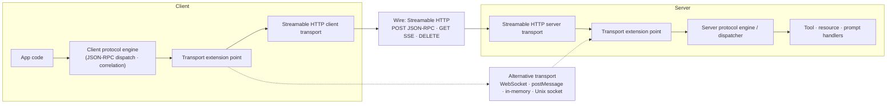

- Solid arrows = actual call/data flow in code.
- Amber nodes = the transport seam (interface, protocol, trait, duck type, or stream pair). Swapping the concrete transport implementation here substitutes a different carrier.
- Dashed arrows = substitution: an alternative transport implements the same seam and is injected at the same call site.

## Summary

| SDK | Client seam | Client injection | Server seam | Server injection | Shipped custom-transport precedents |
| --- | --- | --- | --- | --- | --- |
| TypeScript | `Transport` interface | `client.connect(transport)` | same `Transport` interface | `server.connect(transport)` (v1) / `PerRequestHTTPServerTransport` in `createMcpHandler` (v2) | `PostMessageTransport` (ext-apps), `InMemoryTransport` |
| Python | `Transport` protocol → `(read_stream, write_stream)` | `Client(server=transport)` / `ClientSession(read_stream, write_stream)` | stream pair consumed by `JSONRPCDispatcher` / `serve_loop` | `serve_loop(server, streams)`; modern per-request handler | WebSocket (removed in v2), in-process direct dispatcher pair |
| Java | `McpClientTransport` | `McpClient.sync/async(transport)` | `McpStreamableServerTransportProvider` | `McpServer.sync/async(provider)` | `StdioClientTransport`, `McpStatelessServerTransport`, legacy SSE |
| Kotlin | `Transport` interface | `Client.connect(transport)` | same `Transport` interface | `Server.createSession(transport)` | `WebSocketClientTransport`, `ChannelTransport`, `InMemoryTransport` |
| C# | `IClientTransport` | `McpClient.CreateAsync(transport)` | `ITransport` | `McpServer.Create(transport, …)` (ASP.NET handler constructs HTTP transport directly) | `StreamClientTransport`/`StreamServerTransport`, `StdioClientTransport` |
| Go | `mcp.Transport` | `client.Connect(ctx, transport)` | same `mcp.Transport` | `server.Connect(ctx, transport)` | `InMemoryTransport`, `StdioTransport`, custom-transport example |
| PHP | client `TransportInterface` | `Client::connect($transport)` | server `TransportInterface` | `Server::run($transport)` | `InMemoryTransport`, `StdioTransport` |
| Ruby | duck type `send_request(request:)` | `MCP::Client.new(transport:)` | `MCP::Transport` base (coupled) | transport ctor `super(server)` → `server.transport = self` | documented `CustomTransport` duck type (client) |
| Rust (rmcp) | `Transport` trait / `IntoTransport` | `client_info.serve(transport)` | same `Transport` trait | `serve_server(service, transport)`; `OneshotTransport` for stateless HTTP | `SinkStreamTransport`, `AsyncRwTransport`, in-process `WorkerTransport`, `UnixSocketHttpClient` |
| Swift | `Transport` protocol (byte-level) | `Client.connect(transport:)` | same `Transport` protocol | `Server.start(transport:)` | `NetworkTransport` (Apple Network), `InMemoryTransport`, documented `MyCustomTransport` |

---

## TypeScript

- **Version:** v2 packages @ 2.0.0, main @ 3924de99 (2026-08-18). Two coexisting serving paths: v2 `createMcpHandler` (per-request transport, blessed) and v1 `WebStandardStreamableHTTPServerTransport` (connection-oriented, still exported).
- **Wire:** single endpoint URL. POST carries every JSON-RPC message (`Content-Type: application/json`, `Accept: application/json, text/event-stream`, legacy `Mcp-Session-Id`, `MCP-Protocol-Version`, SEP-2243 body-derived `mcp-protocol-version`/`mcp-method`/`mcp-name`). Responses: 200 SSE (`event: message` / `data: <JSON>` frames, optional `id:`/`retry:`) or 200 `application/json`; 202 for notification-only POSTs. Legacy era: standalone GET SSE stream + DELETE session termination. Modern era (2026-07-28): POST-only, stateless, no session header.

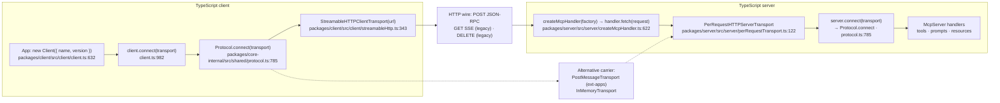

- **Seam:** `Transport` interface — `start()`, `send(message, options?)`, `close()`, callbacks `onclose`/`onerror`/`onmessage` — at `packages/core-internal/src/shared/transport.ts:107`. Injected at `Protocol.connect(transport)` (protocol.ts:785) from both `Client.connect` and `McpServer.connect`; v2's per-request path constructs `PerRequestHTTPServerTransport` and calls the same `server.connect(transport)` (invoke.ts:61-66). Proof the seam works: `PostMessageTransport` (modelcontextprotocol/ext-apps, src/message-transport.ts:46) implements this exact interface over `window.postMessage` with no HTTP anywhere.

---

## Python

- **Version:** mcp v2, main @ 57394b0 (2026-08-20). Client field is named `server=` — a custom `Transport` instance goes in `Client(server=…)`; a URL string selects Streamable HTTP. Server is Starlette/ASGI + uvicorn only.
- **Wire:** single endpoint (default `/mcp`). Client POSTs one JSON-RPC message (`Content-Type: application/json`, `Accept: application/json, text/event-stream`, `mcp-session-id` legacy, `mcp-protocol-version`, per-message `mcp-method`/`mcp-name`/`Mcp-Param-*`). Response `application/json`, or SSE `event: message` / `data: <JSON>` frames. Legacy: GET standalone SSE + `Last-Event-ID` replay + DELETE. Modern (2026-07-28): stateless POST-only, 405 otherwise, response-stream close = cancellation.

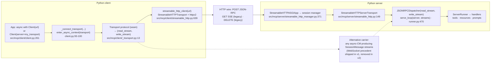

- **Seam:** client = `Transport` protocol (`src/mcp/client/_transport.py:13`): async context manager yielding `TransportStreams = (ReadStream, WriteStream)` of `SessionMessage`, handed to `JSONRPCDispatcher` (client.py:97-98). Server = no public `Transport` protocol, but `serve_loop(server, read_stream, write_stream, …)` (runner.py:470) accepts any read/write stream pair — `StreamableHTTPServerTransport.connect()` is just the HTTP realization of that pair. Substituting a carrier = implementing the async-CM stream pair (or, on the server, any stream pair feeding the dispatcher).

---

## Java

- **Version:** java-sdk main, pom 2.1.0-SNAPSHOT (post-2.0 session refactor); reactive (Project Reactor). Streamable HTTP is session-oriented: POST per message, GET SSE listening stream, DELETE termination, `Last-Event-ID` resumption.
- **Wire:** single URL, default `/mcp`. POST with `Accept: application/json, text/event-stream`, `Content-Type: application/json; charset=utf-8`, `Mcp-Session-Id` (after initialize), `MCP-Protocol-Version`. Initialize → 200 JSON + `Mcp-Session-Id` response header; responses/notifications → 202; requests → 200 SSE (`event: message` / `data: <JSON>`). GET → SSE listening stream; DELETE → session termination.

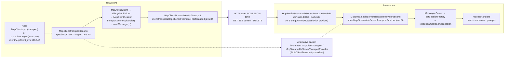

- **Seam:** client = `McpClientTransport` (`spec/McpClientTransport.java:20`, extends `McpTransport` with `connect(handler)`, `sendMessage`, `unmarshalFrom`, `protocolVersions`) — injected at `McpClient.sync/async(transport)`. Server = `McpStreamableServerTransportProvider` (`spec/McpStreamableServerTransportProvider.java:36`) — injected at `McpServer.sync/async(provider)`; `McpAsyncServer` installs `DefaultMcpStreamableServerSessionFactory` on it (McpAsyncServer.java:186-188) to create per-client session/transport pairs. `HttpClientStreamableHttpTransport`/`HttpServletStreamableServerTransportProvider` are just two implementations. Migration guide documents custom implementors (`MIGRATION-2.0.md`).

---

## Kotlin

- **Version:** kotlin-sdk main @ 815a70e (2026-08-20); multiplatform, Ktor 3.5.2. Server DSLs default to `enableJsonResponse = true` (JSON mode); stateful SSE needs `StreamableHttpServerTransport(Configuration(enableJsonResponse = false))`.
- **Wire:** single endpoint (default `/mcp`). POST with `Content-Type: application/json`, `Accept: application/json, text/event-stream`, `mcp-session-id`, `mcp-protocol-version`, `Mcp-Method`, `Mcp-Name`. Responses: SSE (`event: message`, `id:`, `retry:`, `data: <JSON>`) or JSON (single object or batch array); 202 for notifications. GET standalone SSE + `Last-Event-ID`; DELETE termination.

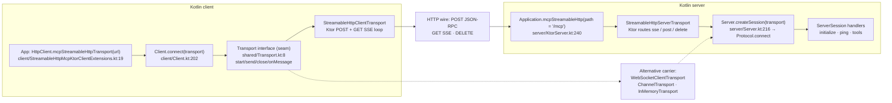

- **Seam:** `Transport` interface (`shared/Transport.kt:8`): `start()`, `send(message, options?)`, `close()`, `onClose/onError/onMessage`. Client and server both funnel through `Protocol.connect(transport)` (Protocol.kt:369-430) — client via `Client.connect(transport)` (Client.kt:202), server via `Server.createSession(transport)` (Server.kt:216) → `ServerSession.connect(transport)`. Kotlin already ships the proof: `WebSocketClientTransport`/`WebSocketMcpServerTransport`, `ChannelTransport` (coroutine channels), `InMemoryTransport`.

---

## C #

- **Version:** csharp-sdk main @ 609499b (2026-08-19). No `McpClientFactory` — the seam is the static `McpClient.CreateAsync(IClientTransport, …)`. Client default `HttpTransportMode.AutoDetect` (Streamable HTTP first, SSE fallback). v2 (2026-07-28 stateless) is default; stateful pieces carry `[Obsolete]` markers.
- **Wire:** endpoint from `HttpClientTransportOptions.Endpoint`. POST with `Accept: application/json, text/event-stream`, `MCP-Protocol-Version`, `Mcp-Session-Id` (stateful), `Last-Event-ID`, `Mcp-Method`, `Mcp-Name`, `Mcp-Param-*`. Response JSON or SSE (`data:` per message); 202 for notifications. Stateful: GET SSE for unsolicited messages; DELETE termination.

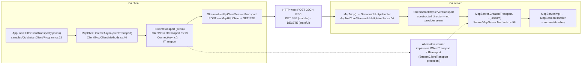

- **Seam:** client = `IClientTransport` (`Client/IClientTransport.cs:18`: `Name`, `ConnectAsync() → ITransport`) injected at `McpClient.CreateAsync`. Server = `ITransport` (`Protocol/ITransport.cs:26`: `SessionId`, channel-backed `MessageReader`, `SendMessageAsync`) injected at `McpServer.Create(ITransport, …)`. Note the asymmetry: the ASP.NET integration (`WithHttpTransport`/`StreamableHttpHandler`) constructs `StreamableHttpServerTransport` directly with no provider abstraction — the generic server seam is `McpServer.Create` itself. `StreamClientTransport`/`StreamServerTransport` already make arbitrary .NET `Stream` pairs work as a carrier.

---

## Go

- **Version:** go-sdk main @ 3d6450f (2026-08). No `NewStreamableHTTPClient`/`NewStreamableHTTPServer` — the client transport is the struct `StreamableClientTransport`, the server is the `http.Handler` `StreamableHTTPHandler`.
- **Wire:** single URL. POST every JSON-RPC message (`Content-Type: application/json`, `Accept: application/json, text/event-stream`, `Mcp-Protocol-Version`, `Mcp-Session-Id` when stateful, SEP-2575 `Mcp-Method`/`Mcp-Name`/`Mcp-Param-*`). Responses: 202 (notifications), 200 JSON, or 200 SSE (`event: message`, `id: <streamID>_<idx>`, `data: <JSON>`). GET standalone SSE + `Last-Event-ID`; DELETE termination. Stateless mode: POST only, 405 otherwise.

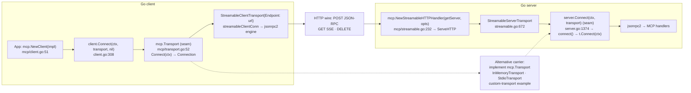

- **Seam:** `mcp.Transport` interface (`mcp/transport.go:52`): single method `Connect(ctx) (Connection, error)`; the returned `Connection` (transport.go:73-94) carries `Read`/`Write`/`Close`/`SessionID`. Injection is direct on both sides: `Client.Connect(ctx, t Transport)` (client.go:308) and `Server.Connect(ctx, t Transport)` (server.go:1374), both through the shared `connect()` helper (transport.go:185-209) that wraps the connection in the `jsonrpc2` engine. Shipped precedents: `NewInMemoryTransports()` (net.Pipe-backed), `StdioTransport`, `IOTransport`, and a full custom-transport example (examples/server/custom-transport/main.go).

---

## PHP

- **Version:** php-sdk main @ c882401 (2026-08-22). Dual-era: `StreamableHttpTransport` serves handshake-era sessions and modern stateless envelopes off one endpoint, classified per request; `StatelessHttpTransport` is a modern-only POST-only PSR-15 handler that is **not** a `TransportInterface`.
- **Wire:** single endpoint. POST JSON-RPC (single or batch) with `Content-Type: application/json`, `Accept: application/json, text/event-stream`, `Mcp-Session-Id` (handshake era), per-message `MCP-Protocol-Version`/`Mcp-Method`/`Mcp-Name`/`Mcp-Param-*`. Response: 200 JSON (single or `[msg,msg]`), 202 empty, or 200 SSE (`event: message` / `data: <JSON>` frames). DELETE + `Mcp-Session-Id` on close. Modern: POST-only, version/capabilities in `params._meta`, `subscriptions/listen` SSE.

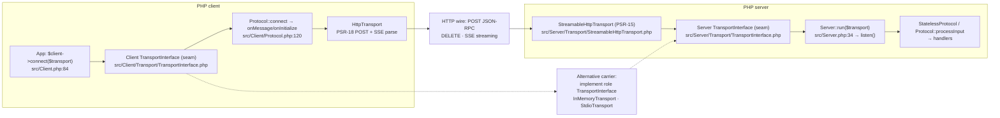

- **Seam:** two deliberately asymmetric, same-named interfaces. Client: `Mcp\Client\Transport\TransportInterface` (`connect`, `send(string)`, `runRequest(\Fiber)`, `close`, callbacks) injected at `Client::connect($transport)` (src/Client.php:84). Server: `Mcp\Server\Transport\TransportInterface` (`initialize`, `listen`, `send(string, array $context)`, `close`, providers/finders) injected at `Server::run($transport)` (src/Server.php:34). PR #160 decoupled both `Protocol` classes from owning the transport — processing methods take the transport as a parameter. Shipped precedents: `InMemoryTransport`, `StdioTransport`.

---

## Ruby

- **Version:** ruby-sdk v1.3.0, main @ 2a31e0b (2026-08-24). Dual-era (SEP-2575): legacy handshake sessions and modern stateless exchanges.
- **Wire:** POST one JSON-RPC 2.0 object (`Content-Type: application/json`, `Accept: application/json, text/event-stream`, `MCP-Session-Id`/`MCP-Protocol-Version` after initialize, `Last-Event-ID` on reconnect). Response: JSON 200/202, or SSE `data: <json>` frames (`SSE_HEADERS`: text/event-stream, no-cache, keep-alive). GET standalone SSE listener; DELETE termination. Modern: POST-only, `_meta` envelope, `server/discover` probe.

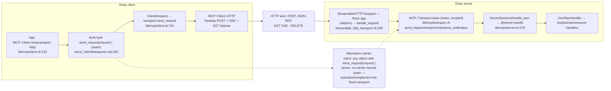

- **Seam:** client = documented duck type: any object implementing `send_request(request:)` (plus optional `send_notification(notification:)`, `connect`, `on_server_request`) injected via the required `transport:` keyword at `MCP::Client.new` (lib/mcp/client.rb:133). Server = `MCP::Transport` base class (`lib/mcp/transport.rb`): subclass must implement `send_response`/`open`/`close`/`send_notification`/`send_request`; the constructor binds itself via `server.transport = self`. **Caveat:** the server side is coupled — `StreamableHTTPTransport` is not just a Transport, it *is* the Rack app (owns `call(env)`, session/stream state, JSON parsing, response building, dispatch). Substituting a server carrier means reimplementing that chain against `MCP::Server#handle`/`ServerSession`; there is no carrier-neutral server transport interface.

---

## Rust (rmcp)

- **Version:** rmcp 3.1.4, main @ 4a738b9 (2026-08-20). Fully migrated to a worker-task model: every transport is a `WorkerTransport<W>` or an adapter over `Sink`/`Stream`/`AsyncRead`/`AsyncWrite`. `ProtocolVersion::LATEST` = 2025-11-25; 2026-07-28 requests are always served statelessly.
- **Wire:** single URL. POST one JSON-RPC message (`Accept: text/event-stream, application/json`, `Mcp-Session-Id` legacy, `MCP-Protocol-Version` + SEP-2243 headers for ≥ 2026-07-28). Responses: 202 (notifications), 200 JSON, or 200 SSE (one message per event, `id:`/`retry:`, priming events). GET SSE + `Last-Event-ID` (legacy); DELETE (legacy). Caps: client SSE event 16 MiB, server body 4 MiB.

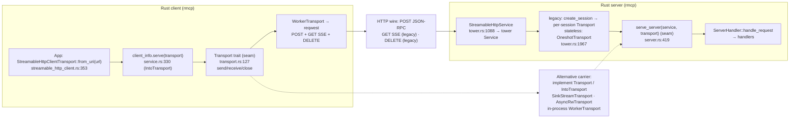

- **Seam:** `Transport` trait (`transport.rs:127`): `send(TxJsonRpcMessage)`, `receive() -> Option<RxJsonRpcMessage>`, `close()` — plus `IntoTransport` (`transport.rs:152`) with blanket impls for `Sink+Stream`, `AsyncRead+AsyncWrite`, `Worker`, and existing `Transport`. Client injection: `client_info.serve(transport)` (service.rs:330, used as `ClientInfo::serve` in examples). Server injection: `serve_server(service, transport)` (server.rs:419) for transport-driven servers; the stateless HTTP path uses `OneshotTransport` per POST (tower.rs:1967). README states any `Transport` implementation can be supplied to `.serve(..)`. Shipped precedents: `SinkStreamTransport`, `AsyncRwTransport`, in-process `WorkerTransport`, `UnixSocketHttpClient`.

---

## Swift

- **Version:** swift-sdk main @ a0ae212 (2026-04-29). No type named `StreamableHTTPClientTransport` — the client is `HTTPClientTransport`; servers are `StatefulHTTPServerTransport` (full streamable spec) and `StatelessHTTPServerTransport` (minimal). Serving is SwiftNIO-based in current main (no Vapor dependency). SSE is Apple-platform-only.
- **Wire:** single endpoint. POST raw JSON-RPC `Data` with `Accept: application/json, text/event-stream`, `MCP-Protocol-Version`, `MCP-Session-Id` (when held), optional `Authorization`. Responses: 200 JSON (stateless) or SSE (`event: message`, `id: <streamID>_<N>`, `data: <JSON>`, `retry:`); 202 for notifications; DELETE → 200. GET standalone SSE + `Last-Event-ID` resumption (stateful).

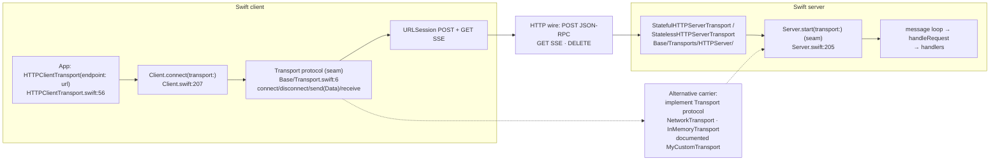

- **Seam:** `Transport` protocol (`Base/Transport.swift:6`): `connect()`, `disconnect()`, `send(_ data: Data)`, `receive() -> AsyncThrowingStream<Data, Error>` — deliberately byte-oriented and JSON-RPC-free (the typed adapter lives above it). Injected at `Client.connect(transport:)` (Client.swift:207) and `Server.start(transport:)` (Server.swift:205). Server-side secondary seam: framework-agnostic `HTTPRequest`/`HTTPResponse` with `handleRequest(_:)` — the SwiftNIO `HTTPHandler` is just one framework adapter. Shipped precedents: `NetworkTransport` (Apple Network, TCP/UDP), `InMemoryTransport`, and README's full `MyCustomTransport` actor example.
