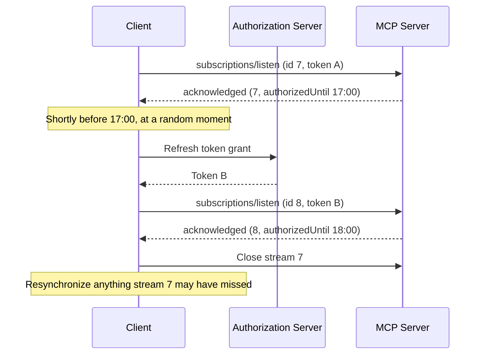

# SEP-XXXX: Authorization Lifetime for Subscription Streams

- **Status**: Draft
- **Type**: Standards Track
- **Created**: 2026-09-29
- **Author(s)**: Ramjot Singh (@RamjotSingh)
- **Sponsor**: None (seeking sponsor)
- **PR**: TBD

## Abstract

MCP authorizes each HTTP request with an access token, but a `subscriptions/listen` stream is one request that can stay open for hours. The specification does not say what happens when the authorization behind a stream expires, is revoked, or stops covering something the stream carries, so a stream opened with a five-minute token can keep delivering change notifications and task results indefinitely.

This SEP introduces the following changes:

- It introduces an `authorizedUntil` as part of the subscription acknowledgment, which informs the client when the stream will be closed, or paused under the companion SEP (paused meaning the connection might not close but no events will be sent).
- When the server closes the stream for token reasons (expiry, revocation, etc.), it informs the exact reason to the client using a new `AuthorizationEnded` error, whose `reason` tells the client whether to refresh its token, involve the user, or stop.
- Makes the subscription call an all-or-nothing call, meaning if the client lacks access to one or more of the resources supplied to be subscribed to, the entire request is denied instead of partially accepted, and the denial names the resources that are not permitted.

The rules apply to every stream, whatever protocol version its client uses. However, older clients might see ordinary disconnects without a reason.

A companion SEP, [Subscription Lifecycle][sep-lifecycle], will let clients that opt in keep a stream across deadlines.

## Motivation

### Streams outlive the authorization they were opened with

The authorization specification requires an access token on every HTTP request, requires servers to reject expired tokens with `401 Unauthorized` ([Authorization: Access Token Usage][auth-token-usage]), and recommends short-lived access tokens "to reduce the impact of leaked tokens" ([Authorization Security Considerations: Token Theft][auth-token-theft]).

`subscriptions/listen` sits outside both rules. It is "a single long-lived POST-response stream" ([2026-07-28 changelog][changelog]), so its token is checked once, when the stream opens, and the specification sets no lifetime for it. The server "delivers `notifications/resources/updated` on the resulting stream whenever a watched resource changes" ([Resources: Subscriptions][resources-subs]). The TypeScript SDK checks the token in middleware when the stream opens, and then delivers every change that matches the acknowledged filter ([TypeScript SDK: listen router][ts-listen-router]). As a result:

- A stolen five-minute token can open a stream that keeps receiving change signals for as long as the connection holds.
- After access is revoked, `notifications/resources/updated` keeps revealing when resources change that the principal can no longer read.
- With the Tasks extension, `notifications/tasks` carries complete task results on the same stream ([SEP-2663: Task Status Notifications][sep-2663-notifications]).

HTTP cannot carry the missing signal. A stream's status line and headers are sent when it starts, so a server cannot answer an open stream with `401`. The only channel left is a JSON-RPC message on the stream.

While servers can disconnect for any reason of their choosing, the existing specification does not clarify that token lifetime should be considered as part of closure of the stream itself. This SEP clarifies the behavior of the server and client when the authorization behind a stream expires, is revoked, or stops covering something the stream carries.

### Clients cannot tell what a closed stream means

A server that enforces a lifetime today can only close the stream, with the completion result or with no response at all ([Subscriptions: Graceful Closure][subs-graceful]). The client cannot tell whether it needs a fresh token, the user's help, or nothing. It reconnects, is rejected with `401` or `403`, and only then learns what is needed. When access is gone for good, it may keep retrying, or keep prompting the user.

## Specification

The key words "MUST", "MUST NOT", "REQUIRED", "SHALL", "SHALL NOT", "SHOULD", "SHOULD NOT", "RECOMMENDED", "NOT RECOMMENDED", "MAY", and "OPTIONAL" in this document are to be interpreted as described in BCP 14 ([RFC 2119][rfc2119], [RFC 8174][rfc8174]) when, and only when, they appear in all capitals.

### 1. Scope

This specification applies to `subscriptions/listen` requests authorized with an MCP access token, which today means requests on Streamable HTTP. It does not apply to stdio, where implementations "SHOULD NOT follow this specification, and instead retrieve credentials from the environment" ([Overview: Auth][overview-auth]). Bounded requests, such as `tools/call`, are out of scope even when their response is streamed; their authorization is evaluated when the request is received. [Section 9](#9-guidance-for-extensions-non-normative) is non-normative guidance for extensions that define long-lived requests of their own.

Everything this specification adds travels in JSON-RPC messages: `authorizedUntil` in the acknowledgment, the `AuthorizationEnded` error, and the refusal of a filter that is not wholly permitted ([section 3](#3-stream-lifetime), rule 5). Their meaning does not depend on the transport. On Streamable HTTP, a server MUST send them with HTTP status `200`, and a client acts on the JSON-RPC message, not on the status. The token errors that the Authorization specification defines over HTTP are unchanged: `401` for a token that is missing, invalid, or expired, and `403` with an `insufficient_scope` challenge for a token that lacks a scope ([Authorization: Error Handling][auth-errors]).

### 2. Definitions

- **Server**: the MCP server together with any intermediary, such as an API gateway, that validates access tokens on its behalf.
- **Stream authorization**: the access token presented on the request that opened a `subscriptions/listen` stream, together with the authorization decisions the server derived from it, such as the principal, the client, and the granted scopes.
- **Acknowledged entry**: a notification type that a stream's acknowledgment enables, or an item in one of its lists, such as a URI in `resourceSubscriptions`.
- **Authorization expiry**: the earlier of (a) the access token's expiry time as known to the server, for example from the `exp` claim of a JWT access token ([RFC 9068][rfc9068]) or from token introspection ([RFC 7662][rfc7662]), and (b) any shorter lifetime that the server's authorization policy imposes on stream authorizations.
- **Authorization deadline**: the time until which the stream authorization lets the server deliver notifications: the authorization expiry, or earlier when a new requirement takes effect ([section 3](#3-stream-lifetime), rule 3). The server reports it as `authorizedUntil`.

All times in this specification are RFC 3339 timestamps in UTC ([RFC 3339][rfc3339]).

### 3. Stream lifetime

1. A server MUST NOT write notifications to a stream after the stream's authorization expiry, whatever protocol version the stream's client uses.
2. Before writing a notification, a server MUST check that the stream authorization permits it, applying the access checks it would apply to a request for the same information, and MUST NOT write a notification that fails them. This includes notifications about sub-resources: a `notifications/resources/updated` for a URI below a listed one is dropped, with no other signal to the client, when the principal cannot read that URI. A server MAY cache the results of these checks as it would for requests.
3. When the server's policy comes to require more than the stream authorization provides, such as additional scopes or stronger or more recent authentication, the server MUST NOT write notifications that require it once the requirement takes effect. When the requirement applies to everything the stream carries, the time it takes effect becomes the stream's authorization deadline.
4. A server MUST act on the revocation signals it receives, such as shared-signals events, without undue delay. It is not required to look for revocation: it MAY evaluate a stream's authorization lazily, when it writes a notification and at the authorization deadline. A server that can re-validate tokens, for example by introspection, MAY also do so periodically.
5. When a stream's authorization has been revoked, or no longer permits any of the stream's acknowledged entries, the server MUST end the stream ([section 5](#5-ending-a-stream-for-authorization-reasons)). A server that learns that no entry remains while processing a change to one of them MUST NOT end the stream at that moment, because the end would tell the client that a resource it can no longer read has just changed; it ends the stream at the authorization deadline instead, or at an earlier moment unrelated to the change, such as one that [Subscription Lifecycle][sep-lifecycle] provides. When the authorization no longer permits some of the entries, the server stops writing notifications for those entries, and the stream continues; a server MUST NOT end a stream because its authorization no longer permits part of what the stream carries.

   A stream opens with all of its filter, or not at all. When a `subscriptions/listen` request lists an entry that the request's authorization does not permit, the server MUST NOT acknowledge the rest of the filter. It responds to the request with a `SubscriptionDeniedError` ([section 8](#8-schema-changes)): error code `-32602` (Invalid params), with `data.denied` listing the entries it does not permit, in the form of a `SubscriptionFilter`. No stream opens. The error is an ordinary JSON-RPC error response, the same on every transport; on Streamable HTTP its status is `200`, not `403`. The server sends it whatever protocol version the client uses. This error is for entries the principal may not access. When the token lacks a scope that an entry requires, the server instead responds with the `insufficient_scope` challenge that the Authorization specification defines ([Authorization: Step-Up Authorization Flow][auth-stepup]). The acknowledgment still omits notification types that the server does not support ([Subscriptions: Acknowledgment][subs-ack]).

6. When an intermediary validates access tokens and the component holding the stream cannot see them, the deployment MUST still meet rules 1 to 5 and rule 7. Either the intermediary ends streams itself, or it passes the validated expiry, and any revocation it detects, to the component holding the stream. When no component knows a stream's authorization expiry, the server SHOULD limit each stream authorization to a maximum lifetime by policy, and treat that as the authorization expiry.
7. The server drops the notifications that rules 1 to 3 keep off a stream, unless a mechanism such as [Subscription Lifecycle][sep-lifecycle] lets it hold them for that same stream. It MUST NOT write them to any other stream or subscription.

Servers that end streams for operational reasons, such as shutdown or load balancing, continue to use the completion result described in [Subscriptions: Graceful Closure][subs-graceful].

### 4. The deadline in the acknowledgment

1. The acknowledgment MUST include `authorizedUntil`, the authorization deadline, when the server knows it. The field is part of the acknowledgment every client receives; it is not gated by the filter.
2. `authorizedUntil` MUST NOT be later than the authorization expiry.
3. At the authorization deadline the server stops delivering, and ends the stream with `AuthorizationEnded` ([section 5](#5-ending-a-stream-for-authorization-reasons)) unless a mechanism such as [Subscription Lifecycle][sep-lifecycle] keeps it. A server does not end a stream before its deadline, and does not add jitter to the deadline.

Client and server clocks can disagree. A client that schedules from `authorizedUntil` SHOULD leave a margin. On Streamable HTTP, it MAY also estimate the server's clock from the `Date` header of the response that carried the acknowledgment ([RFC 9110, section 6.6.1][rfc9110-date]).

### 5. Ending a stream for authorization reasons

A stream that ends for authorization reasons ends with one final message: the `AuthorizationEnded` error.

**Server rules**

1. A server ends a stream for authorization reasons at its authorization deadline ([section 4](#4-the-deadline-in-the-acknowledgment)), when its authorization is revoked, and when no acknowledged entry remains ([section 3](#3-stream-lifetime), rule 5). It MUST then send an `AuthorizationEnded` error response to the `subscriptions/listen` request as the last message on the stream, and close the stream. The error replaces the completion result. If the stream can no longer be written, the server closes it without a response.
2. `error.data` carries `reason` (REQUIRED):

   | `reason`                     | Meaning                                                                                                                                          | Client action                                                                                                                                                                       |
   | ---------------------------- | ------------------------------------------------------------------------------------------------------------------------------------------------ | ----------------------------------------------------------------------------------------------------------------------------------------------------------------------------------- |
   | `token_expiry`               | The stream's authorization expired.                                                                                                              | Obtain a fresh token for the same resource and scopes, normally without user interaction, and re-establish the stream.                                                              |
   | `insufficient_authorization` | The server now requires more than the stream authorization provides: additional scopes, stronger or more recent authentication, or other claims. | Re-establish the stream with the current token; the `401` or `403` response says what is required. Meet it, subject to [section 7](#7-user-consent-and-safety), and try again.      |
   | `revoked`                    | The stream's authorization has been revoked, or no acknowledged entry remains, and new credentials from the same grant are not expected to help. | MUST NOT start interactive authorization because of this reason. MAY make one attempt to reopen with a token obtained without user interaction. Report the loss to the application. |

3. While it can still return an HTTP status, a server rejects a request that its token does not authorize with `401` or `403`, as the Authorization specification requires. Once the HTTP response has been committed, it uses `AuthorizationEnded` instead, even if it has not yet sent the acknowledgment. A server MUST NOT use `AuthorizationEnded` when it can still return an HTTP status. The refusal of a filter that is not wholly permitted ([section 3](#3-stream-lifetime), rule 5) does not depend on this: it is a JSON-RPC error, which the server sends instead of the acknowledgment whether or not the response has been committed.
4. A server MUST NOT send `AuthorizationEnded` in response to a request whose protocol version predates the revision that defines it. For such requests it closes the stream without a response, which those clients treat as an unexpected disconnect. Section 3 still applies.
5. A server MUST NOT send `notifications/cancelled` for a stream it ends this way. The error response is the end signal on every transport, as the completion result is. The Cancellation page currently says otherwise; a fix is pending ([#3348][issue-3348]).

```json
{
  "jsonrpc": "2.0",
  "id": 7,
  "error": {
    "code": -32028,
    "message": "Authorization ended",
    "data": { "reason": "token_expiry" }
  }
}
```

**Client rules**

1. The client acts on `reason`, subject to [section 7](#7-user-consent-and-safety), with backoff, jitter, and the retry limits of the step-up flow ([Authorization: Step-Up Authorization Flow][auth-stepup]). It MUST treat an unrecognized `reason` as `token_expiry`.
2. Notifications may have been lost. After its new stream is acknowledged, the client SHOULD resynchronize any state it derives from them, as it would after any unexpected disconnect; for example by listing tools, prompts, or resources again, reading subscribed resources again, or calling `tasks/get` for the tasks it follows.
3. A client that has already opened a new stream in its place SHOULD ignore the error.

A stream can therefore end in three distinguishable ways:

| How the stream ends                  | Meaning                                                                                               | Client action                                                               |
| ------------------------------------ | ----------------------------------------------------------------------------------------------------- | --------------------------------------------------------------------------- |
| Result with `resultType: "complete"` | The server ended the subscription for an operational reason, such as shutdown.                        | MAY open a new stream. The result alone never justifies prompting the user. |
| `AuthorizationEnded` error           | The stream's authorization ended or changed; `reason` says how.                                       | Act on `reason`, open a new stream if appropriate, and resynchronize.       |
| Transport closes with no response    | Unexpected disconnect, or a stream at an older protocol version that ended for authorization reasons. | MAY reconnect.                                                              |

### 6. Re-establishing a stream

A client that wants to keep receiving notifications opens a new `subscriptions/listen` stream with the same filter when its stream ends, or shortly before.

1. The client obtains credentials as the reason requires ([section 5](#5-ending-a-stream-for-authorization-reasons)). Before the deadline, the reason is `token_expiry`.
2. A client SHOULD obtain at most one new token per superseded token, and SHOULD use it for every stream authorized by the superseded token. Concurrent refreshes can trigger the reuse detection that applies to rotated refresh tokens ([OAuth 2.1, section 4.3.1][oauth21-refresh]), which may revoke the whole grant.
3. For `token_expiry`, the new token MUST outlive the old stream's authorization deadline. A client that cannot obtain such a token (for example, because its authorization server returns a cached token) lets the stream end, then opens a new stream with a new token. If a new stream ends with the same reason shortly after opening, the client MUST back off.
4. Notifications sent between the old stream ending and the new one being acknowledged can be missed. After the new stream is acknowledged, the client SHOULD resynchronize the state it depends on ([section 5](#5-ending-a-stream-for-authorization-reasons), client rule 2). If the server refuses the new stream because its authorization no longer permits some of the entries ([section 3](#3-stream-lifetime), rule 5), the client's coverage has changed: it SHOULD report the entries listed in `data.denied` to the application, and MAY open the stream again without them.
5. A client MAY open the new stream before the old one ends, to narrow the gap, choosing the moment at random within the last minute before the deadline, or within the last 10% of the authorization's lifetime if that is shorter, so that streams whose tokens expire together do not all reconnect at once. It MUST NOT have more than one new stream in progress for the same stream, and cancels the old stream once the new one is acknowledged ([Cancellation: Transport-Specific Cancellation][cancel-transport]). This relies on the acknowledgment marking where delivery on the new stream starts, which is proposed in a separate pull request (link to follow). While both streams are open, notifications can be duplicated or arrive out of order, and clients MUST tolerate both. For task notifications, a client MUST NOT move a task back to an earlier `lastUpdatedAt` or out of a terminal status, and SHOULD deduplicate `inputRequests` by key.

### 7. User consent and safety

A `401` answers something the client just did; an error on a stream arrives without any action by the user. A compromised or malicious server could use such errors to prompt the user repeatedly. Clients therefore follow these rules:

1. An error on a stream MUST NOT by itself start interactive authorization. It can only lead the client to send a request, and interactive authorization then follows only from that request's `401` or `403` response, as the Authorization specification defines. Without a user present, or a policy configured in advance, a client MAY only refresh its token for the same resource and the scopes already granted.
2. Before interactive re-authorization that follows an error on a stream, a client MUST get explicit confirmation from the user that names the MCP server and the authorization server. It SHOULD wait until the user next interacts with that server, and SHOULD rate-limit both prompts and silent refreshes.
3. Scope increases requested after such an error SHOULD be limited to what the acknowledged entries need. Clients SHOULD treat a challenge for unrelated scopes as suspect.
4. When a client gives up, because retries are exhausted or credentials cannot be obtained, it MUST report to the application that the subscription was lost and needs action.

### 8. Schema changes

Additions to `schema/draft/schema.ts`:

```typescript
/**
 * A long-lived request ended for authorization reasons: its authorization
 * expired or was revoked, or no longer permits anything the request carries.
 * In the core protocol it is sent as the final response on a
 * subscriptions/listen stream.
 *
 * @category Errors
 */
export const AUTHORIZATION_ENDED = -32028;

/**
 * Why a stream's authorization ended or needs attention. Clients treat
 * unrecognized values as "token_expiry".
 *
 * @category Authorization
 */
export type AuthorizationReason =
  "token_expiry" | "insufficient_authorization" | "revoked" | string;

export interface SubscriptionsAcknowledgedNotificationParams extends NotificationParams {
  // ...existing fields...

  /**
   * The stream's authorization deadline, as an RFC 3339 UTC timestamp.
   * Present when the server knows it.
   */
  authorizedUntil?: string;
}

/**
 * Sent as the final response on a subscriptions/listen stream that the server
 * ends for authorization reasons.
 *
 * @category Errors
 */
export interface AuthorizationEndedError extends Omit<
  JSONRPCErrorResponse,
  "error"
> {
  error: Error & {
    code: typeof AUTHORIZATION_ENDED;
    data: { reason: AuthorizationReason };
  };
}

/**
 * Sent in response to a subscriptions/listen request whose filter lists
 * entries that the request's authorization does not permit. The server opens
 * no stream and sends no acknowledgment.
 *
 * @category Errors
 */
export interface SubscriptionDeniedError extends Omit<
  JSONRPCErrorResponse,
  "error"
> {
  error: InvalidParamsError & {
    data: {
      /**
       * The requested entries that the authorization does not permit.
       */
      denied: SubscriptionFilter;
    };
  };
}
```

`-32028` is provisional: it is the first code in the range reserved for the MCP specification ([Overview: Error Codes][overview-errors]) after the five that [SEP-3415][sep-3415] requests, and the final number is assigned when the SEP is accepted. `SubscriptionDeniedError` uses the existing `-32602` (Invalid params), which every protocol version defines, as `resources/read` does for a resource that does not exist ([Resources: Error Handling][resources-errors]). The documentation of `InvalidParamsError` adds subscriptions to the contexts it lists.

### 9. Guidance for extensions (non-normative)

An extension can define a long-lived request of its own, such as `events/stream` in the Events extension ([SEP-3415][sep-3415]), which delivers the events of one subscription on one request. Such a request outlives its token as `subscriptions/listen` does, and the extension can apply this SEP to it:

- Report the authorization deadline when the request starts, as `authorizedUntil` does in the acknowledgment.
- At the deadline, or when the authorization is revoked, end the request as [section 5](#5-ending-a-stream-for-authorization-reasons) describes: with `AuthorizationEnded` and its reason as the final response. Clients then handle the end of every long-lived request in the same way.
- When the server learns, while processing a change to the request's only target, that the authorization no longer permits that target, end the request at the deadline, or at a moment unrelated to the change, as [section 3](#3-stream-lifetime), rule 5 requires for a stream with no entries left. Ending it at once would tell the client that the target has just changed.
- Apply the consent rules of [section 7](#7-user-consent-and-safety) to that error, and to any similar signal that the extension delivers over its own channels, such as a webhook.

A subscription that the server holds without an open request, such as a webhook subscription, also outlives the token that created it. [Subscription Lifecycle][sep-lifecycle], in its guidance for extensions, describes how an extension can bound it.

### 10. Changes to specification documents

- **Subscriptions** (`basic/patterns/subscriptions`): add `authorizedUntil` to the acknowledgment; in Acknowledgment, state that the acknowledgment is never narrowed for authorization reasons, and that a filter listing entries the authorization does not permit is refused with `SubscriptionDeniedError`; add sections on stream lifetime and on ending a stream for authorization reasons; in Graceful Closure, state that ends for authorization reasons use the error instead of the completion result.
- **Resources** (`server/resources`): in Subscriptions, state that the server checks each `notifications/resources/updated` against the stream's authorization, and drops those for URIs the principal cannot read.
- **Cancellation** ([`basic/patterns/cancellation`][cancel-page]): no change in this SEP, which depends on the fix for [#3348][issue-3348]: only clients send `notifications/cancelled`, and a server ends a stream by responding to it.
- **Authorization** (`basic/authorization`): add a "Long-lived requests" section: the `401` rule applies until the response is committed, after which streams end with `AuthorizationEnded`; and the consent rules of [section 7](#7-user-consent-and-safety).
- **Streamable HTTP** (`basic/transports/streamable-http`): in Receiving Messages, state that the `AuthorizationEnded` error and the refusal of a filter that is not wholly permitted are sent with HTTP status `200`, and that `401` and `403` remain the Authorization specification's token errors.
- **Overview** (`basic/index`): add `-32028 AuthorizationEnded` to the error code table.
- **Schema** and **Changelog**: the additions above, and an entry under Major changes, because servers gain a new lifetime requirement.

### 11. Examples

The acknowledgment of a stream whose token expires at 17:00:

```json
{
  "jsonrpc": "2.0",
  "method": "notifications/subscriptions/acknowledged",
  "params": {
    "_meta": { "io.modelcontextprotocol/subscriptionId": 7 },
    "notifications": {
      "resourceSubscriptions": ["file:///project/config.json"]
    },
    "authorizedUntil": "2026-09-28T17:00:00Z"
  }
}
```

A client that reopens the stream before the deadline:



A client that does nothing sees stream 7 end at 17:00 with `AuthorizationEnded` and reason `token_expiry`. A stream whose principal's access is revoked ends at once:

```json
{
  "jsonrpc": "2.0",
  "id": 7,
  "error": {
    "code": -32028,
    "message": "Authorization ended",
    "data": { "reason": "revoked" }
  }
}
```

A request for a stream on `file:///project/config.json` and a resource that the user can no longer read is refused, and no stream opens:

```json
{
  "jsonrpc": "2.0",
  "id": 9,
  "error": {
    "code": -32602,
    "message": "Not permitted",
    "data": {
      "denied": { "resourceSubscriptions": ["file:///hr/case-114.md"] }
    }
  }
}
```

The client can open the stream again on `file:///project/config.json` alone, and tell the application that it no longer receives changes to the other resource.

## Rationale

### Bound stream lifetime with a MUST

An access token's expiry bounds the authorization it carries. OAuth does not say whether a response already in flight may continue past that point, but for a stream that keeps delivering new information the answer has to be no: a notification written after the token expires reaches a client that is no longer authorized to receive it. The specification relies on short-lived tokens to limit the damage of a leaked token, and a stream that outlives its token removes that protection for the data most likely to be sensitive: change signals and task results.

The rule therefore applies to every stream. Ending an older client's stream is not a new restriction; it is the minimum a correct server must do. Binding only newer protocol versions would not work anyway, because a stolen token could open a stream that declares an older version. The cost, for clients that re-establish, is one reconnection per token lifetime, which the deadline in the acknowledgment makes predictable. [Subscription Lifecycle][sep-lifecycle] removes that cost for clients that opt in.

### Check each notification, lazily

Streams do not change the authorization model. Applying to each notification the checks the server would apply to a request for the same information keeps sub-resources with their own permissions, such as a private channel in a team the principal belongs to, out of the stream without ending it. Servers may check lazily, when they write a notification or reach the deadline, because rule 1 bounds how long any stream can outlive its authorization.

### Refuse a filter that is not wholly permitted

The acknowledgment already omits notification types that the server does not support, and could omit entries the principal may not access in the same way. But a client that does not compare the acknowledgment with its request would then believe it is watching resources that it is not, and a client that does compare learns only that something is missing, not why. Refusing the request and naming the entries makes the change explicit, at the cost of one more request. The refusal reveals no more than requests for the same information would, because the server applies the same access checks ([section 3](#3-stream-lifetime), rule 2).

The refusal is a JSON-RPC error, so it is the same on every transport. It is not an HTTP `403`. In the Authorization specification, `403` concerns the token, and with `insufficient_scope` it asks the client to obtain more scope, which cannot help when the principal may not access a resource at all; and a `403` can lead a client to interactive authorization ([section 7](#7-user-consent-and-safety), rule 1). The error uses `-32602`, which every protocol version defines, so the server refuses clients of every version in the same way. A new code would be defined only by the revision that adopts this SEP, and could not be sent to older clients.

A running stream is treated differently. It keeps the entries that remain, and ends only when none remains, at a moment unrelated to the change ([section 3](#3-stream-lifetime), rule 5), because ending it when a change arrives would tell the client that a resource it can no longer read has just changed. A new request reveals no such timing.

### End with an error, and give reasons

A new `resultType` would break older clients, which "MUST" treat unrecognized result types as invalid ([Overview: ResultType][overview-resulttype]), and a reason on the completion result would be ignored by them. An error response is how JSON-RPC says a request can no longer be served. Gating it on the protocol version leaves older clients on the path they already handle: a close without a response.

Token expiry, a policy change, and revocation call for different client actions: refresh without the user, involve the user, or stop. Without reasons, clients would refresh when that cannot help, prompt users who have withdrawn consent, and retry revoked access in a loop.

### Signal in JSON-RPC, and leave token errors to the Authorization specification

MCP is transport-agnostic: its message patterns mean the same on every transport. Every signal this SEP adds is therefore a JSON-RPC message, and none depends on an HTTP status. HTTP could not carry the end of a stream anyway: once a stream has started, its status line and headers have been sent.

Token errors are the exception. The Authorization specification defines them over HTTP: `401` for a token that is missing, invalid, or expired, and `403` with an `insufficient_scope` challenge for a token that lacks a scope. Gateways that validate tokens send them without reading the JSON-RPC message, and clients already act on them, so this SEP leaves them unchanged and uses them only for what they mean: the token needs attention. Replacing them would change the Authorization specification for every request, not only for subscriptions.

The error on a stream says that credentials need attention, and why. The `401` or `403` response to the client's next request says exactly what is required, in a `WWW-Authenticate` challenge that clients already handle ([RFC 6750, section 3][rfc6750-3]). Carrying challenges in the error would duplicate that channel, need validation rules of its own, and let a server ask for credentials outside any request.

### Use an absolute deadline

MCP represents points in time as RFC 3339 timestamps, such as `createdAt` and `lastUpdatedAt` in the Tasks extension. A relative duration drifts with every hop, and is ambiguous once a message has been queued. Clients allow for clock skew with a margin, and on Streamable HTTP can estimate it from the `Date` header.

### Put it in the core protocol

`subscriptions/listen` and the Authorization specification are core, and the lifetime rule is a security property of a core primitive. As an optional extension it would protect nothing by default, and the error code must come from the range reserved for the core specification.

### Prior art

- **Microsoft Graph** sends a `reauthorizationRequired` lifecycle notification because "your access token might expire before your subscription", and pauses delivery until the application re-authorizes ([Graph lifecycle notifications][graph-lifecycle]).
- **Slack Socket Mode** reports `approximate_connection_time` when a connection opens, and warns about ten seconds before it closes one ([Slack Socket Mode][slack-socket]).
- **Microsoft Entra Continuous Access Evaluation** and the **OpenID Shared Signals Framework** let resource servers act on revocation before a token expires.

### Alternatives considered

- **Close the stream with no signal.** Uses existing machinery, but the client learns what it needs only by failing a request.
- **Reuse `notifications/cancelled` with a reason string.** The reason is free text for logging, and servers end streams by responding to them ([#3348][issue-3348]).
- **Rely only on clients refreshing early.** Tells the client nothing about revocation or new policy, and places no limit on what a server delivers after expiry.
- **End the stream when access to part of it is lost.** Turns a permission change on one resource into a disconnect for all the others, and loops when the loss is finer than an acknowledgment can express.
- **Carry `WWW-Authenticate` challenges in the error.** See above.
- **Acknowledge the permitted part of a filter.** The client may not notice what is missing, and cannot tell why. See [Refuse a filter that is not wholly permitted](#refuse-a-filter-that-is-not-wholly-permitted).
- **Refuse a filter with HTTP `403`, or with a new error code.** See the same section.
- **Reuse `Forbidden` from the Events extension.** [SEP-3415][sep-3415] requests `Forbidden` (`-32024`) as a general-purpose code for reuse across MCP, and uses it both to refuse a subscription that is not permitted and to end one whose access was revoked. One code would merge two signals that do different jobs here: a refusal names the entries that are not permitted, so that the client can ask again without them, and the end of a stream gives a reason that tells the client whether to refresh, involve the user, or stop. A new code also exists only from the revision that defines it, so a server could not send it to the clients of earlier versions that this SEP's refusal has to reach; SEP-3415 itself leaves open whether its codes should be `InvalidParams` with typed `data` instead. [Section 9](#9-guidance-for-extensions-non-normative) describes how an extension's long-lived requests can use this SEP's signals instead.

## Backward Compatibility

The wire changes are additive: an optional acknowledgment field, a new error code sent only in response to requests at the protocol version that defines it, and `data.denied` on the existing `-32602` error.

The behavior in [section 3](#3-stream-lifetime) is new: servers stop delivering at authorization expiry, ending the streams of older clients at that point, check each notification against the stream's authorization, and refuse a filter that lists entries the authorization does not permit. This is deliberate. A stream that keeps delivering after its token expires, or that keeps reporting changes to resources its principal can no longer read, is delivering data its client is not authorized to receive, whatever protocol version the client speaks.

An older client sees its stream close without a response, which the Subscriptions pattern describes as an unexpected disconnect that the client MAY treat as a trigger to reconnect. A client that reconnects presents its current token; if that token has expired, it receives `401` and runs its normal refresh. Clients that treat every disconnect as final lose their subscription once per token lifetime. That is the cost of not delivering data beyond its authorization. An older client whose filter lists an entry it may not access receives `-32602` instead of an acknowledgment: an ordinary request error, which it can handle without understanding `data.denied`.

A newer client talking to an older server sees no `authorizedUntil`, and falls back on the `expires_in` value from its token response. stdio is unaffected.

## Security Implications

- **What this changes.** Streams stop delivering notifications, including task results, once their authorization is known to have expired or detected to have been revoked, and never deliver a notification that the principal could not obtain with a request. The guarantee is bounded by what the deployment knows ([section 3](#3-stream-lifetime), rules 4 and 6).
- **Revocation latency.** A server that checks lazily, or validates self-contained tokens locally, may not see a revoked token before it expires; loss of access to a resource is still caught at the next notification about it. Deployments that need faster revocation combine short-lived tokens with introspection or a shared-signals feed.
- **User consent.** An error on a stream arrives without any user action. [Section 7](#7-user-consent-and-safety) makes the defenses normative: nothing on a stream starts interactive authorization by itself, any prompt follows from a `401` or `403` to a request the client chose to send, and confirmation names both servers.
- **Clients without a user.** An agent with no user present can only refresh silently. Without a refresh token, which clients must not assume they will receive, its subscription lapses when its token expires, and is reported as lost. Long-lived subscriptions without a user need refresh tokens, client credentials, or the agent identity work on the roadmap.
- **Refresh token rotation.** Concurrent refreshes of a rotated refresh token can look like token theft, and the authorization server may revoke the grant. [Section 6](#6-re-establishing-a-stream), rule 2 has clients refresh once and reuse the result.
- **Reconnect storms.** Clients re-establish at a random moment before the deadline, add jitter, and back off.
- **No credentials on the stream.** The error carries a coarse reason only, never tokens or policy details.
- **Refusals name entries.** A refused `subscriptions/listen` request learns which of the entries it asked for the principal may not access. That is no more than requests for the same information reveal, since the server applies the same access checks ([section 3](#3-stream-lifetime), rule 2).
- **What remains.** A task can keep executing after its caller's authorization has expired or been revoked; this SEP stops only the notifications about it. When a server should stop such a task is an open question in the Tasks extension ([ext-tasks #11][ext-tasks-11]).

## Performance Implications

Per-notification access checks cost what the same checks cost for requests, and can be cached the same way. Servers are not required to poll for revocation. A client that re-establishes pays one new stream, one acknowledgment, and one resynchronization per stream per token lifetime, plus one token refresh shared by the streams that use the token. [Subscription Lifecycle][sep-lifecycle] replaces the new stream with a single update request.

## Reference Implementation

A [prototype][prototype] implements this SEP alone, as one commit on a fork of the TypeScript SDK (branch `poc/authorization-lifetime`); the prototype of [Subscription Lifecycle][sep-lifecycle] is one further commit on top of it. Its server records each stream's authorization deadline and reports it as `authorizedUntil`. When a stream opens, the server checks each entry of the filter through a pluggable access check, and refuses the request with `-32602` and `data.denied` if any entry is not permitted; it then checks every notification through the same check. It stops delivering at the deadline and ends streams with `AuthorizationEnded`, or without a response for clients on older protocol versions. Its client exposes `authorizedUntil` and the end reason. A self-verifying demo that uses only this SEP runs against a toy authorization server issuing 20-second or two-minute tokens. In it, two streams are re-established before their deadline with one refresh; notifications are filtered one by one; a stream that loses its only entry ends at the deadline, not at the change; streams end with each reason; a stream reopened with a resource the user can no longer read is refused, naming that resource, and is reopened without it; step-up follows only a `403`; the client does not prompt when access is gone for good; and an older client's stream closes without a response. The demo also runs today's behavior beside the proposal, through a second server endpoint without it, and writes a wire log grouped by scenario: current and proposed clients with current and proposed servers, each request with its response, and every line the proposal adds marked. The server tests cover each server item in the Testing Plan below, with revocation signalled through a control API instead of introspection, and the demo exercises each client item.

The SDK has no draft protocol revision, so the prototype treats a request as being at the draft version when its client capabilities include `experimental["io.modelcontextprotocol/subscription-lifetime"]`, and sends `-32028` only then.

## Testing Plan

Conformance scenarios, for the [conformance repository][conformance]:

**Server, required**

1. Includes `authorizedUntil` in the acknowledgment when the token's expiry is known, no later than that expiry.
2. Writes no notifications after the token's expiry, within a stated clock tolerance, and ends the stream then with `-32028` and reason `token_expiry`, without sending `notifications/cancelled`.
3. Rejects a new `subscriptions/listen` request carrying an expired token with HTTP `401`, not with `-32028`.
4. For a request that declares an older protocol version, writes nothing after the token's expiry, and closes the stream without a response.
5. Drops a notification about a resource the principal cannot read, and keeps the stream open while other acknowledged entries remain.
6. When the principal loses access to every listed resource, ends the stream with reason `revoked`.
7. Answers a `subscriptions/listen` request that lists a resource the principal cannot read, alongside one it can, with error `-32602` whose `data.denied` lists exactly that resource, sent with HTTP status `200` and without an acknowledgment; acknowledges the same filter without that resource in full.

**Server, recommended**

1. After revocation (in the test harness, introspection returns `active: false`), writes no further notifications and ends the stream with reason `revoked`.

**Client, required**

1. Re-establishes a stream before `authorizedUntil`, using one refresh for all streams that share the token, and resynchronizes.
2. Does not start interactive authorization because of an error on a stream alone.
3. On `revoked`, makes at most one attempt without user interaction, then reports the loss.
4. When a stream it opens again is refused with `data.denied`, reports the entries listed to the application, without prompting the user.

## Open Questions

Each question carries the author's proposed answer.

1. Should the `reason` values be shared with Tasks, for tasks that stop for authorization reasons ([ext-tasks #11][ext-tasks-11])? Proposed: yes. `AuthorizationReason` is defined once here, and the Tasks extension can reuse it for a task that stops because its caller's authorization ended.
2. If Streamable HTTP over stdio lands, as the roadmap proposes, should this SEP apply to stdio? Proposed: yes, for stdio connections that carry MCP access tokens. The rules follow the token, not the transport.

[auth-token-usage]: https://modelcontextprotocol.io/specification/2026-07-28/basic/authorization#access-token-usage
[auth-token-theft]: https://modelcontextprotocol.io/specification/2026-07-28/basic/authorization/security-considerations#token-theft
[auth-stepup]: https://modelcontextprotocol.io/specification/2026-07-28/basic/authorization#step-up-authorization-flow
[auth-errors]: https://modelcontextprotocol.io/specification/2026-07-28/basic/authorization#error-handling
[changelog]: https://modelcontextprotocol.io/specification/2026-07-28/changelog
[subs-graceful]: https://modelcontextprotocol.io/specification/2026-07-28/basic/patterns/subscriptions#graceful-closure
[subs-ack]: https://modelcontextprotocol.io/specification/2026-07-28/basic/patterns/subscriptions#acknowledgment
[resources-subs]: https://modelcontextprotocol.io/specification/2026-07-28/server/resources#subscriptions
[resources-errors]: https://modelcontextprotocol.io/specification/2026-07-28/server/resources#error-handling
[cancel-page]: https://modelcontextprotocol.io/specification/2026-07-28/basic/patterns/cancellation
[cancel-transport]: https://modelcontextprotocol.io/specification/2026-07-28/basic/patterns/cancellation#transport-specific-cancellation
[issue-3348]: https://github.com/modelcontextprotocol/modelcontextprotocol/issues/3348
[overview-auth]: https://modelcontextprotocol.io/specification/2026-07-28/basic/index#auth
[overview-errors]: https://modelcontextprotocol.io/specification/2026-07-28/basic/index#error-codes
[overview-resulttype]: https://modelcontextprotocol.io/specification/2026-07-28/basic/index#result-responses
[sep-2663-notifications]: https://modelcontextprotocol.io/seps/2663-tasks-extension#task-status-notifications
[ts-listen-router]: https://github.com/modelcontextprotocol/typescript-sdk/blob/main/packages/server/src/server/listenRouter.ts
[ext-tasks-11]: https://github.com/modelcontextprotocol/ext-tasks/issues/11
[conformance]: https://github.com/modelcontextprotocol/conformance
[graph-lifecycle]: https://learn.microsoft.com/en-us/graph/change-notifications-lifecycle-events
[slack-socket]: https://docs.slack.dev/apis/events-api/using-socket-mode
[oauth21-refresh]: https://datatracker.ietf.org/doc/html/draft-ietf-oauth-v2-1-13#section-4.3.1
[rfc2119]: https://www.rfc-editor.org/rfc/rfc2119
[rfc8174]: https://www.rfc-editor.org/rfc/rfc8174
[rfc3339]: https://www.rfc-editor.org/rfc/rfc3339
[rfc6750-3]: https://www.rfc-editor.org/rfc/rfc6750#section-3
[rfc7662]: https://www.rfc-editor.org/rfc/rfc7662
[rfc9068]: https://www.rfc-editor.org/rfc/rfc9068
[rfc9110-date]: https://www.rfc-editor.org/rfc/rfc9110#section-6.6.1
[prototype]: https://github.com/RamjotSingh/typescript-sdk/blob/poc/authorization-lifetime/AUTHORIZATION-LIFETIME-PROTOTYPE.md
[sep-lifecycle]: https://github.com/RamjotSingh/transports-wg/blob/sep/subscription-lifecycle/proposals/XXXX-subscription-lifecycle.md
[sep-3415]: https://github.com/modelcontextprotocol/modelcontextprotocol/pull/3415
