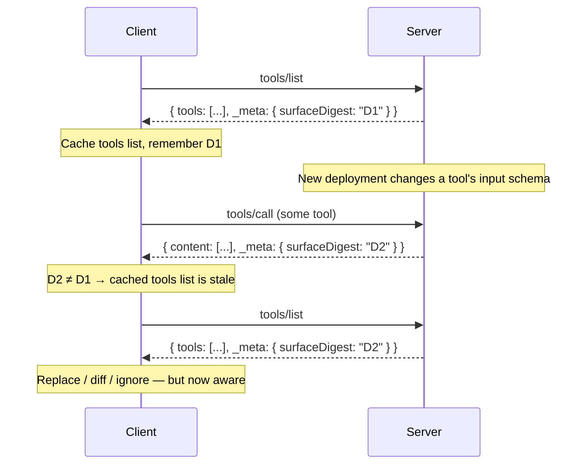

# SEP-XXXX: Deterministic Primitive Surface Digest

- **Status**: Draft
- **Type**: Standards Track
- **Created**: 2026-06-25
- **Author(s)**: Sam Morrow (@SamMorrowDrums)
- **Sponsor**: None (seeking sponsor)
- **PR**: https://github.com/modelcontextprotocol/specification/pull/{NUMBER}
- **Related**: [SEP-2575](https://github.com/modelcontextprotocol/modelcontextprotocol/pull/2575) (Stateless MCP), [SEP-2567](https://github.com/modelcontextprotocol/modelcontextprotocol/pull/2567) (Sessionless MCP), [SEP-2549](https://github.com/modelcontextprotocol/modelcontextprotocol/pull/2549) (TTL for List Results), [SEP-414](https://github.com/modelcontextprotocol/modelcontextprotocol/pull/414) (Request `_meta`)

## Abstract

This SEP adds a deterministic, opaque **surface digest** to the `_meta` of every
server result. The digest is a content hash of the **caller-visible** primitive
surface — the tools, prompts, resources, and resource templates that the
requesting authorization context would currently see. Because it is carried on
_every_ response, any subsequent request (including `tools/call`) lets a
stateless client detect that the surface has changed simply by comparing the new
digest to the last one it saw. When they differ, the client re-fetches the
affected lists.

The mechanism is designed for a stateless-first protocol
([SEP-2575](https://github.com/modelcontextprotocol/modelcontextprotocol/pull/2575),
[SEP-2567](https://github.com/modelcontextprotocol/modelcontextprotocol/pull/2567)).
It does not depend on a long-lived connection, an SSE stream, or
`subscriptions/listen`. Unlike the time-based freshness hint of
[SEP-2549](https://github.com/modelcontextprotocol/modelcontextprotocol/pull/2549),
it is **deterministic**: a new server deployment that changes primitive
definitions, or an external change to the caller's permissions, deterministically
changes the digest, so a client is never silently stuck with a stale list inside
a still-valid TTL window. It is additive and fully backward compatible.

The digest is also **reflectable**: a client MAY echo the digest it is operating
against back to the server in request `_meta`. This turns ordinary requests into
conditional requests — the server can reject a `tools/call` issued against a
stale contract _before executing it_ (returning the new digest), rather than
running a tool whose input or **output schema** has changed underneath the
caller. This gives both sides a deterministic, stateless way to agree on which
version of the surface a request belongs to.

## Motivation

MCP has, today, two ways for a client to learn that a server's primitive surface
has changed:

1. **Push** — `notifications/*/list_changed`, now delivered over the long-lived
   `subscriptions/listen` stream. This requires the client to hold an open
   subscription, which a stateless client by definition does not.
2. **Pull (freshness)** — the `ttlMs` hint from
   [SEP-2549](https://github.com/modelcontextprotocol/modelcontextprotocol/pull/2549).
   This tells a client _how long it may assume the list is fresh_, but it does
   not tell the client _whether the list actually changed_.

Neither mechanism gives a stateless client a **deterministic** answer to the
question "is my cached list still correct?" on an ordinary request. Two real,
common sources of change make this gap concrete, and **neither is MCP internal
session state** — they are facts about the world and the deployment that MCP
should reflect:

- **The server deployment changed.** A new version of a server is rolled out
  that adds, removes, or modifies tools (including changing an input schema or
  description). With TTL alone, a client that fetched the list one second before
  the deploy will keep using the old list for the remainder of its TTL — which
  may be minutes or hours — even though every subsequent call is being served by
  a new deployment with a different surface. The freshness window is, by design,
  non-deterministic with respect to deploys.

- **External authorization changed.** A user gains or loses access to a tool.
  Servers are explicitly permitted to vary the visible set by the authorization
  presented on the request (see `server/tools` in the draft: the set "**MAY**
  vary by the authorization presented on the request"). When a caller's
  entitlements change, the _correct_ visible surface changes, but nothing in the
  current protocol obligates the server to signal this on the caller's next
  request, and a TTL cannot encode it.

- **A running server can violate its own advertised schema.** When a deploy
  changes a tool's `outputSchema` (or `inputSchema`), a client that cached the
  old definition is now planning calls and validating `structuredContent`
  against a contract the live server no longer honors. The server may return
  output that is perfectly valid under its _new_ `outputSchema` but fails the
  client's _old_ one — the server effectively "violates its own schema" from the
  client's point of view. Worse, the model may have chosen arguments based on a
  stale `inputSchema`. There is today no deterministic way for either side to
  notice this mismatch before the call runs and produces a confusing failure or
  an unintended side effect.

In a stateless-first world, no client should have an excuse for operating against
a stale list of primitives. The client should be **able to know, on any
subsequent call**, that the surface it cached no longer matches reality, and then
decide what to do — re-fetch and replace, diff and hide changed primitives for
the session, or deliberately ignore the change. What it must not be is _unaware_.

A deterministic content digest, carried on every response and computed over the
caller-visible surface, closes this gap with a single small, additive field. It
captures all three drivers of change above — deployment changes alter primitive
definitions and therefore the digest; permission changes alter the visible set
and therefore the digest; schema changes are definition changes and therefore
also change the digest — without reintroducing any per-connection session state.

### Operational experience: why the existing mechanisms did not solve this

This SEP is motivated by concrete, first-hand pain operating a large MCP server
(the GitHub MCP server) and wanting to tell users, reliably, that the server's
tools had changed after a deploy. Every avenue available in the current and draft
specs fell short:

1. **We did not want to stand up an SSE GET stream solely for deploy updates.**
   Supporting a long-lived server-to-client channel — and the routing,
   keep-alive, and reconnection machinery it implies — is a large operational
   burden to carry just to announce that a deployment happened. Many clients also
   do not maintain it.

2. **`tools/list_changed` is not universally honored by clients.** Plenty of
   clients never subscribed to or acted on the notification, and the draft's move
   to opt-in `subscriptions/listen` does not change this: a client that does not
   open the stream (the default for a stateless client) suffers the same fate and
   never learns of the change.

3. **Session-ID revocation was supposed to force renegotiation, but bricked the
   server in practice.** The intended design — revoke a session ID so the client
   renegotiates and picks up the new surface — did not work with real clients in
   our testing. A revoked session ID instead left the agent with an MCP server it
   could _no longer access at all_, rather than transparently re-initializing.
   The very statefulness meant to solve the problem became the failure mode.

So the "the server changed, please refresh" problem was, in practice, never
cleanly solved. A stateless, deterministic, pull-based signal that rides on
responses the client is already receiving avoids all three failure modes.

### Why push notifications are especially awkward for scaled deployments

Even where `subscriptions/listen` (or the old GET stream) is supported, using it
to announce a _deployment_ change is operationally awkward at scale, and the
draft's removal of the session ID makes it harder, not easier:

- A deploy-driven `tools/list_changed` must reach the specific connected
  client(s) affected. Without a session ID to identify and address a connection,
  the server must either route the notification to the right open connection via
  some out-of-band message queue, or broadcast to _all_ connected clients.
- In a horizontally scaled fleet, the connection that should receive the
  notification may be held by a _different_ instance than the one that knows
  about the change, requiring cross-instance fan-out infrastructure purely to
  deliver "we deployed."
- During a rolling deploy, different instances cut over at different times, so
  the "list changed" event is genuinely fuzzy: there is no single instant at
  which the fleet's surface changed. Pushing a discrete notification for a
  gradual, racy condition is hard to reason about for everyone involved.

A digest carried on every response sidesteps all of this. There is nothing to
route and nothing to broadcast: each instance simply stamps each response with
the digest of the surface _it_ is serving, and the client compares. The mechanism
is correct without any cross-instance coordination, and it represents a rolling
deploy honestly (the client may observe the digest oscillate while instances
drain) rather than pretending there was one atomic change event.

## Specification

### Overview

Servers attach a deterministic digest of the **caller-visible primitive surface**
to the `_meta` of every result. Clients retain the last digest seen for a given
`(server, authorization context)` and compare it on each response. A change means
"re-fetch the affected lists."

### New `_meta` keys on results

Two reserved MCP `_meta` keys are defined on the result `_meta` object. Both use
the reserved `io.modelcontextprotocol/` prefix.

| Key                                         | Type     | Presence                                   | Meaning                                                                |
| ------------------------------------------- | -------- | ------------------------------------------ | ---------------------------------------------------------------------- |
| `io.modelcontextprotocol/surfaceDigest`     | `string` | REQUIRED when the capability is advertised | Opaque digest of the entire caller-visible primitive surface.          |
| `io.modelcontextprotocol/surfaceComponents` | `object` | OPTIONAL                                   | Per-kind digests, letting a client pinpoint which list(s) to re-fetch. |

`surfaceComponents`, when present, is an object whose keys are primitive kinds
and whose values are opaque per-kind digests:

```json
{
  "_meta": {
    "io.modelcontextprotocol/surfaceDigest": "sha256:0f1c…9ab2",
    "io.modelcontextprotocol/surfaceComponents": {
      "tools": "sha256:7d2e…11c0",
      "prompts": "sha256:e3aa…0042",
      "resources": "sha256:b910…77fe",
      "resourceTemplates": "sha256:c004…1a9d"
    }
  }
}
```

#### Schema change (TypeScript)

A `ResultMetaObject` is introduced, mirroring the existing `RequestMetaObject`,
and is used as the type of `Result._meta`:

```typescript
/**
 * Extends {@link MetaObject} with result-specific protocol metadata. All key
 * naming rules from `MetaObject` apply.
 *
 * @see {@link MetaObject} for key naming rules and reserved prefixes.
 * @category Common Types
 */
export interface ResultMetaObject extends MetaObject {
  /**
   * An opaque, deterministic digest of the primitive surface visible to the
   * authorization context that made this request — i.e. the tools, prompts,
   * resources, and resource templates that `tools/list`, `prompts/list`,
   * `resources/list`, and `resources/templates/list` would currently return
   * to this caller.
   *
   * Clients MUST treat this value as opaque and compare it only for equality.
   * A value that differs from the previously observed digest for the same
   * server and authorization context indicates the surface has changed and
   * cached lists SHOULD be re-fetched before next use.
   *
   * Servers that advertise the `surfaceDigest` capability MUST include this
   * field on every result.
   */
  "io.modelcontextprotocol/surfaceDigest"?: string;

  /**
   * Optional per-kind digests, allowing a client to determine which specific
   * list(s) changed without diffing. Each value is opaque and compared only
   * for equality. When present, the aggregate `surfaceDigest` MUST change
   * whenever any component digest changes.
   */
  "io.modelcontextprotocol/surfaceComponents"?: {
    tools?: string;
    prompts?: string;
    resources?: string;
    resourceTemplates?: string;
  };
}
```

The base `Result._meta` is retyped from `MetaObject` to `ResultMetaObject`. This
is type-compatible: `ResultMetaObject extends MetaObject`, and existing servers
that omit the keys remain valid.

#### Capability advertisement

Support is advertised in `ServerCapabilities` (returned by `server/discover`) so
that the _absence_ of a digest on a response is unambiguous:

```typescript
export interface ServerCapabilities {
  // … existing fields …

  /**
   * Present if the server emits a deterministic primitive surface digest on
   * every result. When advertised, every result's `_meta` MUST carry
   * `io.modelcontextprotocol/surfaceDigest`.
   */
  surfaceDigest?: {
    /**
     * Present if the server also emits per-kind digests under
     * `io.modelcontextprotocol/surfaceComponents`.
     */
    components?: {};
  };
}
```

If a server advertises `surfaceDigest`, it **MUST** include
`io.modelcontextprotocol/surfaceDigest` on **every** result it returns,
including `tools/call` results (success and tool-execution-error results),
`resources/read` results, and all `*/list` results. This "always present"
guarantee is what lets a client distinguish "unchanged" (digest present and
equal) from "not supported" (capability absent).

### Server requirements (determinism)

The digest is the load-bearing contract of this SEP, so its computation is
constrained:

1. **Pure function of the visible surface.** The digest **MUST** be computed
   solely from the set of primitives visible to the request's authorization
   context. It **MUST NOT** incorporate non-deterministic inputs such as
   timestamps, random salts, request IDs, per-instance identifiers, or internal
   map iteration order.

2. **Cross-instance stability.** All instances of a deployment serving the same
   visible surface to the same authorization context **MUST** produce the same
   digest. This is what makes the signal safe during horizontally scaled
   operation: two replicas of the _same_ version do not cause spurious
   invalidation, while a replica of a _new_ version that exposes a different
   surface produces a different digest.

3. **Sensitivity to any observable change.** The digest **MUST** change if any
   visible primitive is added, removed, or modified. "Modified" means any field
   the client can observe — name, title, description, input schema, output
   schema, annotations, URI, MIME type, etc. Hashing only the set of _names_ is
   insufficient: a redeploy that changes a tool's input schema while keeping its
   name **MUST** still change the digest.

4. **Collision resistance.** The digest **MUST** be produced by a
   collision-resistant function so that a changed surface cannot map to an equal
   digest (which would silently hide the change). Servers **SHOULD** use
   SHA-256. Non-cryptographic hashes (CRC, FNV, etc.) **MUST NOT** be used.

5. **Stable across pagination.** Because the digest reflects the entire visible
   surface, it is independent of which page of a paginated list was requested
   and **MUST** be identical across all pages of a consistent snapshot.

#### Recommended computation

To maximize the chance that independent implementations of the same logical
server agree (and so avoid spurious churn behind a load balancer), servers
**SHOULD** compute the digest as follows. Clients never need to know this recipe;
it exists only so server operators and SDKs can interoperate.

1. For each primitive kind, in the fixed order `tools`, `prompts`, `resources`,
   `resourceTemplates`:
   1. Collect the full set of primitives visible to the caller (the union of all
      pages `*/list` would return).
   2. Serialize each primitive's full definition with
      [RFC 8785 JSON Canonicalization](https://www.rfc-editor.org/rfc/rfc8785)
      (sorted keys, no insignificant whitespace).
   3. Sort the canonical strings lexicographically.
   4. The component digest is `SHA-256` over the concatenation of those strings
      with a separator, encoded as `"sha256:" + hex`.
2. The aggregate `surfaceDigest` is `SHA-256` over the concatenation of
   `kind + ":" + componentDigest` for each kind in the fixed order, again
   encoded as `"sha256:" + hex`.

The `"sha256:"` prefix is informational; clients **MUST NOT** parse or depend on
it and **MUST** compare the whole string for equality.

### Client requirements

1. Clients **MUST** treat both digests as opaque, comparing only for equality.
2. A client **SHOULD** retain the last-seen `surfaceDigest` per
   `(server, authorization context)`. The authorization context is part of the
   key because the surface is permission-filtered (see Security Implications).
3. On each response carrying a `surfaceDigest`:
   - If no prior value is retained, record it. This first observation is **not**
     a change.
   - If a prior value exists and the new value **differs**, the client **SHOULD**
     treat its cached `tools`/`prompts`/`resources`/`resourceTemplates` lists as
     stale and re-fetch the affected lists before next use. If
     `surfaceComponents` is present, the client **MAY** re-fetch only the kinds
     whose component digest changed.
   - If the value is **equal**, the surface is asserted unchanged; the client
     **MAY** continue to use its cached lists even if their `ttlMs` has expired
     (see Interaction with TTL).
4. On detecting a change, the client **MAY** replace its active primitives,
   diff and selectively update, surface the change to the user/model, or
   deliberately ignore it — but it is now _aware_, which is the goal.
5. If a server advertised the `surfaceDigest` capability but a response omits the
   field, the client **SHOULD** treat that as a protocol violation and fall back
   to TTL/notification behavior. If the capability was never advertised, the
   client **MUST NOT** infer anything from the field's absence.

### Reflection: conditional requests (client → server)

The digest is most powerful when it flows in _both_ directions. A client MAY
declare, on a request, which surface it believes it is operating against by
including the last digest it observed in the request `_meta`:

| Key                                             | Type     | Direction       | Meaning                                                      |
| ----------------------------------------------- | -------- | --------------- | ------------------------------------------------------------ |
| `io.modelcontextprotocol/expectedSurfaceDigest` | `string` | client → server | The surface digest the client's request was planned against. |

This is an MCP-native, transport-agnostic analogue of an HTTP `If-Match`
precondition. It is **opt-in by the client**: a client that does not include the
field gets exactly the response-side behavior described above.

When a request carries `expectedSurfaceDigest`, the server **MAY** compare it to
the digest of the surface it would currently serve the caller:

- If they **match**, the server processes the request normally.
- If they **differ**, the server **MAY** short-circuit and decline to process the
  request against a contract the client no longer shares, returning a
  `SurfaceChangedError` (below) that carries the current digest. The server
  **MAY** instead choose to process the request anyway (e.g., for a read-only or
  version-tolerant operation); reflection is an enabler, not an obligation.

Servers **SHOULD** apply this precondition most aggressively to `tools/call`,
where executing under a changed `inputSchema`/`outputSchema` risks unintended
side effects or output the client cannot validate. Because the check happens
_before_ execution, the server **terminates a stale call early** instead of
running a tool whose contract has drifted. The error gives the harness a
deterministic, machine-readable signal to re-fetch the surface, re-plan, and
re-prompt the model with the updated contract — exactly the "the server changed,
redirect the model" behavior that is otherwise impossible to deliver
statelessly.

#### New error: `SurfaceChangedError`

```typescript
/**
 * Error code returned when a request carried an
 * `io.modelcontextprotocol/expectedSurfaceDigest` that does not match the
 * surface the server would currently serve the caller, and the server elected
 * to reject rather than process the request against a changed contract.
 *
 * Analogous to HTTP 412 Precondition Failed. The client SHOULD re-fetch the
 * affected lists, re-plan against the new surface, and retry with a new
 * JSON-RPC id.
 */
export const SURFACE_CHANGED = -32005;

export interface SurfaceChangedError extends Omit<Error, "code" | "data"> {
  code: typeof SURFACE_CHANGED;
  data: {
    /**
     * The digest of the surface the server would currently serve this caller.
     * The client SHOULD adopt this as its new expected digest after
     * re-fetching.
     */
    "io.modelcontextprotocol/surfaceDigest": string;
  };
}
```

A client that receives `SurfaceChangedError` **MUST NOT** silently retry the
identical request; it **SHOULD** re-fetch the affected lists, re-plan, and (if
still appropriate) retry with the updated arguments and a **different** JSON-RPC
`id`, consistent with the existing tool-call retry rule. To avoid retry loops
during a rolling deploy, clients **SHOULD** bound retries and **MAY** fall back
to issuing the call without `expectedSurfaceDigest` once they have re-synced.

```mermaid
sequenceDiagram
    participant H as Harness/Model
    participant C as Client
    participant S as Server

    C->>S: tools/call (name, args) + expectedSurfaceDigest "D1"
    Note over S: Live surface is now "D2" (deploy / perms change)
    S-->>C: error SurfaceChangedError { data.surfaceDigest: "D2" }
    Note over C: Stale contract — do not run against D1
    C->>S: tools/list  (re-sync)
    S-->>C: { tools: [...], _meta: { surfaceDigest: "D2" } }
    C->>H: surface changed; updated tool contract
    H->>C: re-planned call (new args)
    C->>S: tools/call (name, args') + expectedSurfaceDigest "D2"
    S-->>C: { content: [...], _meta: { surfaceDigest: "D2" } }
```

### Interaction with TTL (SEP-2549)

The digest and `ttlMs` are complementary, and together they give the client
HTTP-style conditional semantics:

- `ttlMs` is the **freshness budget**: how long the client may avoid even looking
  at the digest.
- `surfaceDigest` is the **validator**: an equal digest is a successful
  revalidation (analogous to an HTTP `304 Not Modified`), so the client may keep
  using cached lists past TTL expiry; a different digest is an explicit
  invalidation that overrides a still-fresh TTL.

This directly addresses the determinism gap in TTL: a redeploy that changes
primitives within a fresh TTL window now changes the digest on the very next
response, so the client re-fetches instead of trusting the budget.

### Interaction with list_changed / subscriptions

The digest is the stateless, pull-side equivalent of
`notifications/*/list_changed`:

- A server **MAY** advertise `surfaceDigest` with or without `listChanged`.
- A client holding a `subscriptions/listen` stream gets immediate push
  invalidation; a stateless client gets deterministic change detection on its
  normal request cadence. Both can be used together with no conflict.

### Message flow



## Rationale

### Why a content digest rather than a server version string?

A server version string was considered and rejected as the primary mechanism:

- It does not capture **per-caller** permission filtering. Two callers on the
  same version can have different visible surfaces; one version string cannot
  represent both, but a content digest naturally diverges.
- It is prone to **false churn**: replicas in a fleet may report slightly
  different build metadata, and conversely an unchanged version may serve a
  changed surface after a config-only change. A content digest is exactly stable
  when the surface is stable and changes exactly when it changes.
- It couples change detection to release cadence rather than to the observable
  surface.

Servers MAY still expose a build version via `Implementation.version` for
diagnostics; it is simply not the change-detection signal.

### Why not reuse "ETag"?

The mechanism is intentionally ETag-_like_ — an opaque validator compared for
equality — but a generic `etag` field was rejected:

- ETag as an HTTP header is transport-specific; MCP is transport-agnostic and
  must work over stdio, where no HTTP headers exist. The signal must live in the
  JSON body.
- A generic `etag` field on results would collide with other anticipated uses of
  per-result validators (most obviously per-resource validators for
  `resources/read` revalidation). Overloading one field for "this resource's
  content" and "the whole primitive surface" would be ambiguous. A dedicated,
  clearly named `surfaceDigest` keeps the two concerns separate.

### Why an aggregate digest rather than only per-list digests?

Per-list digests alone were rejected as the _primary_ signal because they reduce
the chance of discovering a change. A response to `tools/call` would naturally
carry only a tools-related digest, so a client would never learn from it that the
_prompts_ list changed. A single aggregate over the whole surface means **any**
response reveals **any** change. Per-kind digests are still valuable for telling
the client _which_ list to re-fetch, so they are offered as an OPTIONAL
refinement (`surfaceComponents`) layered on top of the required aggregate.

### Why deterministic rather than TTL-based?

TTL is a freshness _hint_ and is non-deterministic with respect to the change
drivers this SEP targets (deploys, permission changes, and schema drift). A
digest is an exact, event-aligned signal. The two compose cleanly
(validator + budget) rather than competing.

### Why reflect the digest back on requests?

Response-side detection alone is reactive: the client only learns the surface
changed _after_ it has already issued a call against the stale contract and
received a result. For `tools/call` that is often too late — the tool may have
executed a side effect, or returned `structuredContent` the client now validates
against the wrong `outputSchema`. Letting the client state its expected digest
(`expectedSurfaceDigest`) turns the call into a precondition: the server can
reject _before_ executing, the way HTTP `If-Match` prevents a lost update. This
is the only stateless way to give the server a chance to "terminate stale calls
early" and hand the harness a deterministic cue to re-plan and re-prompt the
model. It is strictly opt-in, so simple clients pay nothing for it.

### Why does this beat push notifications for deployment changes?

For the specific case of "the server was redeployed," a pull-based digest is
easier to reason about than `list_changed` for everyone involved (see Motivation,
"scaled deployments"): there is no connection to address, no message queue to
fan out across instances, and no need to invent a single "change instant" for a
gradual rollout. Each instance stamps the surface it serves; correctness requires
no cross-instance coordination. Notifications remain the right tool for _prompt_,
low-latency invalidation on a connection the client is already holding open; the
digest is the right tool for stateless clients and for deploy-driven change.

### Request bouncing during deploys

During a rolling deploy, old and new replicas may both serve traffic for a
period, so a client may observe the digest oscillate between the old and new
surface as requests land on different instances. This is a _faithful_ reflection
of reality — two surfaces are genuinely live — and resolves to a single value
once the old instances finish draining. This is a deployment/routing concern
(standard connection draining and routing new connections to new instances
addresses it) and is **out of scope** for MCP; it is not MCP internal state. The
deterministic digest does not make this worse and, unlike a TTL, never hides the
fact that the surface is in flux.

## Backward Compatibility

This change is purely additive:

- Servers that do not advertise the capability and omit the keys continue to work
  unchanged. Clients fall back to TTL and/or notifications, which is current
  behavior.
- Clients that do not understand the keys ignore them, as `_meta` permits
  additional properties.
- Retyping `Result._meta` from `MetaObject` to `ResultMetaObject` is
  source-compatible because `ResultMetaObject extends MetaObject` and all new
  keys are optional.
- The request-side `expectedSurfaceDigest` is optional and ignored by servers
  that do not implement reflection, so they simply process the request as today.
  `SurfaceChangedError` uses a new code (`-32005`) that does not collide with any
  existing error.
- No existing field or behavior is modified or removed, and the new capability is
  independently negotiable.

## Security Implications

- **The digest is permission-filtered, hence private.** Because it is computed
  over the _caller-visible_ surface, two authorization contexts generally produce
  different digests. The digest therefore carries the same confidentiality as the
  list contents themselves: it is effectively `cacheScope: "private"` data
  (SEP-2549). Shared or public intermediaries **MUST NOT** share a digest across
  authorization contexts, and clients **MUST** key their retained digest by
  authorization context.

- **The digest is an information channel.** It reveals _that_ a caller's visible
  surface changed and is stable per surface. An intermediary that can observe a
  victim's digests (e.g., a proxy logging `_meta`) could infer permission changes
  or fingerprint a toolset. Servers and intermediaries **MUST** treat digests
  with the same care as the underlying primitive definitions.

- **Collision resistance is security-relevant.** If a non-collision-resistant
  function were used, a server redeploy that swapped a benign primitive for a
  differently-behaving one could, in principle, collide to the same digest and
  hide the change from the client. This is why a cryptographic hash is required.

- **Not an integrity or authenticity mechanism.** The digest is unsigned and only
  helps an _honest_ server signal change. It does not protect against a malicious
  server that lies about (or fails to change) its digest. Clients **MUST NOT**
  treat a stable digest as a security guarantee about server behavior.

- **Reflection narrows a side-effect race.** Echoing `expectedSurfaceDigest` lets
  an honest server refuse a `tools/call` whose `inputSchema`/`outputSchema`
  changed out from under the caller, reducing the chance of executing a
  side-effecting tool under a contract the client did not agree to. This is a
  safety improvement, not a guarantee: it depends on a cooperating server, and a
  client **MUST NOT** rely on it to enforce authorization (the server's own
  per-request access checks remain authoritative).

## Reference Implementation

_No reference implementation yet._

---

## Open Questions

1. **Capability shape.** Should `surfaceDigest` be a top-level `ServerCapabilities`
   field (as proposed) or nested under an existing capability? Should
   per-component support be a separate capability or always implied?
2. **Mandating the canonicalization recipe.** Should RFC 8785 canonicalization be
   normative (to guarantee cross-implementation agreement for the same logical
   server) or left server-defined (treating cross-instance agreement purely as an
   operator responsibility)?
3. **Scope of the surface.** Should the digest cover only primitives, or also
   server `instructions` and other negotiated surface that a client caches?
4. **Algorithm agility.** Is the informational `"sha256:"` prefix the right way to
   leave room for future hash functions, given clients treat the value as opaque?
5. **Protocol-version interplay.** A protocol-version change can alter primitive
   schema shapes and therefore the digest. Is "the digest changes on a version
   bump" acceptable (it is a real change to what the client observes), or should
   the digest be normalized against protocol version?
6. **Reflection on non-`tools/call` methods.** Should `expectedSurfaceDigest` and
   `SurfaceChangedError` be defined for all methods, or scoped to `tools/call`
   (and possibly `resources/read`) where executing against a stale contract is
   most consequential?
7. **Granularity of the precondition.** Should a client be able to reflect a
   _per-kind_ component digest (e.g., only the `tools` digest) so that an
   unrelated change to the `prompts` list does not trip the precondition on a
   `tools/call`? This trades precision for a larger surface of keys.
8. **Deploy-time retry storms.** During a long rolling deploy the digest may
   oscillate, so strict reflection could cause repeated `SurfaceChangedError`s.
   What guidance (backoff, a "reflect once then proceed" mode, a grace window)
   best prevents pathological retry loops while preserving the safety benefit?

## Acknowledgments

Builds directly on the stateless/sessionless direction of SEP-2575 and SEP-2567,
the caching model of SEP-2549, and the `_meta` conventions of SEP-414.
