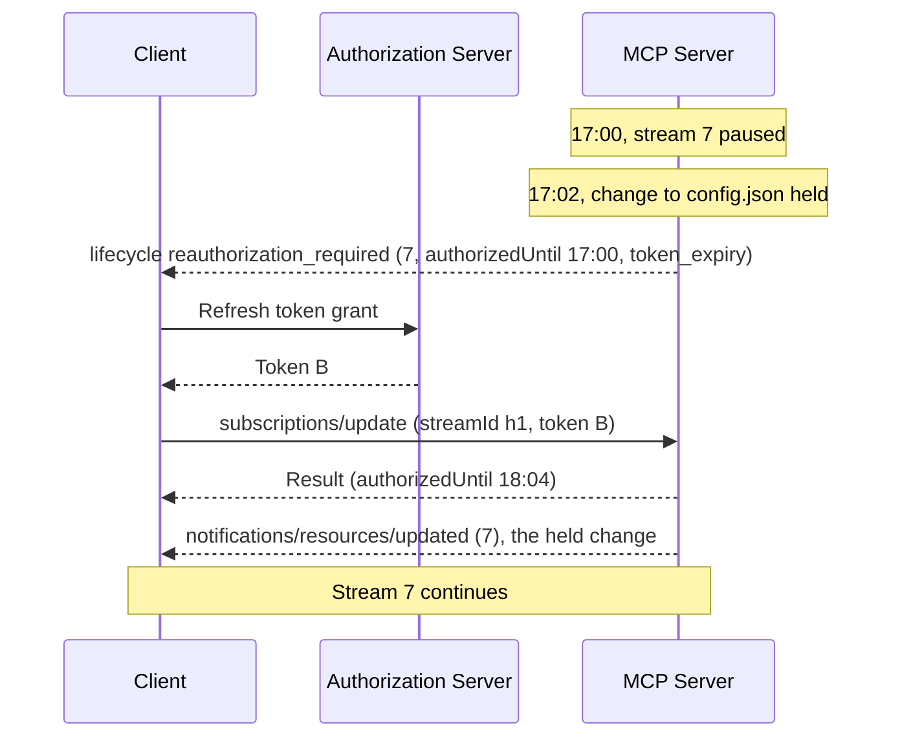
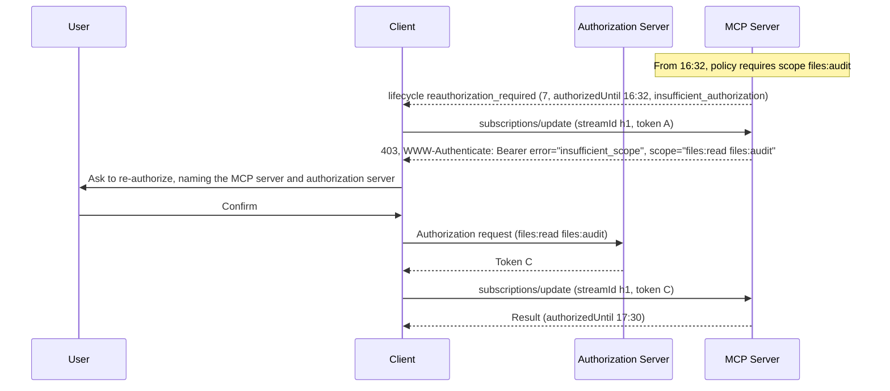

# SEP-XXXX: Subscription Lifecycle: Reminders, In-Place Updates, and Pausing

- **Status**: Draft
- **Type**: Standards Track
- **Created**: 2026-09-29
- **Author(s)**: Ramjot Singh (@RamjotSingh)
- **Sponsor**: None (seeking sponsor)
- **PR**: TBD
- **Requires**: [Authorization Lifetime for Subscription Streams][sep-lifetime] (SEP draft)

## Abstract

[Authorization Lifetime for Subscription Streams][sep-lifetime] ends a `subscriptions/listen` stream at each authorization deadline. On its own, that costs every stream a reconnection, a gap, and a resynchronization per token lifetime, and tells a client nothing when it loses access to one of the resources it listed.

This SEP introduces additive changes to the authorization SEP and extends it by proposing the following changes:

- Tie each stream to a server issued `streamId`
- Let clients keep their streams alive by fulfilling the authorization challenge presented by the server
- Limit the lifetime of a subscription by having a negotiation between server and client
- Introduces a concept of paused stream in case authorization is lost but expiry hasn't been hit yet
- Enable lifecycle notifications allowing clients to
  - Receive reminders when their authorization (like lifetime of the token) is about to run out
  - Be notified when they lose access to one of the subscribed resources
  - Receive notification if the server thinks that the client missed notifications due to some reason (like a server lapse) thus allowing clients to sync

The protocol adds all of these as optional and each is negotiated at a per stream level.

## Motivation

- **A reconnection per token lifetime.** Under the lifetime SEP, every stream ends at every authorization deadline. Streamable HTTP cannot resume a stream ("Resumable SSE streams via `Last-Event-ID` are not supported"; [Streamable HTTP: Receiving Messages][http-receiving]), so each end costs a gap and a resynchronization, and the server rebuilds the stream's upstream registrations. With tokens that last minutes, streams churn constantly.
- **Late clients lose their streams.** A client that is asleep, whose authorization server is briefly unavailable, or whose user is still completing step-up authentication, misses the deadline and has to start over.
- **Loss of access is silent.** The lifetime SEP stops notifications for a listed resource the principal can no longer read. An agent waiting for a change to that resource cannot tell "no changes" from "no access", and waits indefinitely.
- **Streams have no chosen lifetime.** A client cannot ask for a stream that ends when it no longer needs it, and a server with a maximum stream lifetime cannot say so. The only real option today is for the client to cancel the stream, or the server to end it. But cancellation is used for a wide variety of scenarios.

Deployed systems handle all four. Microsoft Graph repeats `reauthorizationRequired` lifecycle notifications before a token expires, reauthorizes subscriptions in place, pauses delivery while a subscription is unauthorized, sends `subscriptionRemoved` and `missed`, and takes a client-chosen `expirationDateTime` ([Graph lifecycle notifications][graph-lifecycle]). Google Drive's changes feed reports a file that the user lost access to as a change with `removed: true` ([Drive API: changes][drive-changes]).

## Specification

The key words "MUST", "MUST NOT", "REQUIRED", "SHALL", "SHALL NOT", "SHOULD", "SHOULD NOT", "RECOMMENDED", "NOT RECOMMENDED", "MAY", and "OPTIONAL" in this document are to be interpreted as described in BCP 14 ([RFC 2119][rfc2119], [RFC 8174][rfc8174]) when, and only when, they appear in all capitals.

### 1. Scope and definitions

This specification builds on [Authorization Lifetime for Subscription Streams][sep-lifetime] (the lifetime SEP) and uses its definitions of server, stream authorization, acknowledged entry, authorization expiry, and authorization deadline. It applies where that SEP applies. For streams that opt in, it changes two of that SEP's rules: such a stream is paused, not ended, at its authorization deadline ([section 5](#5-pausing)), and a paused stream carries lifecycle notifications after the authorization expiry. A successful update ([section 4](#4-updating-a-stream-in-place)) replaces a stream's stream authorization. [Section 7](#7-guidance-for-extensions-non-normative) is non-normative guidance for extensions.

- **Stream ID**: an opaque, server-issued identifier for a stream, reported in its acknowledgment as `streamId`, which a client uses to update the stream in place. It differs from the subscription ID, the JSON-RPC ID of the `subscriptions/listen` request, which the client chooses and which labels the messages on the stream.
- **Expiry**: the time after which the client no longer wants the stream, as it requested, or as the server set when it requested none ([section 2](#2-expiry)).
- **Paused**: the state of a stream past its authorization deadline that the server keeps open without delivering notifications, other than lifecycle notifications, until the client re-authorizes it or the stream reaches its expiry ([section 5](#5-pausing)).

As in the lifetime SEP, every signal this specification adds is a JSON-RPC message, which a server MUST send with HTTP status `200` on Streamable HTTP; the Authorization specification's token errors are unchanged ([Authorization Lifetime, section 1](https://github.com/RamjotSingh/transports-wg/blob/sep/authorization-lifetime/proposals/XXXX-authorization-lifetime-for-subscription-streams.md#1-scope)).

### 2. Expiry

A client MAY include `expiresAt` in its `subscriptions/listen` request: the time after which it no longer wants the stream. Omitting it leaves the expiry to the server; requests from clients that predate this specification never carry it. **A stream with no expiry still has an authorization deadline.**

1. When the request includes `expiresAt`, the server either uses that expiry or rejects the request; it MUST NOT shorten or extend it. It MUST reject the request with `-32602` (Invalid params) if the expiry is not in the future, or is later than the server's maximum stream lifetime allows; in the second case, `data.maxExpiresAt` gives the latest expiry the server would accept. When the request omits `expiresAt`, the server sets the expiry to its maximum, or leaves the stream without one.
2. The acknowledgment MUST include `expiresAt` when the stream has an expiry.
3. At its expiry, a stream ends with the completion result described in [Subscriptions: Graceful Closure][subs-graceful], whether or not it is paused. When the expiry and the authorization deadline coincide, the expiry applies.

### 3. Lifecycle notifications

#### 3.1 Opting in

A client opts in by setting `lifecycle: true` in the `notifications` filter of its `subscriptions/listen` request. A server that implements this specification MUST include `lifecycle: true` in the acknowledgment when the client requested it, and then MUST send lifecycle notifications as this section requires. It MUST NOT include `lifecycle` when the client did not request it, and MUST NOT send `notifications/subscriptions/lifecycle` on a stream whose acknowledgment does not include it. `lifecycle` is not an acknowledged entry.

A client MUST NOT rely on lifecycle notifications alone. It SHOULD also schedule re-authorization from `authorizedUntil` and from its own knowledge of its token's expiry, because an older server may echo the filter without implementing this specification.

#### 3.2 The notification

`notifications/subscriptions/lifecycle` tells the client about a change in a stream's lifetime or coverage. Every lifecycle notification carries these fields, and each type adds its own:

| Field                                             | Type        | Description                                                                                                  |
| ------------------------------------------------- | ----------- | ------------------------------------------------------------------------------------------------------------ |
| `type`                                            | string      | What happened: `reauthorization_required`, `access_reduced`, `missed`, or a type defined elsewhere (rule 1). |
| `lastUpdatedAt`                                   | string      | The stream's `lastUpdatedAt` as it stands when the notification is sent (rule 3).                            |
| `_meta["io.modelcontextprotocol/subscriptionId"]` | `RequestId` | The stream the notification applies to, as on every notification delivered on a stream.                      |

| `type`                     | Added fields                | Sent                                                                                                            |
| -------------------------- | --------------------------- | --------------------------------------------------------------------------------------------------------------- |
| `reauthorization_required` | `authorizedUntil`, `reason` | Before the authorization deadline, and periodically while the stream is paused ([section 3.3](#33-reminders))   |
| `access_reduced`           | `removed`                   | Once, when acknowledged entries are removed because access to them was lost ([section 3.4](#34-reduced-access)) |
| `missed`                   | none                        | When notifications may have been dropped ([section 3.5](#35-missed-notifications))                              |

1. Clients MUST ignore lifecycle notifications of a `type` they do not recognize. Later revisions, extensions, and individual servers may define more types; for example, a warning that a key used to encrypt notifications is about to expire, or a server's own warning that the principal is close to a quota. Unprefixed types are reserved for this specification and its later revisions. Other types MUST use a prefixed name, as `_meta` keys do: a reverse-DNS prefix owned by whoever defines the type, such as `com.example/quota_warning`, with prefixes whose second label is `modelcontextprotocol` or `mcp` reserved for MCP ([Overview: `_meta`][overview-meta]).
2. A client MUST ignore a reminder ([section 3.3](#33-reminders)) whose `lastUpdatedAt` is earlier than that of an update result it has received for the stream: the update has replaced the deadline the reminder reports. Likewise, when an update result's `lastUpdatedAt` is earlier than that of a reminder the client has received, the reminder's `authorizedUntil` stays current. A client never ignores `access_reduced` or `missed` this way, because an update undoes neither.
3. The acknowledgment, update results, and lifecycle notifications carry `lastUpdatedAt`: the time of the stream's most recent change of expiry, authorization deadline, authorization, or acknowledged entries. It does not change as notifications are delivered. Each change MUST give the stream a later `lastUpdatedAt` than it had before, so servers use enough precision, such as milliseconds, to keep changes apart.
4. Lifecycle notifications MUST NOT carry tokens or other credentials. The consent rules of the lifetime SEP ([Authorization Lifetime, section 7](https://github.com/RamjotSingh/transports-wg/blob/sep/authorization-lifetime/proposals/XXXX-authorization-lifetime-for-subscription-streams.md#7-user-consent-and-safety)) apply to them as they do to its error: no lifecycle notification by itself starts interactive authorization.

#### 3.3 Reminders

A `reauthorization_required` notification, or reminder, tells the client that the stream's authorization ends at `authorizedUntil`, or has ended, and why. Unless the client re-authorizes the stream, it is then paused ([section 5](#5-pausing)) or ends.

| Field             | Type   | Description                                                                                                                                                                                                                                                                                                                         |
| ----------------- | ------ | ----------------------------------------------------------------------------------------------------------------------------------------------------------------------------------------------------------------------------------------------------------------------------------------------------------------------------------- |
| `authorizedUntil` | string | The stream's authorization deadline. In a reminder sent while the stream is paused, it has passed.                                                                                                                                                                                                                                  |
| `reason`          | string | Why, as for the lifetime SEP's error: `token_expiry`, `insufficient_authorization`, or `revoked` ([Authorization Lifetime, section 5](https://github.com/RamjotSingh/transports-wg/blob/sep/authorization-lifetime/proposals/XXXX-authorization-lifetime-for-subscription-streams.md#5-ending-a-stream-for-authorization-reasons)). |

**Server rules**

These rules apply to streams whose acknowledgment includes `lifecycle`.

1. The server MUST send at least one reminder before the authorization deadline, unless the stream's expiry comes first.
2. The server SHOULD send reminders at these times before the deadline: 60, 30, 15, 10, and 5 seconds; or, when the stream authorization's lifetime is less than ten minutes, 10, 5, 3, 2, and 1 percent of that lifetime. It SHOULD send the first reminder earlier by a random amount of up to 10% of its lead time, so that streams whose tokens expire together do not all prompt refreshes at once.
3. Once an update moves the deadline later, the server stops sending reminders for the old deadline, and starts again before the new one.
4. When a stream's deadline becomes earlier than the one last reported, for example because a new requirement takes effect, the server MUST send a reminder with the new `authorizedUntil` at once, unless it ends the stream immediately. A server MAY give clients time to meet a new requirement before it takes effect.
5. After sending a reminder, the server MUST keep the stream open at least until its `authorizedUntil`, unless the client cancels the stream, the server shuts down, the transport fails, or the lifetime SEP requires an earlier end. A reminder does not by itself suspend delivery.
6. `authorizedUntil` MUST NOT be later than the authorization expiry.
7. Revocation needs no reminder. The server MAY end the stream at once.
8. While the stream is paused, the server repeats the reminder, as [section 5](#5-pausing) describes.

No reminders precede a stream's expiry: the client requested that time, or saw the server's maximum in the acknowledgment.

**Client rules**

1. On a reminder, a client that wants to keep the stream re-authorizes it before `authorizedUntil`, or as soon as it can if the stream is already paused ([section 4](#4-updating-a-stream-in-place)). Later reminders for the same deadline do not call for another token refresh.
2. For `insufficient_authorization`, the client sends an update with its current token; the `401` or `403` response says what is required.
3. A client that does not act on reminders stops receiving notifications at `authorizedUntil`: its stream is paused until its expiry, or ends if it cannot be paused.

#### 3.4 Reduced access

An `access_reduced` notification tells the client that the stream no longer carries some of its acknowledged entries.

| Field     | Type                 | Description                                                                                                                                             |
| --------- | -------------------- | ------------------------------------------------------------------------------------------------------------------------------------------------------- |
| `removed` | `SubscriptionFilter` | The removed entries, in the shape of the acknowledgment's `notifications` field; for example `{ "resourceSubscriptions": ["file:///hr/case-114.md"] }`. |

**Server rules**

1. When a stream's authorization no longer permits some of its acknowledged entries, the server removes them from the stream, as the lifetime SEP requires. On a stream whose acknowledgment includes `lifecycle`, it MUST send one `access_reduced` notification listing them.
2. **Removal is permanent. If access returns, the server does not resume delivering a removed entry.**
3. The notification MUST NOT reveal when a removed entry changed. A server that learns of the loss while processing a change to that entry, rather than from an access-change signal or from the client's own update, MUST hold the notification until it next sends a reminder or an update result, and send it then. The removal changes the stream's `lastUpdatedAt` only when the notification is sent. If the stream ends first, the client learns of the removal when it next asks for those entries: the lifetime SEP refuses a filter that lists them, and names them in `data.denied` ([Authorization Lifetime, section 3](https://github.com/RamjotSingh/transports-wg/blob/sep/authorization-lifetime/proposals/XXXX-authorization-lifetime-for-subscription-streams.md#3-stream-lifetime), rule 5).
4. When no acknowledged entry remains, the server ends the stream with reason `revoked`, as the lifetime SEP requires, no earlier than rule 3 would allow it to send the notification.
5. A failed or unavailable access check is not a loss of access. The server drops the affected notification and keeps the entry.
6. Notifications about sub-resources that are not themselves acknowledged entries are filtered as the lifetime SEP describes, with no lifecycle notification.

**Client rules**

1. On `access_reduced`, the client stops expecting notifications for the removed entries, and SHOULD tell the application which entries it lost.
2. To follow a removed entry again, the client subscribes to it again, for example on a new stream. The server checks access then, as it does for any subscription.

A client that wants a subscription to end when it loses access to what it subscribed to opens one stream per entry: when a stream's only entry is removed, the stream ends (rule 4).

#### 3.5 Missed notifications

A `missed` notification tells the client that the stream may have dropped notifications the client was entitled to, and that it should resynchronize. It adds no fields.

1. Sending `missed` is OPTIONAL; servers are not required to track what they deliver. A server that has reason to believe it dropped notifications the stream's authorization permitted SHOULD send it, and SHOULD also send it when it cannot tell. Examples are an access check that could not be completed, a gap in an upstream change feed, and notifications that the server dropped, rather than held, while the stream was paused or waiting for the client to meet a new requirement; in that case, the server sends `missed` after the client re-authorizes.
2. On `missed`, the client SHOULD resynchronize the state it derives from the stream, as it would after an unexpected disconnect.

### 4. Updating a stream in place

A client changes a live stream with `subscriptions/update`. Every update also re-authorizes the stream: the access token on the update becomes the stream authorization, so an update with no other fields is a re-authorization. A stream updated in place keeps running, so no notifications are lost, duplicated, or reordered.

The only updatable field this specification defines is `expiresAt` ([section 2](#2-expiry)). Extensions and later revisions can add others, such as encryption keys or signing secrets, so that one method changes any setting of a live subscription. An update sets each field it names to the value given: an omitted field keeps its value, and `null` removes it, as in JSON Merge Patch ([RFC 7396][rfc7396]). Sending the same update twice therefore has the same effect as sending it once.

**Server rules**

1. A server that can route a request to the instance holding a stream, or make an update visible to that instance, SHOULD support updating the stream in place. It indicates this by including `streamId` in the stream's acknowledgment: an opaque identifier that cannot be guessed, bound to the subject (`sub`) and client (`client_id`) of the access token that opened the stream, or to the equivalent values from introspection. It MUST NOT issue a stream ID for a stream whose authorization deadline it does not know, or whose token does not identify both a subject and a client: without a deadline an update result cannot report one, and a stream ID bound to a client alone can be used by any user of a public client.
2. On `subscriptions/update`, the server authorizes the request as it would any other. It rejects an invalid token with `401`, and a token that does not meet a requirement announced with `insufficient_authorization` with the `401` or `403` response, including the `WWW-Authenticate` challenge, that it would give any request that fails that requirement.
3. It MUST return `-32602` (Invalid params) for an unknown stream ID, a stream ID bound to a different subject or client, or a stream that has ended; using one error for all three does not reveal whether a stream ID exists. For a field it does not support, it MUST return `-32602` with `data.unsupportedFields` listing the field names. For an `expiresAt` that [section 2](#2-expiry), rule 1 would reject on a new stream, it MUST return `-32602` in the same way, with `data.maxExpiresAt` where that rule gives it. If the new authorization permits none of the stream's acknowledged entries, it MUST reject the update with the lifetime SEP's `SubscriptionDeniedError`: `-32602`, with `data.denied` listing them, as the lifetime SEP refuses a new stream ([Authorization Lifetime, section 3](https://github.com/RamjotSingh/transports-wg/blob/sep/authorization-lifetime/proposals/XXXX-authorization-lifetime-for-subscription-streams.md#3-stream-lifetime), rule 5).
4. A rejected update changes nothing: the stream carries on, or stays paused, as before.
5. On success, the server applies the fields, the new access token becomes the stream authorization, and the server sets a new authorization deadline, no later than the new authorization expiry. Acknowledged entries that the new authorization does not permit are removed, and the server sends `access_reduced` for them after the result ([section 3.4](#34-reduced-access)). The result carries `expiresAt` when the stream has an expiry, `authorizedUntil`, and `lastUpdatedAt`. A running stream continues uninterrupted, and a paused one resumes ([section 5](#5-pausing)).
6. A server applies the updates to a stream one at a time. When updates race, the last one applied wins.

**Client rules**

1. When the acknowledgment includes `streamId`, a client SHOULD re-authorize the stream by sending `subscriptions/update` before `authorizedUntil`, prompted by a reminder or scheduled from that time, rather than let the stream pause or end. A client that misses the deadline can still update a paused stream, until the stream's expiry.
2. The client sends the update with the stream ID, authorized with the new token. On Streamable HTTP, it MUST set the `Mcp-Name` header to the stream ID, so that load balancers can route the request to the instance holding the stream, as the Tasks extension does with task IDs.
3. A client SHOULD have at most one update in flight for a stream. If the response to an update is lost, the client MAY send the same update again.
4. An update has extended the stream only if the result's `authorizedUntil` is later than before. If it is not, for example because the new token expires no later than the old one, the client SHOULD NOT send the same token again.
5. If the update fails with `401` or `403`, the client handles the response as the Authorization specification defines for any request, subject to the lifetime SEP's consent rules, and retries within the retry limits of the step-up flow. If it fails with `-32602` and `data.denied`, the new authorization permits nothing the stream carries: the client reports the loss to the application and cancels the stream. If it fails with `-32602` whose `data` has none of `unsupportedFields`, `maxExpiresAt`, and `denied`, or with `-32601` (Method not found), the stream ID cannot be used: the client lets the stream end, or cancels it, and re-establishes it as the lifetime SEP describes ([Authorization Lifetime, section 6](https://github.com/RamjotSingh/transports-wg/blob/sep/authorization-lifetime/proposals/XXXX-authorization-lifetime-for-subscription-streams.md#6-re-establishing-a-stream)). After `-32602` with `unsupportedFields` or `maxExpiresAt`, the client corrects the request; the stream is unaffected.
6. The lifetime SEP's rules on obtaining one token per superseded token, and on that token outliving the deadline, apply to updates too.

### 5. Pausing

At its authorization deadline, unless the client has re-authorized it, a stream whose acknowledgment includes both `lifecycle` and `streamId` is paused instead of ended. Any other stream ends at its deadline, as the lifetime SEP requires.

1. A paused stream carries no notifications other than lifecycle notifications, which carry no resource data. This is the only exception to the lifetime SEP's rule that nothing is written after the authorization expiry.
2. While a stream is paused, the server SHOULD repeat the reminder ([section 3.3](#33-reminders)) at intervals it chooses, no more often than once a minute.
3. The server keeps a paused stream open until its expiry, or, if it has none, until the client cancels it. It MUST NOT end a paused stream because the client has not re-authorized it; it ends it only at its expiry, when the lifetime SEP requires it (on revocation, or when no acknowledged entry remains), or for an operational reason such as shutdown. A server that does not want streams to stay paused for long sets a lower maximum stream lifetime ([section 2](#2-expiry)).
4. The server either drops the notifications that a paused stream would otherwise carry, or holds them. The same applies to notifications that a new requirement keeps off a stream that is still running. It MAY write held notifications to the stream once the client re-authorizes it in place, in their original order, after checking each one against the new authorization as it would any other notification. It MUST NOT write them to any other stream or subscription, and discards them when the stream ends.
5. When the client re-authorizes a paused stream, the server resumes delivery on the same stream: it writes the notifications it held, then carries on as before. If it dropped notifications that the new authorization permits, it sends `missed` ([section 3.5](#35-missed-notifications)).
6. A client whose stream is paused re-authorizes it as it would before the deadline, or cancels it.

### 6. Schema changes

Additions to `schema/draft/schema.ts`, alongside those of the lifetime SEP, which defines `authorizedUntil` in the acknowledgment and `AuthorizationReason`:

```typescript
export interface SubscriptionFilter {
  // ...existing fields...

  /**
   * If true, receive {@link SubscriptionLifecycleNotification | notifications/subscriptions/lifecycle}.
   */
  lifecycle?: boolean;
}

export interface SubscriptionsListenRequestParams extends RequestParams {
  // ...existing fields...

  /**
   * When the client no longer wants the stream, as an RFC 3339 UTC timestamp.
   * If omitted, the server applies its own maximum, if it has one. A server
   * rejects an expiry later than it accepts, rather than shortening it.
   */
  expiresAt?: string;
}

export interface SubscriptionsAcknowledgedNotificationParams extends NotificationParams {
  // ...existing fields...

  /**
   * The stream's expiry: the one the client requested, or the server's maximum
   * if the client requested none. Present when the stream has one.
   */
  expiresAt?: string;

  /**
   * The time of the stream's most recent change of expiry, authorization
   * deadline, authorization, or acknowledged entries.
   */
  lastUpdatedAt?: string;

  /**
   * Identifies the stream for subscriptions/update. Present when the server
   * supports updating this stream in place.
   */
  streamId?: string;
}

/**
 * Fields common to every lifecycle notification.
 *
 * @category `notifications/subscriptions/lifecycle`
 */
export interface SubscriptionLifecycleParamsBase extends NotificationParams {
  /**
   * What happened. Types this specification does not define use a prefixed
   * name, as _meta keys do. Clients ignore types they do not recognize.
   */
  type: string;
  /** The stream's lastUpdatedAt as it stands when this notification is sent. */
  lastUpdatedAt: string;
}

/**
 * The stream's authorization ends at authorizedUntil, or has ended. Unless
 * the client re-authorizes the stream, it is then paused or ended.
 *
 * @category `notifications/subscriptions/lifecycle`
 */
export interface ReauthorizationRequiredLifecycleParams extends SubscriptionLifecycleParamsBase {
  type: "reauthorization_required";
  authorizedUntil: string;
  reason: AuthorizationReason;
}

/**
 * The stream no longer carries these acknowledged entries. Removal is
 * permanent; to follow them again, the client subscribes to them again.
 *
 * @category `notifications/subscriptions/lifecycle`
 */
export interface AccessReducedLifecycleParams extends SubscriptionLifecycleParamsBase {
  type: "access_reduced";
  removed: SubscriptionFilter;
}

/**
 * The stream may have dropped notifications the client was entitled to.
 * The client resynchronizes.
 *
 * @category `notifications/subscriptions/lifecycle`
 */
export interface MissedLifecycleParams extends SubscriptionLifecycleParamsBase {
  type: "missed";
}

/**
 * Sent on a subscriptions/listen stream whose acknowledgment included
 * `lifecycle: true`.
 *
 * @category `notifications/subscriptions/lifecycle`
 */
export interface SubscriptionLifecycleNotification extends JSONRPCNotification {
  method: "notifications/subscriptions/lifecycle";
  params:
    | ReauthorizationRequiredLifecycleParams
    | AccessReducedLifecycleParams
    | MissedLifecycleParams
    // Types defined by later revisions, extensions, or individual servers:
    | SubscriptionLifecycleParamsBase;
}

/**
 * Parameters for a {@link SubscriptionsUpdateRequest | subscriptions/update} request.
 * An update sets each field it names; an omitted field keeps its value, and
 * null removes it (JSON Merge Patch, RFC 7396). Extensions and later
 * revisions may add updatable fields.
 *
 * @category `subscriptions/update`
 */
export interface SubscriptionsUpdateRequestParams extends RequestParams {
  /** The stream ID from the stream's acknowledgment. */
  streamId: string;
  /** A new expiry, as an RFC 3339 UTC timestamp; null removes the expiry. */
  expiresAt?: string | null;
}

/**
 * Updates an open subscriptions/listen stream in place. Every update also makes
 * the access token on this request the stream's authorization, so an update
 * with no other fields re-authorizes the stream. On Streamable HTTP, the
 * Mcp-Name header carries the stream ID.
 *
 * @category `subscriptions/update`
 */
export interface SubscriptionsUpdateRequest extends JSONRPCRequest {
  method: "subscriptions/update";
  params: SubscriptionsUpdateRequestParams;
}

/**
 * @category `subscriptions/update`
 */
export interface SubscriptionsUpdateResult extends Result {
  /** The stream's expiry after the update. Present when the stream has one. */
  expiresAt?: string;
  /** The stream's authorization deadline after the update. */
  authorizedUntil: string;
  /** The stream's lastUpdatedAt after the update. */
  lastUpdatedAt: string;
}

/**
 * error.data of a -32602 response to subscriptions/update that names fields
 * the server does not support.
 *
 * @category `subscriptions/update`
 */
export interface SubscriptionsUpdateUnsupportedFields {
  unsupportedFields: string[];
}

/**
 * error.data of a -32602 response to subscriptions/listen or
 * subscriptions/update whose expiresAt is later than the server accepts.
 *
 * @category `subscriptions/listen`
 */
export interface SubscriptionExpiryTooLate {
  /** The latest expiry the server would accept, as an RFC 3339 UTC timestamp. */
  maxExpiresAt: string;
}

/** @internal */
export type ServerNotification =
  // ...existing members...
  SubscriptionsAcknowledgedNotification | SubscriptionLifecycleNotification;

/** @internal */
export type ClientRequest =
  // ...existing members...
  SubscriptionsListenRequest | SubscriptionsUpdateRequest;

/** @internal */
export type ServerResult =
  // ...existing members...
  SubscriptionsListenResult | SubscriptionsUpdateResult;
```

### 7. Guidance for extensions (non-normative)

- **Long-lived requests.** An extension with its own long-lived request, such as `events/stream` in the Events design sketch, can apply both SEPs to it: report an expiry, an authorization deadline, and a stream ID when the request starts, send lifecycle notifications, re-authorize it in place, and pause it at the deadline. Where the event type supports replay, cursors let such an extension recover events across a re-established request.
- **One target per subscription.** An Events subscription names one event and its arguments, and `events/stream` opens one stream per subscription ([Events design sketch][events-sketch]). Losing access to that target leaves nothing to deliver, so the subscription ends; `access_reduced` matters for subscriptions that name several targets.
- **Server-held subscriptions.** An extension whose subscriptions the server holds without an open request, such as Events webhook subscriptions, can deliver the same lifecycle objects over its own authenticated channel, signed like its other deliveries, and map `authorizedUntil` to its own field, such as `refreshBefore`. The client renews with fresh credentials, for Events by calling `events/subscribe` again; an extension could instead issue a stream ID and accept `subscriptions/update`, so that one method updates every kind of subscription. If the client has not renewed by the deadline, the server pauses delivery, as for a core stream, and resumes once the client renews, delivering the events it held after checking them against the new authorization. A subscription granted with no expiry still has an authorization deadline. A possible control envelope:

  ```json
  {
    "type": "reauthorization_required",
    "authorizedUntil": "2026-09-28T17:05:00Z",
    "reason": "token_expiry",
    "lastUpdatedAt": "2026-09-28T16:05:00.000Z"
  }
  ```

- **Tasks.** The Tasks extension needs no change. A task ID listed in a stream's filter is an acknowledged entry, which `access_reduced` can remove.

### 8. Changes to specification documents

- **Subscriptions** (`basic/patterns/subscriptions`): add `lifecycle` to the notification filter table and `expiresAt` to the request; add `expiresAt`, `lastUpdatedAt`, and `streamId` to the acknowledgment; add `notifications/subscriptions/lifecycle` and `subscriptions/update`; add sections on expiry, lifecycle notifications, updating a stream in place, and pausing. In Graceful Closure, state that a stream reaching its expiry ends with the completion result, paused or not.
- **Resources** (`server/resources`): in Subscriptions, state that removing a listed URI is reported with `access_reduced` on streams that opted in.
- **Streamable HTTP** (`basic/transports/streamable-http`): add a row to the standard request headers table: `Mcp-Name` carries `params.streamId` for `subscriptions/update`.
- **Schema** and **Changelog**: the additions above, and an entry under Major changes for the new request and notification.

### 9. Examples

#### Opting in

The client asks for a stream that lasts twelve hours, within the server's maximum of three days. Its token expires at 17:00.

```jsonc
// Client request, sent at 16:00 UTC. _meta (protocol version, client info, capabilities) omitted.
{
  "jsonrpc": "2.0",
  "id": 7,
  "method": "subscriptions/listen",
  "params": {
    "notifications": {
      "resourceSubscriptions": [
        "file:///project/config.json",
        "file:///hr/case-114.md",
      ],
      "lifecycle": true,
    },
    "expiresAt": "2026-09-29T04:00:00Z",
  },
}
```

```json
{
  "jsonrpc": "2.0",
  "method": "notifications/subscriptions/acknowledged",
  "params": {
    "_meta": { "io.modelcontextprotocol/subscriptionId": 7 },
    "notifications": {
      "resourceSubscriptions": [
        "file:///project/config.json",
        "file:///hr/case-114.md"
      ],
      "lifecycle": true
    },
    "expiresAt": "2026-09-29T04:00:00Z",
    "authorizedUntil": "2026-09-28T17:00:00Z",
    "lastUpdatedAt": "2026-09-28T16:00:00.112Z",
    "streamId": "sub_8f3kQ2vXr7mN"
  }
}
```

The same server rejects a request for five days:

```json
{
  "jsonrpc": "2.0",
  "id": 7,
  "error": {
    "code": -32602,
    "message": "expiresAt is later than this server allows",
    "data": { "maxExpiresAt": "2026-10-01T16:00:00Z" }
  }
}
```

#### A reminder, and the update that answers it

```json
{
  "jsonrpc": "2.0",
  "method": "notifications/subscriptions/lifecycle",
  "params": {
    "_meta": { "io.modelcontextprotocol/subscriptionId": 7 },
    "type": "reauthorization_required",
    "authorizedUntil": "2026-09-28T17:00:00Z",
    "reason": "token_expiry",
    "lastUpdatedAt": "2026-09-28T16:00:00.112Z"
  }
}
```

```http
POST /mcp HTTP/1.1
Authorization: Bearer <new access token>
Mcp-Method: subscriptions/update
Mcp-Name: sub_8f3kQ2vXr7mN
```

```jsonc
// Request body. _meta omitted.
{
  "jsonrpc": "2.0",
  "id": 12,
  "method": "subscriptions/update",
  "params": { "streamId": "sub_8f3kQ2vXr7mN" },
}
```

```json
{
  "jsonrpc": "2.0",
  "id": 12,
  "result": {
    "resultType": "complete",
    "expiresAt": "2026-09-29T04:00:00Z",
    "authorizedUntil": "2026-09-28T18:00:00Z",
    "lastUpdatedAt": "2026-09-28T16:59:04.380Z"
  }
}
```

A reminder already in flight when the update succeeded carries the earlier `lastUpdatedAt`, so the client ignores it.

#### Reduced access

The principal is removed from the HR case. The server learns of it when the file next changes, so it holds the notification until its next reminder instead of sending it then.

```json
{
  "jsonrpc": "2.0",
  "method": "notifications/subscriptions/lifecycle",
  "params": {
    "_meta": { "io.modelcontextprotocol/subscriptionId": 7 },
    "type": "access_reduced",
    "removed": { "resourceSubscriptions": ["file:///hr/case-114.md"] },
    "lastUpdatedAt": "2026-09-28T17:58:51.020Z"
  }
}
```

#### A late client

The client sleeps through the reminders. At 17:00 the server pauses stream 7, and at 17:02 it holds a change to `config.json` instead of writing it.



A server that dropped the change instead of holding it sends `missed` after the result, and the client reads `config.json` again.

#### A policy change that requires more scope



If the user confirms after 16:32, stream 7 is paused from 16:32 until the update succeeds.

## Rationale

### Reauthorize in place, and re-establish only as a fallback

A stream re-authorized in place never breaks: nothing is lost, duplicated, or reordered, and servers do not rebuild a stream's upstream registrations once per token lifetime. This is not the resumability that SEP-2575 removed, which required keeping per-request state across connection failures ([SEP-2575: Resumable Streams Are Removed][sep-2575-resumable]); an update keeps a live stream alive.

An update needs its own request, because a stream is a single request, and the token that authorized it cannot change once the request has been sent. The request has to name the stream, and the JSON-RPC ID cannot, because it only has to be unique among one client's in-flight requests ([Overview: Requests][overview-requests]). The acknowledgment therefore carries a server-issued stream ID, which the client sends in `Mcp-Name` for routing, as the Tasks extension does with task IDs. This follows the rule that state spanning requests is "referenced by an explicit identifier the client passes on each request" ([Overview: Statelessness][overview-stateless]). Servers that can neither route nor share an update, such as some serverless deployments, omit the stream ID, and their clients re-establish streams as the lifetime SEP describes.

### One method for every change

Graph has a separate reauthorize operation, but renewing a subscription with `PATCH` also reauthorizes it, and in MCP every request carries a token. An update with no other fields is therefore a re-authorization, and fields that extensions add, such as encryption keys, change through the same request. Updates set values rather than apply changes, so repeating one after a lost response is harmless, and when updates race the last one wins. The name follows `tasks/update`.

### Remind repeatedly, and pause instead of ending

A single notice can be lost in a busy client. Graph repeats `reauthorizationRequired` at shrinking intervals until the token expires, and tells applications to expect it "from once every few minutes for every subscription to rarely for some of your subscriptions" ([Graph lifecycle notifications][graph-lifecycle]). Reminders give a client several chances: at most five per authorization lifetime, none after the client updates, and jitter on the first to spread refreshes.

Graph also pauses a subscription whose authorization has lapsed, until the application acts: delivery "pauses, until you take the required action". A client that is late, because it was asleep, its authorization server was unavailable, or its user took time to step up, re-authorizes the same stream instead of opening a new one. Unlike Graph, reminders continue during the pause, because on an open stream they cost almost nothing. A paused stream ends only at its expiry, which the client chose within the server's maximum, so the expiry is also the limit on pausing. It costs what an idle stream costs, and exists only while the client keeps the connection open. Streams that cannot resume still end at the deadline, because to their clients a paused stream would look like a quiet one.

### Order reminders and update results by `lastUpdatedAt`

An update result returns on the update's own request, while lifecycle notifications travel on the stream, so the two can arrive in either order: a reminder sent just before an update can arrive after its result, and a reminder about a change made just after an update can arrive before it. `lastUpdatedAt` versions the stream's state so that the client can tell which is current. It changes only with that state, never with each notification, because notifications on one stream already arrive in order. Only reminders report state that an update replaces; `access_reduced` and `missed` report events that an update does not undo, so a client acts on them whenever they arrive.

### Remove listed entries one way, without revealing timing

An agent that listed a resource is waiting for it. If its notifications stop without a word, it cannot tell "no changes" from "no access", so the server says once which entries it removed; the acknowledgment promised them, and `access_reduced` withdraws that promise. Removal is one way. Resuming when access returns would need the server to keep evaluating a resource the principal cannot see, permissions that flip back and forth would produce a run of notices, and the gap between would need a resynchronization anyway. Graph works the same way: after `subscriptionRemoved`, "you need to recreate the subscription".

Lazy servers usually discover a loss of access when a change to the resource arrives. A notice sent at that moment would tell the client that something it can no longer see has just changed, which is why it waits for the next reminder or update result.

### Hold notifications only on their own stream

Core notifications either say that something changed or carry complete state, so a client that resynchronizes reaches the state it would have reached by receiving what it missed, and a server can always drop instead of holding. A server that holds writes only to the stream the notifications were kept off, once it is re-authorized, and discards them when it ends. That needs no state beyond the live stream the server already has.

### Opt in through the filter, with one flag

The Subscriptions pattern requires that the server "MUST NOT send notification types the client has not explicitly requested" ([Subscriptions: Opening a Stream][subs-open]). One filter flag covers every lifecycle type, so new types, including those that servers define under their own prefix, need no new flag, and clients ignore the types they do not know.

### Reject an expiry the server will not honor

A server with a maximum stream lifetime rejects a longer request instead of shortening it, as Graph does, so that a client never holds a stream that ends earlier than it asked without knowing. Omitting `expiresAt` stays valid, because older clients never send it.

### Prior art

- **Microsoft Graph**: repeated `reauthorizationRequired` notifications; reauthorization with `POST /subscriptions/{id}/reauthorize` or by renewing; delivery that pauses until the application acts; `subscriptionRemoved`; `missed`; and a client-chosen `expirationDateTime`, rejected beyond a per-resource maximum ([Graph lifecycle notifications][graph-lifecycle]).
- **Google Drive**: a file the user lost access to appears in the changes feed with `removed: true` ([Drive API: changes][drive-changes]).
- **Slack Socket Mode**: a `disconnect` warning about ten seconds before a connection closes, and up to ten concurrent connections, so that apps can open a new one first ([Slack Socket Mode][slack-socket]).

### Alternatives considered

- **Replace streams only.** Needs no stream ID or new request, but every stream turns over once per token lifetime, with overlapping streams, duplicates, and gaps. It remains the fallback.
- **A dedicated `subscriptions/reauthorize` method.** A second way to do what an update with no fields already does.
- **End every stream at its deadline.** Simpler for servers, but a client late by seconds loses its stream.
- **Let the server end paused streams when it chooses.** The expiry is the lifetime the server accepted. A server that wants shorter pauses sets a lower maximum, so that clients learn the limit up front.
- **Filter silently, with no notice**, or **resume a removed entry when access returns**. See the rationale above.
- **One update for several streams that share a token.** Saves requests, but the streams may be held by different instances, so a single request cannot be routed to all of them. Clients send one update per stream; the token refresh behind them is shared.
- **Change a stream's filter through `subscriptions/update`.** Would let a client follow a removed entry again without opening a new stream, but it reopens what the acknowledgment settles: what the server honors, and where delivery starts. Not in this SEP; because updates are merge patches, a later revision can add a filter field without changing the method.

## Backward Compatibility

Everything in this SEP is optional and negotiated per stream. Clients that do not set `lifecycle` see no lifecycle notifications. Clients that do not send `expiresAt` get the server's maximum, reported in the acknowledgment. Clients never send `subscriptions/update` unless an acknowledgment includes `streamId`.

An older server ignores `expiresAt` and `lifecycle`. It may echo `lifecycle` in the acknowledgment without sending lifecycle notifications, so clients also schedule re-authorization from `authorizedUntil` and their own token's expiry ([section 3.1](#31-opting-in)), and cancel a stream themselves when they no longer want it.

## Security Implications

- **User consent.** Lifecycle notifications arrive without any user action. The lifetime SEP's consent rules apply to them: nothing on a stream starts interactive authorization by itself, and any prompt follows from a `401` or `403` to a request the client chose to send.
- **Timing of `access_reduced`.** A server that discovers a loss of access while processing a change must not send the notice, move `lastUpdatedAt`, or end the stream at that moment ([section 3.4](#34-reduced-access), rules 3 and 4). `removed` lists only entries the client itself listed.
- **Paused streams.** A paused stream writes nothing but lifecycle notifications, which carry no resource data, so pausing does not extend what an expired authorization can see. It stays open until its expiry, so a server limits pauses through its maximum stream lifetime, and SHOULD limit how many streams a principal can hold.
- **Held notifications.** A server writes them only to the stream they were kept off, after it is re-authorized, checks each one against the new authorization first, and bounds how many it holds and for how long.
- **Stream IDs.** A stream ID names a stream but authorizes nothing. It is bound to the subject and client of the token that opened the stream, taken from the token rather than from self-asserted client information, so a leaked stream ID lets no one else extend or take over a stream. Servers generate stream IDs that cannot be guessed, and SHOULD rate-limit `subscriptions/update`.
- **Integrity.** Lifecycle notifications travel on the TLS-protected response to the client's own authenticated request, and carry no credentials. Extensions that deliver them over their own channels authenticate those deliveries as they do any other.

## Performance Implications

Updating in place costs one request per stream per authorization lifetime, plus one token refresh shared by all the streams that use that token; the streams themselves keep running. Reminders add at most five small notifications per authorization lifetime, and a paused stream at most one a minute. A paused stream otherwise costs what an idle stream costs. Held notifications are bounded by the server.

## Reference Implementation

A [prototype][prototype] (branch `poc/subscription-lifecycle` of a TypeScript SDK fork) is the prototype of [Authorization Lifetime for Subscription Streams][sep-lifetime] plus one commit, so [the difference between the two branches][prototype-diff] is exactly this SEP. It implements stream IDs, `subscriptions/update` routed by `Mcp-Name`, reminders on the default schedule with jitter, pausing and resuming with held notifications, `access_reduced` under the timing rule, `missed`, and `expiresAt`. Its client exposes the new acknowledgment fields, `update()`, and lifecycle notifications, dropping stale reminders. Its self-verifying demo, separate from the lifetime SEP's, uses the default reminder schedule with jitter, and exercises a reminder answered by an update, a missed deadline followed by a pause and a late update, `access_reduced`, a step-up through the `403` challenge, and expiry; it passes with 20-second tokens. It also runs today's behavior beside the proposals, through a second server endpoint without them, and writes a wire log grouped by scenario: current and proposed clients with current and proposed servers, each request with its response, and every line the proposals add marked. Routing updates across several server instances is not yet demonstrated.

## Testing Plan

Conformance scenarios, for the [conformance repository][conformance]:

**Server, required**

1. Acknowledges `lifecycle` when, and only when, the client requested it, and sends no lifecycle notifications otherwise.
2. Uses a requested `expiresAt` as given, rejects one beyond its maximum with `-32602` and `maxExpiresAt`, sent with HTTP status `200`, and ends a stream at its expiry with the completion result, paused or not.
3. On an opted-in stream, sends at least one reminder before `authorizedUntil`, unless the expiry comes first, and one at once when the deadline moves earlier.
4. At `authorizedUntil`, pauses a stream whose acknowledgment includes `lifecycle` and `streamId`, writes only lifecycle notifications while it is paused, and keeps it open until its expiry.
5. On `subscriptions/update` with a valid new token and no other fields, keeps the stream running, or resumes it, returns `authorizedUntil` no later than the new token's expiry and a later `lastUpdatedAt`, and delivers past the old token's expiry.
6. Returns `-32602` for an unknown stream ID, and for a stream ID presented with a token for a different subject or client; `-32602` with `unsupportedFields` for an unsupported field; and `-32602` with `denied` when the new token permits none of the acknowledged entries. Each is sent with HTTP status `200`, and none of them changes the stream.
7. Gives the same result for the same update applied twice.
8. When the principal loses access to one of two listed resources, sends one `access_reduced` naming it, not at the moment of a change to it, and keeps delivering the other.
9. Writes held notifications only to the stream they were kept off, after it is re-authorized, and never to another stream.

**Server, recommended**

1. Sends reminders at the recommended lead times, with the first one jittered, and repeats them while a stream is paused, no more often than once a minute.
2. Routes `subscriptions/update` to the instance holding the stream when two instances sit behind a load balancer.
3. After an update that follows notifications it dropped instead of holding, sends `missed`.

**Client, required**

1. When the acknowledgment includes `streamId`, updates the stream before `authorizedUntil`, or while it is paused, setting `Mcp-Name` to the stream ID, and uses one refresh for all streams that share the token.
2. After an update fails with `-32602` carrying none of `unsupportedFields`, `maxExpiresAt`, and `denied`, or with `-32601`, re-establishes the stream and resynchronizes.
3. Of a reminder and an update result, applies the one with the later `lastUpdatedAt`, whichever arrives first; never ignores `access_reduced` or `missed` because of `lastUpdatedAt`; and ignores a lifecycle notification whose `type` it does not recognize.
4. Does not start interactive authorization because of a lifecycle notification alone.

**Client, recommended**

1. On `missed`, resynchronizes.
2. On `access_reduced`, tells the application which entries it lost.

## Open Questions

Each question carries the author's proposed answer.

1. Are the reminder lead times and jitter right for tokens that last a few minutes, and should reminders during a long pause back off? In the prototype, 20-second tokens received reminders about 1.9, 1.0, 0.6, 0.4, and 0.2 seconds before the deadline, and a token refresh plus update took about 10 ms against a local authorization server. Proposed: omit lead times under one second, which leave too little time to refresh against a remote authorization server, and have reminders during a pause double from one minute up to an hour.
2. Should this SEP go through the Extensions Track instead? Unlike the lifetime SEP, nothing in it is needed for security. Proposed: Standards Track, because these features change the behavior of the core `subscriptions/listen` primitive rather than add a separate one, and extensions such as Events are expected to build on them.

[subs-open]: https://modelcontextprotocol.io/specification/2026-07-28/basic/patterns/subscriptions#opening-a-stream
[subs-graceful]: https://modelcontextprotocol.io/specification/2026-07-28/basic/patterns/subscriptions#graceful-closure
[http-receiving]: https://modelcontextprotocol.io/specification/2026-07-28/basic/transports/streamable-http#receiving-messages
[overview-meta]: https://modelcontextprotocol.io/specification/2026-07-28/basic/index#_meta
[overview-requests]: https://modelcontextprotocol.io/specification/2026-07-28/basic/index#requests
[overview-stateless]: https://modelcontextprotocol.io/specification/2026-07-28/basic/index#statelessness
[sep-2575-resumable]: https://modelcontextprotocol.io/seps/2575-stateless-mcp#response-streaming
[events-sketch]: https://github.com/modelcontextprotocol/experimental-ext-triggers-events/blob/main/docs/design-sketch-proposal.md
[conformance]: https://github.com/modelcontextprotocol/conformance
[graph-lifecycle]: https://learn.microsoft.com/en-us/graph/change-notifications-lifecycle-events
[drive-changes]: https://developers.google.com/workspace/drive/api/reference/rest/v3/changes
[slack-socket]: https://docs.slack.dev/apis/events-api/using-socket-mode
[rfc2119]: https://www.rfc-editor.org/rfc/rfc2119
[rfc8174]: https://www.rfc-editor.org/rfc/rfc8174
[rfc7396]: https://www.rfc-editor.org/rfc/rfc7396
[prototype]: https://github.com/RamjotSingh/typescript-sdk/blob/poc/subscription-lifecycle/SUBSCRIPTION-LIFECYCLE-PROTOTYPE.md
[prototype-diff]: https://github.com/RamjotSingh/typescript-sdk/compare/poc/authorization-lifetime...poc/subscription-lifecycle
[sep-lifetime]: https://github.com/RamjotSingh/transports-wg/blob/sep/authorization-lifetime/proposals/XXXX-authorization-lifetime-for-subscription-streams.md
