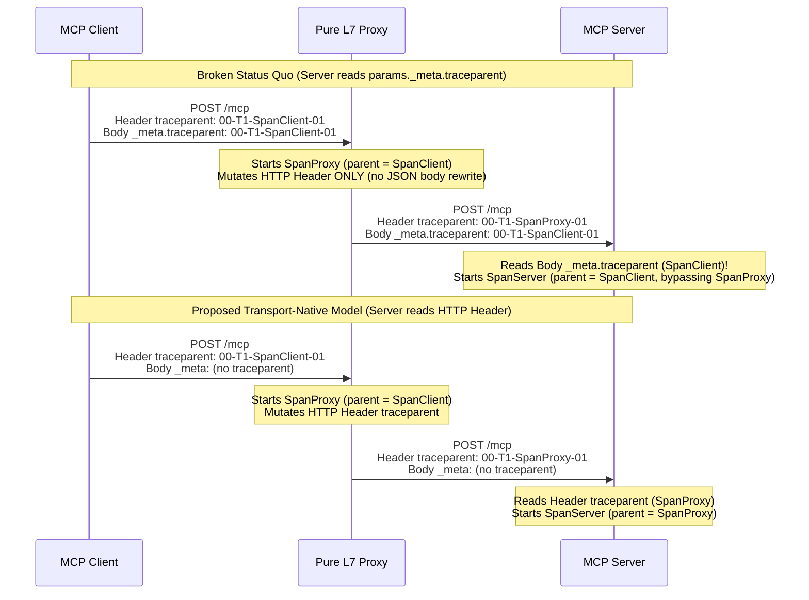

# SEP-???: Transport-Native Trace Context Propagation

- **Status**: Draft
- **Type**: Standards Track
- **Updates**: [SEP-414](https://modelcontextprotocol.io/seps/414-request-meta), [SEP-2243](https://modelcontextprotocol.io/seps/2243-http-standardization)
- **Created**: 2026-09-21
- **Author(s)**: Paul Ogilby (`pgal@google.com`) ([@paul-r-gall](https://github.com/paul-r-gall))
- **Sponsor**: TBD
- **PR**: https://github.com/modelcontextprotocol/modelcontextprotocol/pull/???

---

## 1. Abstract

This proposal updates [SEP-414](https://modelcontextprotocol.io/seps/414-request-meta) to mandate that Model Context Protocol (**MCP**) implementations over Layer 7 (**L7**) metadata-capable transports—specifically Streamable HTTP, legacy HTTP+SSE, and gRPC—propagate distributed trace context (`traceparent`, `tracestate`, and `baggage`) via the underlying transport's native header or metadata mechanisms rather than inside the JSON-RPC request body (`params._meta`). The JSON-RPC `params._meta` carrier defined in SEP-414 remains the normative carrier exclusively for transports that lack per-message envelope headers, such as `stdio` and raw byte-stream transports. When both transport headers and `params._meta` trace fields appear on an HTTP or gRPC request, the server MUST treat the transport-layer trace headers as authoritative and exempt them from SEP-2243 `HeaderMismatch` (`-32020`) validation.

---

## 2. Motivation & Problem Statement

SEP-414 standardized `params._meta` (`traceparent`, `tracestate`, and `baggage`) inside the JSON-RPC message payload as the universal carrier for [W3C Trace Context](https://www.w3.org/TR/trace-context/) and [W3C Baggage](https://www.w3.org/TR/baggage/) across MCP implementations. While embedding trace context in the JSON-RPC body works for direct client-to-subprocess `stdio` pipes, relying on `params._meta` over network transports (HTTP and gRPC) breaks standard L7 proxy architectures.

### Root Cause: Trace Context Mutates at Every L7 Network Hop

Unlike static routing attributes mirrored by [SEP-2243](https://modelcontextprotocol.io/seps/2243-http-standardization) (`Mcp-Method`, `Mcp-Name`, `MCP-Protocol-Version`), distributed trace context is inherently **mutable at every intermediary hop**. When an MCP request traverses one or more pure L7 proxies, each proxy participates in the trace lifecycle through the following steps:

1. Extract the incoming `traceparent` value (`00-<trace-id>-<client-span-id>-<flags>`) and `tracestate` from the transport request.
2. Allocate a new span ID (`<proxy-span-id>`) representing the proxy hop, setting `parent_span_id = <client-span-id>`.
3. Mutate the outbound `traceparent` to `00-<trace-id>-<proxy-span-id>-<flags>` and update `tracestate` so the MCP server parents its span to `<proxy-span-id>`.

Requiring MCP servers to read trace context from `params._meta` in the JSON-RPC request body creates three consistency problems for L7 infrastructure:

- **Mandatory payload buffering and mutation in pure L7 proxies:** Standard L7 proxies process and mutate tracing headers during the HTTP/gRPC header phase in constant time before reading the request body. To update `params._meta.traceparent` with `<proxy-span-id>`, a pure L7 proxy must buffer the entire HTTP request payload in memory, parse the JSON-RPC document, mutate or inject `params._meta.traceparent` and `params._meta.tracestate`, re-serialize the JSON body, and recompute `Content-Length`. This negates the zero-body-parsing performance guarantees established by SEP-2243, increases memory and CPU overhead under high concurrency, and requires custom MCP-specific body-rewriting logic in otherwise protocol-agnostic L7 infrastructure.
- **Broken causal trace topologies (orphaned and sibling spans):** Off-the-shelf L7 proxies and service meshes instrument HTTP and gRPC traffic by mutating HTTP headers or gRPC metadata (`traceparent`) while forwarding the request body untouched. When an MCP server reads `params._meta.traceparent` from the unmutated JSON-RPC body instead of the HTTP header, the server parents its span to the original `<client-span-id>` rather than `<proxy-span-id>`. As a result, the proxy span and the MCP server span appear as disconnected siblings rather than parent and child, or the server creates a separate root trace if an edge gateway initiated tracing via HTTP headers without modifying the JSON body.
- **Conflict with SEP-2243 header-body equality validation:** SEP-2243 specifies that the JSON-RPC request body is the source of truth and requires servers to reject requests with HTTP `400 Bad Request` and JSON-RPC error `-32020` (`HeaderMismatch`) when mirrored headers diverge from body fields. Because every tracing-enabled L7 proxy rewrites the outbound `traceparent` and `tracestate` headers with a new `<proxy-span-id>`, transport trace headers intentionally diverge from any static `params._meta.traceparent` field written by the originating client.



---

## 3. Goals & Non-Goals

### Goals

This proposal targets the following objectives:

- Mandate transport-native trace context propagation (`traceparent`, `tracestate`, and `baggage`) for all L7 metadata-capable MCP transports, including Streamable HTTP, HTTP+SSE, and gRPC.
- Enable standard, unmodified L7 proxies, service meshes, and API gateways to insert spans into the MCP request lifecycle using header-only processing without buffering or parsing JSON-RPC request bodies.
- Retain `params._meta` trace context propagation (`traceparent`, `tracestate`, and `baggage`) for `stdio` and raw byte-stream transports that lack per-message transport headers.
- Define unambiguous precedence rules and SEP-2243 `HeaderMismatch` exemptions when trace context appears in both transport headers and `params._meta`.
- Specify normative translation rules for MCP gateways and bridges that convert traffic between `stdio` and HTTP/gRPC transports.

### Non-Goals

This proposal explicitly excludes the following areas:

- Defining new trace context encoding formats beyond [W3C Trace Context](https://www.w3.org/TR/trace-context/) and [W3C Baggage](https://www.w3.org/TR/baggage/).
- Changing the SEP-2243 header-body mirroring or validation rules for immutable routing headers (`MCP-Protocol-Version`, `Mcp-Method`, `Mcp-Name`, and `Mcp-Param-{Name}`).
- Specifying OpenTelemetry span attribute schemas or metric names for MCP operations.

---

## 4. Specification

### 4.1 Trace Context Carriers by Transport Class

MCP categorizes transports into two classes for trace context propagation based on whether the transport provides native per-message envelope metadata:

| Transport Class | Applicable Bindings | Normative Trace Context Carrier | `params._meta` Trace Keys (`traceparent`, `tracestate`, `baggage`) |
| :--- | :--- | :--- | :--- |
| **Metadata-Capable L7 Transports** | Streamable HTTP, HTTP+SSE, gRPC | Native transport headers / metadata | Prohibited / Ignored (Transport headers take strict precedence) |
| **Framing-Only Byte-Stream Transports** | `stdio`, Unix domain sockets, raw TCP | `params._meta` in JSON-RPC body | Required when propagating trace context |

### 4.2 Requirements for Streamable HTTP and HTTP-Based Transports

When communicating over the [Streamable HTTP](https://modelcontextprotocol.io/specification/2026-07-28/basic/transports/streamable-http) transport (or legacy HTTP+SSE transport), clients, intermediaries, and servers MUST adhere to the following rules:

1. **Client Injection:** Clients that propagate distributed trace context MUST serialize `traceparent`, `tracestate`, and `baggage` as standard HTTP request headers on the HTTP POST request in accordance with the [W3C Trace Context](https://www.w3.org/TR/trace-context/) and [W3C Baggage](https://www.w3.org/TR/baggage/) specifications. Clients SHOULD NOT include `traceparent`, `tracestate`, or `baggage` inside `params._meta` on HTTP requests.
2. **Intermediary Mutation:** L7 proxies, load balancers, and API gateways that participate in distributed tracing MUST read and mutate the HTTP `traceparent` and `tracestate` request headers according to W3C Trace Context rules. Intermediaries MUST NOT be required to parse or modify the JSON-RPC request body to propagate trace context.
3. **Server Extraction & Precedence:** Servers MUST extract incoming trace context (`traceparent`, `tracestate`, and `baggage`) from the HTTP request headers. When a request contains trace context in both the HTTP headers (`H`) and `params._meta` (`M`), the server MUST resolve the parent context as follows:
   - **Same Trace (`H.trace_id == M.trace_id`):** The HTTP header reflects an intermediary L7 proxy hop within the same trace. The server MUST use the HTTP header (`H`) as the parent context (`parent_span_id = H.span_id`) and ignore `M`.
   - **Conflicting Traces (`H.trace_id != M.trace_id`, `H` is sampled `01`):** A non-conforming client omitted HTTP trace headers while an intermediary L7 proxy initiated and sampled a new trace (`H`). The server MUST use the sampled HTTP header (`H`) as the primary parent context so the proxy's trace remains complete. To preserve correlation without relying on OpenTelemetry Span Links (which are unsupported by some backends and cannot be attached after HTTP middleware span creation in SDKs lacking `Span.addLink()`), the server SHOULD record `M` as a span attribute (`mcp.meta.traceparent`) on the server span and MAY additionally attach `M` as a Span Link if supported.
   - **Conflicting Traces (`H.trace_id != M.trace_id`, `H` is unsampled `00` and `M` is sampled `01`):** Many L7 proxies inject `traceparent` with `sampled = 00` on the `99.99%` of requests they do not sample, exporting no proxy span for `H`. Unless the server is explicitly configured to enforce edge-proxy down-sampling, the server SHOULD fall back to `M` (`params._meta.traceparent`) as the parent context so the client's sampled trace is not discarded into a non-recording span.
4. **Legacy Client Fallback (`H` absent):** If an HTTP request omits the `traceparent` HTTP header entirely but includes `params._meta.traceparent`, the server SHOULD fall back to extracting trace context from `params._meta`.
5. **Exemption from `HeaderMismatch` (`-32020`) Validation:** Trace context headers (`traceparent`, `tracestate`, and `baggage`) are transport-mutable envelope headers, not mirrored body fields. Servers and intermediaries MUST NOT compare HTTP trace context headers against `params._meta` and MUST NOT reject requests with JSON-RPC error `-32020` (`HeaderMismatch`) when HTTP trace headers differ from or do not exist in `params._meta`.

#### Normative Example: Streamable HTTP `tools/call` with Trace Context

The following HTTP POST request illustrates conforming trace context propagation over Streamable HTTP after passing through an L7 proxy:

```http
POST /mcp HTTP/1.1
Host: mcp.example.com
Content-Type: application/json
Accept: application/json, text/event-stream
MCP-Protocol-Version: 2026-07-28
Mcp-Method: tools/call
Mcp-Name: get_weather
traceparent: 00-0af7651916cd43dd8448eb211c80319c-b7ad6b7169203331-01
tracestate: proxy-vendor=00f067aa0ba902b7

{
  "jsonrpc": "2.0",
  "id": 2,
  "method": "tools/call",
  "params": {
    "name": "get_weather",
    "arguments": {
      "location": "New York"
    },
    "_meta": {
      "io.modelcontextprotocol/protocolVersion": "2026-07-28",
      "io.modelcontextprotocol/clientInfo": {
        "name": "ExampleClient",
        "version": "1.0.0"
      },
      "io.modelcontextprotocol/clientCapabilities": {}
    }
  }
}
```

### 4.3 Requirements for gRPC Custom Transports

Implementations that bind MCP over gRPC MUST propagate distributed trace context using native gRPC request metadata:

1. **Client & Proxy Propagation:** Clients and gRPC proxies MUST propagate `traceparent`, `tracestate`, and `baggage` as ASCII gRPC metadata headers (or binary `grpc-trace-bin` metadata where supported by the OpenTelemetry gRPC instrumentation) on each unary or streaming RPC invocation.
2. **Body Omission & Precedence:** Clients SHOULD NOT populate `traceparent`, `tracestate`, or `baggage` inside the serialized message body (`_meta`). Servers MUST extract trace context from the gRPC call metadata and MUST give gRPC metadata strict precedence over `_meta`.

### 4.4 Requirements for `stdio` and Byte-Stream Transports

When communicating over the [`stdio`](https://modelcontextprotocol.io/specification/2026-07-28/basic/transports/stdio) transport (or custom transports over raw byte streams such as Unix domain sockets or TCP streams that reuse `stdio` framing without an envelope header layer), implementations MUST follow the SEP-414 convention:

1. **Payload Carrier:** Clients and servers that propagate trace context over `stdio` MUST carry `traceparent`, `tracestate`, and `baggage` inside the `params._meta` object of the JSON-RPC message.
2. **Format Compliance:** Values for `traceparent`, `tracestate`, and `baggage` in `params._meta` MUST conform to the [W3C Trace Context](https://www.w3.org/TR/trace-context/) and [W3C Baggage](https://www.w3.org/TR/baggage/) specifications.

#### Normative Example: `stdio` `tools/call` with Trace Context

The following JSON-RPC message illustrates conforming trace context propagation over `stdio`:

```json
{
  "jsonrpc": "2.0",
  "id": 2,
  "method": "tools/call",
  "params": {
    "name": "get_weather",
    "arguments": {
      "location": "New York"
    },
    "_meta": {
      "io.modelcontextprotocol/protocolVersion": "2026-07-28",
      "io.modelcontextprotocol/clientCapabilities": {},
      "traceparent": "00-0af7651916cd43dd8448eb211c80319c-00f067aa0ba902b7-01"
    }
  }
}
```

### 4.5 Requirements for Transport-Bridging Gateways (`stdio` ↔ HTTP/gRPC)

An MCP gateway, sidecar, or adapter that bridges between `stdio` and an L7 network transport (HTTP or gRPC) MUST translate trace context across the transport boundary:

1. **`stdio` to HTTP/gRPC Direction:** Receive the JSON-RPC message over `stdio`, extract `traceparent`, `tracestate`, and `baggage` from `params._meta`, start the bridge's outbound client span (parented to the extracted span ID), inject the updated `traceparent`, `tracestate`, and `baggage` into the outbound HTTP headers or gRPC metadata, and remove `traceparent`, `tracestate`, and `baggage` from `params._meta` before forwarding the JSON-RPC payload.
2. **HTTP/gRPC to `stdio` Direction:** Extract `traceparent`, `tracestate`, and `baggage` from the inbound HTTP headers or gRPC metadata, start the bridge's local span (parented to the inbound header span ID), and write the updated `traceparent`, `tracestate`, and `baggage` into `params._meta` of the JSON-RPC message written to the `stdio` subprocess.

---

## 5. Rationale

### Why Not Mirror `_meta.traceparent` into HTTP Headers (the SEP-2243 Pattern)?

SEP-2243 mirrors static JSON-RPC body fields (`method`, `params.name`, and `x-mcp-header` parameters) into HTTP headers (`Mcp-Method`, `Mcp-Name`, `Mcp-Param-*`) and enforces strict equality between the header value and the body value at the server (`HeaderMismatch` `-32020`).

This mirroring model works only for **immutable** properties that intermediaries inspect without modifying. Trace context violates this invariant because `traceparent` contains the immediate intermediary caller's `parent-id` (span ID) and `tracestate` carries vendor-specific hop state. Every tracing-enabled L7 proxy along the request path must replace the `parent-id` segment of `traceparent` with its own span ID. If MCP treated HTTP `traceparent` as a mirror of `params._meta.traceparent`:

- Either the server would reject every proxied request with `-32020` (`HeaderMismatch`) because the HTTP header `parent-id` (`<proxy-span-id>`) no longer matches `params._meta.traceparent` (`<client-span-id>`).
- Or every L7 proxy would be forced to parse and rewrite the JSON-RPC request body to keep `params._meta.traceparent` synchronized with the HTTP header, defeating the purpose of transport-level headers.

### Alignment with W3C Trace Context and OpenTelemetry Standards

Both the W3C Trace Context specification and OpenTelemetry's semantic conventions for HTTP and gRPC define transport headers (`traceparent`, `tracestate`, and `baggage`) as the canonical carrier for HTTP and gRPC traffic. Relying on native transport headers allows MCP clients and servers to leverage existing, standard OpenTelemetry HTTP and gRPC auto-instrumentation libraries without custom JSON-RPC body extractors or injectors.

---

## 6. Alternatives Considered

### Alternative 1: Require L7 Proxies to Parse and Mutate `params._meta` in the JSON Body

- **Description:** Keep `params._meta` as the sole trace context carrier across all transports and require L7 proxies to buffer the HTTP request body, parse the JSON-RPC payload, update `params._meta.traceparent` with the proxy's span ID, and re-serialize the body.
- **Pros:** Maintains a single payload-level location (`params._meta`) for trace context across both `stdio` and HTTP.
- **Cons & Rejection Rationale:** Rejected. Buffering and mutating full JSON-RPC request payloads in L7 proxies introduces memory allocation pressure, CPU serialization cost, and latency on every call. Furthermore, generic L7 proxies do not parse MCP JSON payloads and therefore cannot record their spans in the trace hierarchy without custom MCP body modification.

### Alternative 2: Dual Propagation in Both HTTP Headers and `params._meta`

- **Description:** Require clients to send `traceparent` in both the HTTP headers and `params._meta`.
- **Pros:** Allows legacy servers that only inspect `params._meta` to see a trace ID even if they ignore HTTP headers.
- **Cons & Rejection Rationale:** Rejected as a normative requirement (though supported as a legacy server fallback when HTTP headers are absent). When both are present and an L7 proxy mutates only the HTTP `traceparent` header, `params._meta.traceparent` becomes stale (`<client-span-id>` vs. `<proxy-span-id>`). Encouraging dual emission creates ambiguity over which parent span ID is authoritative and risks servers parenting to the stale `_meta` span ID.

### Alternative 3: Do Nothing (Retain SEP-414 As-Is)

- **Impact:** MCP servers and SDKs continue to extract `traceparent` from `params._meta` over Streamable HTTP, while enterprise L7 proxies emit and mutate `traceparent` in HTTP headers.
- **Rejection Rationale:** Rejected. Doing nothing permanently breaks end-to-end distributed trace trees whenever standard L7 proxies or service meshes sit between MCP clients and servers.

---

## 7. Backward Compatibility & Migration Strategy

This proposal preserves backward compatibility through a phased precedence and fallback model:

- **Unmigrated Clients + Updated Servers:** If a legacy SEP-414 client populates `params._meta.traceparent` without setting the HTTP `traceparent` header, and no intermediary proxy injects an HTTP `traceparent` header, the server falls back to reading `params._meta.traceparent` (Section 4.2, Rule 4). If an L7 proxy sits in front of the server and injects an HTTP `traceparent` header, the server uses the HTTP header, ensuring the proxy span is properly parented.
- **Updated Clients + Legacy Servers:** During migration, SDKs MAY provide a configurable compatibility flag (`emitLegacyMetaTraceContext: true`) that writes `traceparent` to both HTTP headers and `params._meta` when talking to legacy servers, while defaulting to HTTP-header-only emission for protocol revisions adopting this SEP.
- **`stdio` Implementations:** All `stdio` clients and servers remain 100% unchanged and continue using `params._meta` as specified in SEP-414.

---

## 8. Security Implications

Transport-level trace context headers (`traceparent`, `tracestate`, and `baggage`) carry correlation identifiers and optional key-value metadata visible to network intermediaries:

1. **Untrusted External Trace Context:** Public-facing MCP servers and edge L7 gateways receiving requests across trust boundaries SHOULD sanitize, validate, or regenerate incoming `traceparent`, `tracestate`, and `baggage` headers in accordance with [W3C Trace Context Security Considerations](https://www.w3.org/TR/trace-context/#security-considerations) to prevent trace spoofing or log injection.
2. **Header Size and Format Validation:** Servers and intermediaries MUST validate that incoming `traceparent` and `tracestate` headers conform to RFC 9110 field-value character constraints and W3C Trace Context length limits before parsing.

---

## 9. Conformance Test Cases

Confirming implementations MUST pass the following conformance scenarios:

| Test ID | Transport | Request Input | Expected Server / Client Behavior |
| :--- | :--- | :--- | :--- |
| `TRACE-HTTP-01` | Streamable HTTP | Client sends `tools/call` with active trace context | Client emits `traceparent` (and optional `tracestate`, `baggage`) in HTTP headers and omits them from `params._meta`. |
| `TRACE-HTTP-02` | Streamable HTTP | Same-trace hop: HTTP header `traceparent: 00-T1-SpanProxy-01` and body `params._meta.traceparent: 00-T1-SpanClient-01` (`T1 == T1`) | Server MUST accept the request (no `-32020` `HeaderMismatch` error) and MUST parent its server span to `SpanProxy`, ignoring `SpanClient`. |
| `TRACE-HTTP-03` | Streamable HTTP | Split-brain sampled proxy (`0.01%`): HTTP header `traceparent: 00-TProxy-SpanProxy-01` and body `params._meta.traceparent: 00-TClient-SpanClient-01` (`TProxy != TClient`) | Server MUST parent its span to `TProxy`/`SpanProxy`, SHOULD record `mcp.meta.traceparent` as a span attribute on the server span, and MAY attach a Span Link to `TClient`/`SpanClient`. |
| `TRACE-HTTP-04` | Streamable HTTP | Split-brain unsampled proxy (`99.99%`): HTTP header `traceparent: 00-TProxy-SpanProxy-00` (`sampled=00`) and body `params._meta.traceparent: 00-TClient-SpanClient-01` (`sampled=01`) | Unless configured to enforce edge down-sampling, server SHOULD fall back to `TClient`/`SpanClient` from `params._meta.traceparent` so the sampled client trace is preserved. |
| `TRACE-HTTP-05` | Streamable HTTP | Legacy request omits HTTP `traceparent` header (`H` absent) and includes `params._meta.traceparent: 00-TClient-SpanClient-01` | Server SHOULD extract `TClient`/`SpanClient` from `params._meta.traceparent` as a backward-compatible fallback. |
| `TRACE-STDIO-01` | `stdio` | Client sends `tools/call` with active trace context over `stdio` | Client MUST include `traceparent` in `params._meta` and server MUST extract parent context from `params._meta`. |

---

## 10. Open Questions & References

### Open Questions

- Should the OpenTelemetry Semantic Conventions for MCP (`docs/gen-ai/mcp.md`) be updated concurrently via a companion PR in `open-telemetry/semantic-conventions` to mirror this transport-split rule (`HTTP/gRPC headers` vs. `stdio _meta`)?
- For Multi Round-Trip Requests ([SEP-2322](https://modelcontextprotocol.io/seps/2322-MRTR)) and SSE response streams over Streamable HTTP, should servers optionally echo `traceresponse` ([W3C Trace Context Level 2](https://www.w3.org/TR/trace-context-2/#traceresponse-header)) in the HTTP response headers to expose the server's span ID back to the client and L7 proxies?

### References

- [SEP-414: Document OpenTelemetry Trace Context Propagation Conventions](https://modelcontextprotocol.io/seps/414-request-meta)
- [SEP-2243: HTTP Header Standardization for Streamable HTTP Transport](https://modelcontextprotocol.io/seps/2243-http-standardization)
- [MCP Specification (2026-07-28) — General Fields (`_meta`)](https://modelcontextprotocol.io/specification/2026-07-28/basic/index#_meta)
- [MCP Specification (2026-07-28) — Streamable HTTP Transport](https://modelcontextprotocol.io/specification/2026-07-28/basic/transports/streamable-http)
- [W3C Recommendation: Trace Context](https://www.w3.org/TR/trace-context/)
- [W3C Recommendation: Propagation Format for Distributed Context: Baggage](https://www.w3.org/TR/baggage/)

---

## 11. Reference Implementation

- **SDK Prototype**: TBD (Streamable HTTP client/server trace context header propagation and precedence logic)
- **Conformance Scenarios (`SEP-2484`)**: TBD (`modelcontextprotocol/conformance` scenarios and `src/seps/sep-0000.yaml` traceability file)

---

## Copyright

This document is placed in the public domain or under the CC0-1.0-Universal license, whichever is more permissive.
