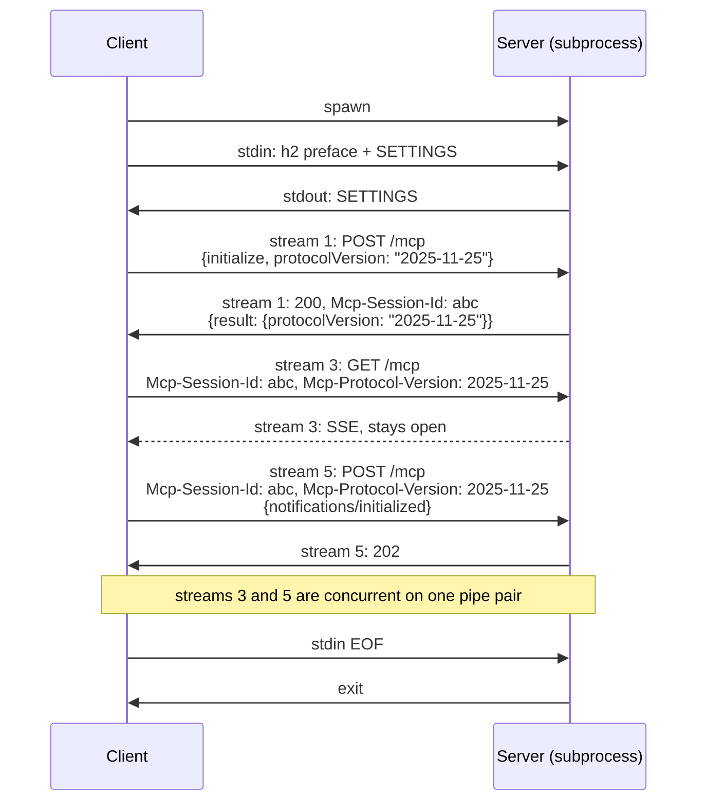
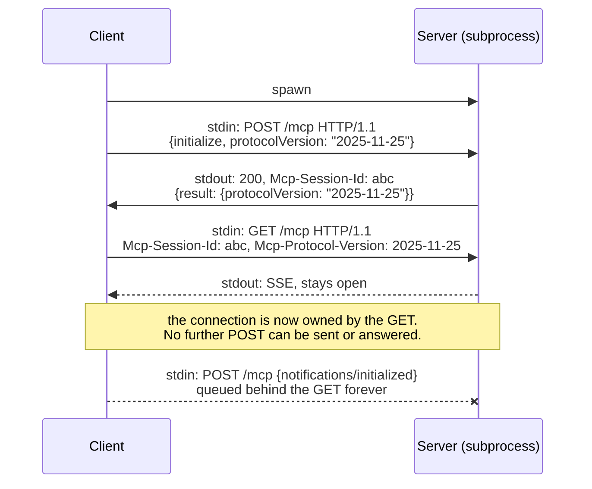
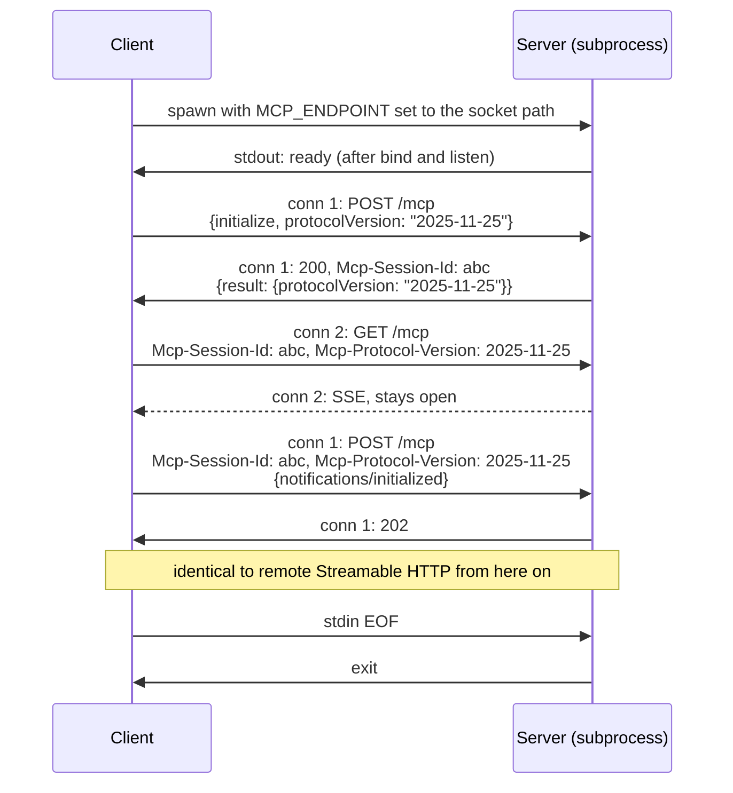
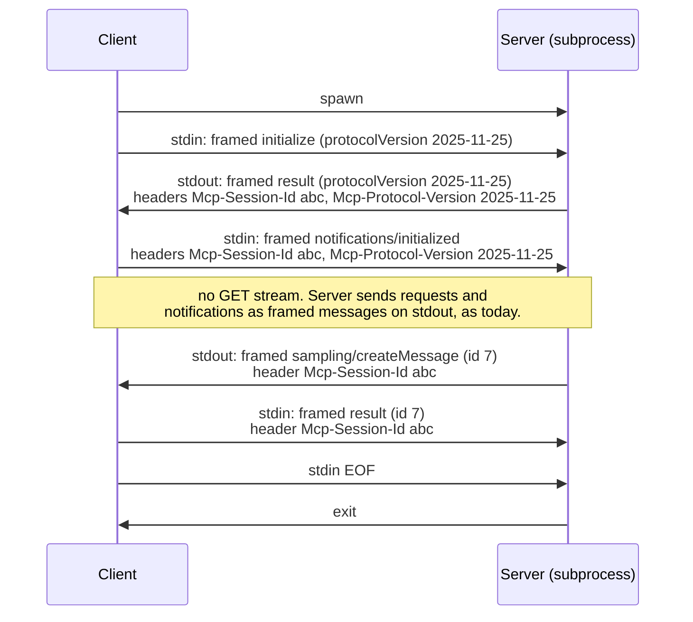
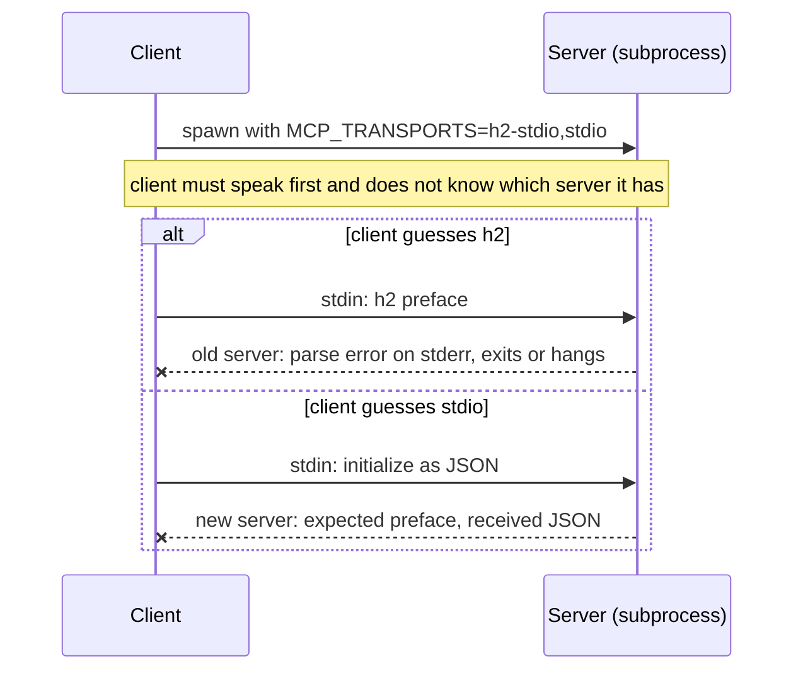
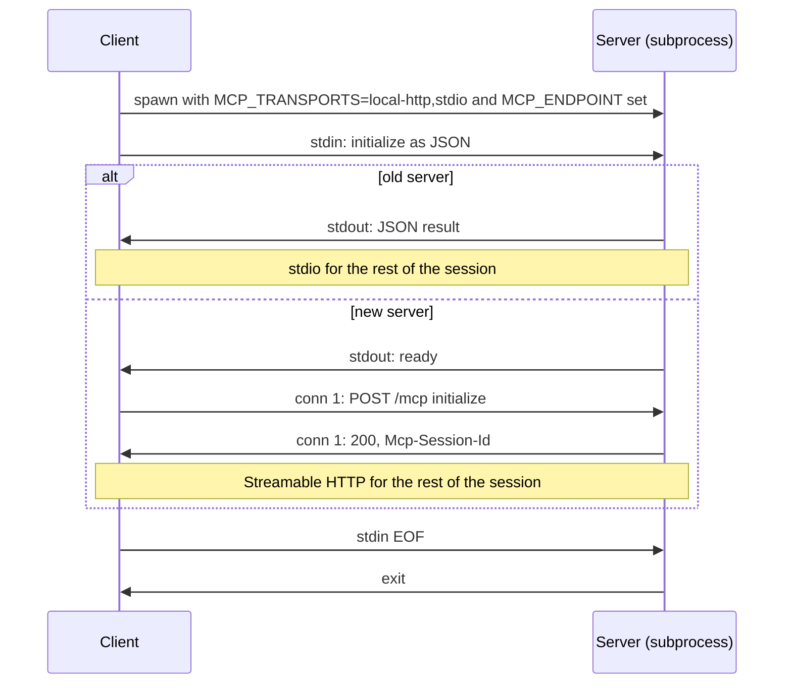
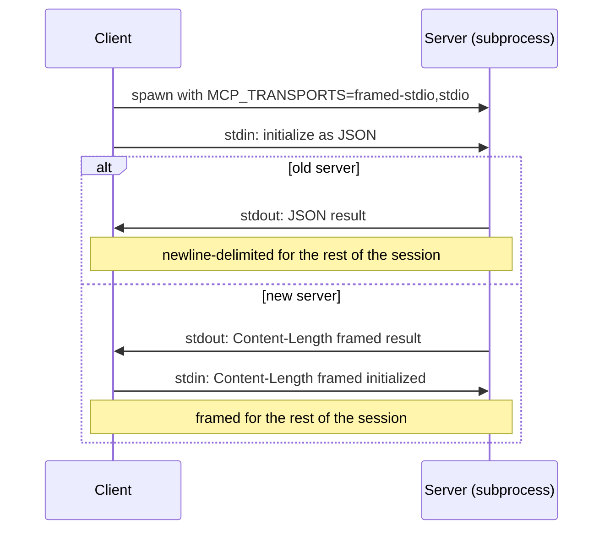

# Local MCP servers over HTTP

Author: Marcelo Trylesinski

## TL;DR

MCP has two transports that do not share a design, so every HTTP feature needs a second stdio
version and every SDK maintains two pipelines. The roadmap proposes HTTP/2 over stdin/stdout. This
document compares that with three alternatives and recommends HTTP/1.1 over a Unix socket on POSIX
and a named pipe on Windows: the existing Streamable HTTP code runs unchanged, it is native in most
runtimes, it can be negotiated in one round trip, and old servers keep working. HTTP/2 over stdio
needs a new HTTP server in Python and cannot be negotiated without configuration. If a named
endpoint is not acceptable, LSP-style headers over stdio is the cheaper fallback.

## Problem

MCP has two transports: stdio and Streamable HTTP. They are not the same shape.

Streamable HTTP carries protocol metadata in HTTP: session ID, protocol version, auth, and the
choice between a single response and a stream. Stdio has none of that. Every time a feature lands on
HTTP, it needs a second stdio-specific design, and every SDK maintains two transport pipelines.

The [roadmap](https://modelcontextprotocol.io/development/roadmap) proposes fixing this by making
Streamable HTTP the single binding, spoken over stdin/stdout for local servers using HTTP/2. This
document looks at that option next to the alternatives and estimates the cost of each per language.

## Requirements

Whatever replaces stdio for local servers must keep what stdio gives us:

- **Subprocess lifecycle.** The client spawns the server and knows when it is gone. The server knows
  when the client is gone.
- **No TCP port.** Nothing a browser or another user on the machine can reach.
- **Survives launchers.** `npx`, `uvx`, and shell wrappers preserve stdio and environment variables.
  They do not reliably preserve extra file descriptors.
- **Works on Windows.**

## Approaches

| # | Approach | Multiplexing | Needs |
|---|----------|--------------|-------|
| A | HTTP/2 over stdin/stdout | HTTP/2 streams | HTTP/2 stack that accepts an arbitrary duplex stream, on both ends |
| B | HTTP/1.1 over stdin/stdout | None | HTTP/1.1 stack that accepts an arbitrary duplex stream, on both ends |
| C | HTTP/1.1 over Unix socket (POSIX) / named pipe (Windows) | Multiple connections | HTTP stack that binds and dials a local endpoint |
| D | Headers over stdio, as LSP does | JSON-RPC IDs, as today | A framing parser, no HTTP stack |

Inherited file descriptors and loopback TCP were considered and dropped: the first is POSIX only and
does not survive `npx`/`uvx`, the second opens a port.

### A. HTTP/2 over stdin/stdout

A single pipe pair is one byte stream, so multiplexing must happen inside it. That forces HTTP/2.
No TLS, so this is prior-knowledge h2c: the client sends the connection preface and starts.

The client spawns the server, writes HTTP/2 frames to its stdin, and reads them from its stdout.
Stdin EOF means shutdown. Nothing else changes: the URL, headers, and session handling are the same
as remote Streamable HTTP.

The cost is entirely in whether a language's HTTP/2 stack lets you hand it a duplex stream that is
not a socket. Where it does, this is cheap. Where it does not, you write an HTTP/2 server.



### B. HTTP/1.1 over stdin/stdout

Same launch as A, but HTTP/1.1 on the pipe. HTTP/1.1 has no multiplexing: one connection carries
one exchange at a time, and its answer to concurrency is to open another connection. Stdio has no
second connection to open.

That breaks Streamable HTTP as specified, and not only by making it slow:

- **Server-initiated requests deadlock.** During a tool call the server sends a sampling or
  elicitation request on that `POST`'s SSE response. The client must answer with a new `POST` while
  the first is still open. It cannot, so both sides wait forever.
- **Cancellation cannot be sent.** `notifications/cancelled` is a `POST` sent while the request it
  cancels is in flight.
- **The standalone `GET` stream owns the connection.** It stays open for the life of the session, so
  no `POST` can follow it.
- **Slow calls block fast ones.** A long tool call holds up a fast `tools/list` and pings.

Pipelining does not help: responses must still come back in order, and no mainstream HTTP client
library implements it.

Dropping those features to fit would leave less than stdio has today, where JSON-RPC IDs already
carry concurrent requests in both directions.

Listed for completeness. It is not a viable option, and it is the reason the roadmap says HTTP/2
rather than HTTP.



### C. HTTP/1.1 over Unix socket / named pipe

The client picks an endpoint name, passes it to the server in an environment variable, and spawns the
server. The server binds it and prints a readiness line on stdout. Stdin EOF means shutdown.

Multiple connections are free, so HTTP/1.1 is the floor and HTTP/2 is optional. Every existing
Streamable HTTP client and server runs unchanged; the only thing that varies is the bind and dial
target. This is how Docker has exposed its API on both platforms for a decade.

This is the option that collapses MCP to one transport. Everything above the connection is
Streamable HTTP verbatim: same endpoint path, same `POST` and `GET`, same SSE streaming, same
`Mcp-Session-Id`, same `Mcp-Protocol-Version`. Remote gets a URL, local gets a socket path or pipe
name. Both are "where do I dial", and every HTTP stack already treats them as the same knob:
`uvicorn --uds` vs `--port`, `httpx` `uds=` vs a URL, Node `socketPath` vs `host`/`port`, Go a
`DialContext` override. No SDK grows a second pipeline, and any HTTP tooling works against a local
server: `curl --unix-socket`, framework middleware, proxies, request logging.

What is left of "stdio" is not a transport, it is a launch procedure: command, args, env, an
environment variable carrying the endpoint, readiness, shutdown. The spec ends up with one transport
section and one short page on how a client spawns a local server.

Streamable HTTP was written assuming TCP, so a few rules need a local carve-out:

- **`Origin` validation.** Required against DNS rebinding. That attack does not exist on a socket
  with no network address. Either the client sends a fixed `Origin` or the check is waived locally.
- **`Host` header.** HTTP/1.1 requires one. Use a constant, Docker uses `localhost`.
- **Auth.** Already optional in Streamable HTTP. Locally, endpoint permissions are the auth. A bearer
  token in the same env var is available as defence in depth, not required.

The endpoint has a name on the filesystem. It is protected by a `0700` directory on POSIX and a
restrictive DACL on Windows. Anything running as the same user can connect, which is the same
threat model as the Docker socket and as stdio itself, since the same user can already read the
server's memory.



The readiness line can be replaced by the client polling the endpoint until connect succeeds. That
leaves stdout untouched and removes one thing to specify.

### D. Headers over stdio, as LSP does

Replace newline-delimited JSON with LSP framing: a header block, a blank line, then the body.

```
Content-Length: 87\r\n
Mcp-Session-Id: 1868a90c-7d4b-4a1e-9f3a-2c5e8b1d0f6e\r\n
Mcp-Protocol-Version: 2025-11-25\r\n
\r\n
{"jsonrpc":"2.0","id":1,"method":"tools/list","params":{}}
```

The headers Streamable HTTP already defines are carried verbatim on each message. New HTTP
features that only need a header land on stdio for free. Multiplexing stays where it is today, in
JSON-RPC request IDs.

This is the smallest change: a framing parser every SDK can write in an afternoon, and the
existing stdio pipeline stays. It does not unify the two transport pipelines, and anything that
depends on HTTP semantics beyond headers (auth flows, response streaming, status codes) still
needs a stdio-specific design. It is also the only option that keeps the channel anonymous, so it
is the fallback if the group decides a named endpoint is not acceptable.



## Cost per language

Native means the standard HTTP stack does it with configuration. Adapter means a small, well
understood piece of glue with prior art. Work means implementing part of an HTTP stack.

| Language | A: HTTP/2 over stdio | B: HTTP/1.1 over stdio | C: Unix socket / named pipe |
|----------|----------------------|------------------------|-----------------------------|
| TypeScript | Native. `http2.connect` with `createConnection`, `server.emit("connection", duplex)`. | Native. `http.createServer()` and `server.emit("connection", duplex)`, `createConnection` on the client. | Native. `listen(path)` and `socketPath` on both platforms. |
| Python | Work. `h2` is sans-IO but there is no ASGI server that speaks it over a pipe. Client needs a custom `httpcore` stream. | Work. `h11` is sans-IO, same missing ASGI adapter and `httpcore` stream as A. | Native on POSIX (`uvicorn --uds`, `httpx` `uds=`). Adapter on Windows, `docker-py` is prior art. |
| Go | Native. `http2.Server.ServeConn(conn)`, `http2.Transport` with `AllowHTTP`. | Native. `http.Server.Serve` on a one-shot `net.Listener`, `DialContext` on the client. | Native. `net.Listen("unix")`, `go-winio` for named pipes. |
| Rust | Native. `hyper` serves and dials over anything `AsyncRead + AsyncWrite`. | Native. Same `hyper` API, `http1` builder. | Native. `tokio` `UnixListener` and `named_pipe`. |
| C# | Work on server, Kestrel does not accept an arbitrary stream. Client is native via `ConnectCallback`. | Work. Same Kestrel limitation. | Native. Kestrel `ListenUnixSocket` and `ListenNamedPipe`, `ConnectCallback` on the client. |
| Java / Kotlin | Work. Netty HTTP/2 codec over a custom stdio `Channel`. | Work. Netty HTTP/1.1 codec over a custom stdio `Channel`. | Work. `java.net.http` has no Unix socket support, Netty domain sockets are POSIX only. |
| Swift | Adapter. `NIOPipeBootstrap` plus `NIOHTTP2` handlers. | Adapter. `NIOPipeBootstrap` plus `NIOHTTP1` handlers. | Native on Apple and Linux via SwiftNIO. Thin on Windows. |
| Ruby | Work. | Work. | Adapter. Puma binds `unix://`, client needs a raw socket wrapper. No named pipes. |

B costs about the same as A everywhere: the hard part is handing an HTTP stack a stream that is not
a socket, not which HTTP version runs on it. D costs the same in every language: a `Content-Length`
framing parser, which most already have from LSP libraries.

## Recommendation

C. It is the only option that delivers "one transport pipeline" in practice rather than on paper.
The SDKs' existing Streamable HTTP code runs unchanged, the infrastructure is native in the runtimes
with the most servers, and the one missing piece (Python on Windows) has prior art.

A achieves one pipeline in the spec but forces the two SDKs with the most servers, Python and
TypeScript, onto opposite sides of the cost line, with Python on the expensive side. B pays the same
cost as A and does not work.

Open question for the group: does "no port" mean "no TCP listener" or "no named endpoint at all"? C
depends on the first reading. Under the second, only stdio qualifies, and D is the cheaper way to
carry the headers than paying the A cost across every SDK.

## Negotiation

Transport negotiation is separate from version negotiation. `protocolVersion` in `initialize` is
unchanged in every option. The question here is how a client learns which transport a server speaks
before the first `initialize` is answered.

Three constraints apply to every option:

- **One spawn.** Respawning to retry a transport doubles startup and can repeat side effects.
- **No timeouts.** An old server is silent until it receives a request. Waiting cannot tell an old
  server from a slow one.
- **The offer travels in the environment.** `npx`, `uvx`, and shell wrappers preserve environment
  variables. They do not preserve extra file descriptors, and appended CLI flags may not reach the
  real binary.

The shape that satisfies all three is the one MCP already uses for `protocolVersion`: the client
offers, the server picks. The client spawns the server with `MCP_TRANSPORTS` listing what it
accepts in preference order, sends `initialize` as newline-delimited JSON on stdin because every
server ever shipped understands that, and reads the server's first output to learn what it chose.
An old server does not know the variable and answers in JSON. The variable names below are
placeholders.

Whether an option can use this shape depends on one thing: who has to speak first.

### A. HTTP/2 over stdin/stdout

HTTP/2 requires the client to send the connection preface before anything else. A JSON `initialize`
is not a preface, so the probe above cannot work: a new server would receive JSON and fail. The
client has to know before it writes the first byte. Paths:

- **Configuration.** The client config entry says `"transport": "h2-stdio"`. No probe, no fallback.
  This is the only path that meets all three constraints, and it means every server has to update
  its install instructions.
- **Server banner.** The server prints a line such as `MCP-Transport: h2` on stdout before reading
  stdin, and the client waits for it. An old server prints nothing until it receives a request, so
  the client cannot tell "old" from "slow" without a timeout.
- **Upgrade after `initialize`.** The client sends JSON `initialize`, the server answers in JSON and
  includes an offer to switch, both sides then start HTTP/2 on the same pipe. This is the `Upgrade:
  h2c` mechanism, which HTTP/2 itself removed in RFC 9113 because nobody implemented it correctly.
  MCP would be defining its own.



### B. HTTP/1.1 over stdin/stdout

Same constraint as A with a request line instead of a preface. A new server reads
`{"jsonrpc":...` where it expects `POST /mcp HTTP/1.1` and fails. Configuration is the only path.
B is not viable for other reasons, so this changes nothing.

### C. HTTP/1.1 over Unix socket / named pipe

The client sets `MCP_TRANSPORTS=local-http,stdio` and `MCP_ENDPOINT`, spawns, and sends JSON
`initialize` on stdin as the probe.

- A **new server** sees `MCP_ENDPOINT`, binds it, prints `ready` on stdout, and ignores stdin except
  for EOF. The client dials the endpoint and re-sends `initialize` as a `POST`. The probe message
  is discarded; it cost one write.
- An **old server** ignores both variables and answers the probe in JSON. The client stays on
  stdio.

The client can also skip the `ready` line and race a connect on the endpoint against the first byte
on stdout. Whichever arrives first is the answer. A new server prints nothing on stdout in that
variant, which leaves it free for the server's own use.



### D. Headers over stdio

The client sets `MCP_TRANSPORTS=framed-stdio,stdio`, spawns, and sends JSON `initialize` on stdin.

- A **new server** answers with a framed message. The client sees `Content-Length:` as the first
  bytes and switches to framing for everything after.
- An **old server** answers in JSON. The client stays on newline-delimited messages.

Two variants exist and both are worse:

- **Client sends framed first.** An old server reads `Content-Length: 87` as a JSON line and fails.
  A dual-framing server that accepts both fixes the new-server side but not the old-server side.
- **Capability in `initialize`.** The client adds `capabilities.framing` to the JSON `initialize`,
  the server agrees in its JSON result, both switch. No environment variable, but the switch happens
  mid-stream after one exchange, and the client must know not to send `initialized` until it has
  read the result. The environment variable removes that ordering.



### Summary

| | Who speaks first | Probe | Server signal | Old server | Spawns | Timeout |
|---|---|---|---|---|---|---|
| A | Client, with a preface | Not possible | None | Chokes | 1 with config, else 2 | Yes, unless config |
| B | Client, with a request line | Not possible | None | Chokes | 1 with config, else 2 | Yes, unless config |
| C | Client, with JSON | JSON `initialize` on stdin | `ready` line or connectable endpoint | Answers in JSON | 1 | No |
| D | Client, with JSON | JSON `initialize` on stdin | `Content-Length:` on stdout | Answers in JSON | 1 | No |

A client that knows the transport from configuration skips the probe in every option. The
`"transport"` field already in every client config carries this, and the probe is only for entries
that do not say. C and D degrade gracefully without it. A and B do not work without it.

## Migration

Stdio JSON-RPC stays the mandatory baseline. Local HTTP is an additive server capability declared in
client configuration. A small bridge binary wraps any stdio server as a local HTTP endpoint and vice
versa, so clients and servers adopt on independent schedules. This is the same path the SSE to
Streamable HTTP transition used.

## Appendix: concepts

**Socket.** An endpoint for two-way communication between processes, exposed to a program as a file
descriptor. A socket has an address family that decides how it is named and who can reach it: `AF_INET`
for TCP/IP, `AF_UNIX` for the local filesystem. One listening socket accepts many connections, each
of which is its own socket. This is what makes "open another connection" possible and what stdio
lacks.

**Pipe.** A one-way byte stream between two processes, created by the kernel with no name and no
address. The parent creates it and the child inherits it. Stdin and stdout are two pipes pointing in
opposite directions, which together form one duplex channel, and exactly one. A pipe has no listen
or accept, so there is never a second connection.

**Port.** A 16-bit number that identifies one endpoint on a host for TCP or UDP. `localhost:8080` is
reachable by every process on the machine, by every user, and by a browser through DNS rebinding or
a malicious page. "No port" in this document means no TCP listener, whatever the interface.

**Unix socket.** A socket in the `AF_UNIX` family. Its address is a filesystem path, for example
`/tmp/mcp-1234/server.sock`. Access is controlled by filesystem permissions, so a `0700` directory
limits it to one user. It behaves like TCP without the network: listen, accept, many connections,
no port, unreachable from a browser. Available on Linux, macOS, and Windows 10 and later, although
Windows support in language runtimes is uneven, which is why named pipes are the usual choice there.

**Named pipe.** The Windows equivalent of a Unix socket, at `\\.\pipe\<name>`. Despite the name it is
not a POSIX pipe: it is duplex, it has an address, a server can accept many connections on it, and
access is controlled by a security descriptor. Docker, PostgreSQL, and VS Code's language client all
use it on Windows where they use a Unix socket elsewhere. POSIX has something also called a named
pipe (a FIFO), which is a one-way pipe with a filesystem name and is not what this document means.

